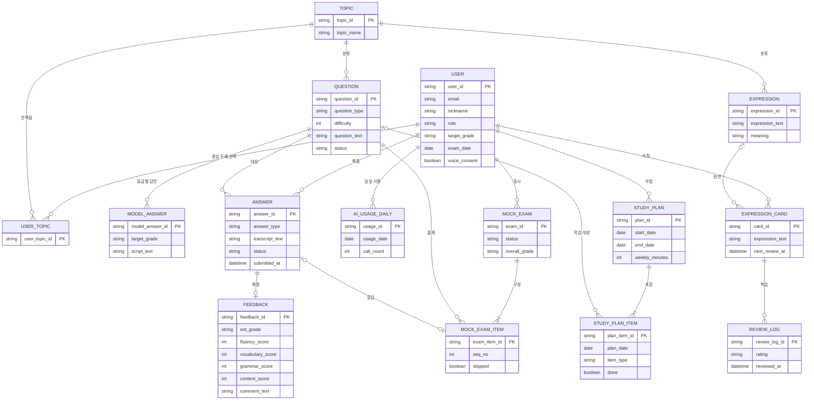
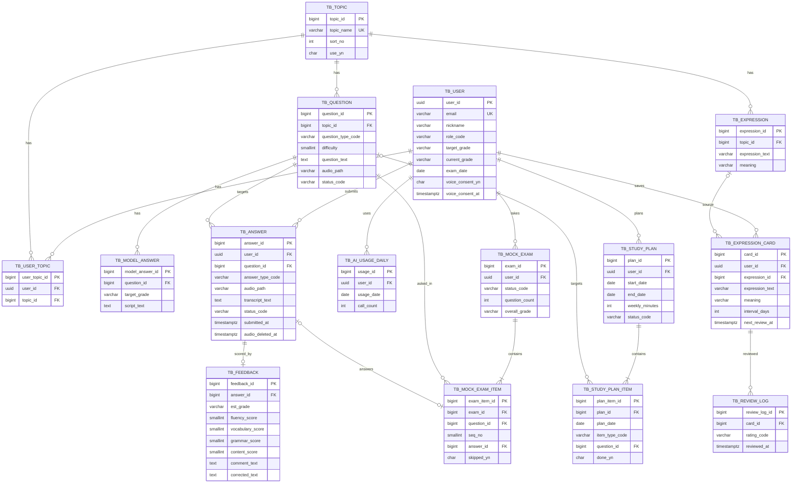

# 데이터 설계서

| 항목 | 내용 |
|:---|:---|
| 사업명 | OPIc 학습 앱 |
| DB 종류 | PostgreSQL (Supabase) <!-- TODO: 확인 필요 (요구사항정의서 기술스택 기준) --> |
| 테이블 수 | 15개 |
| 작성 일시 | 2026-09-30 |
| 버전 | v0.1 |

> 기준 문서: `요구사항정의서_OPIc_학습_앱_MVP_20260930.md`, `유즈케이스_OPIc_학습_앱_20260930.md`, `서비스분류_OPIc_학습_앱_20260930.md`
> 범위: v1.0 / v1.1 / v2.0 전체 (릴리즈는 엔터티 목록에 표기)
> 계정(이메일·비밀번호·세션)은 Supabase `auth.users`가 관리하고, `TB_USER`는 그 계정의 앱 프로필이다. `TB_USER.user_id`는 `auth.users.id`(uuid)와 동일하다.

---

## 1. 엔터티 목록

| 엔터티명 | 테이블명 | 설명 | 연계 UC | 서비스 | 릴리즈 |
|:---|:---|:---|:---|:---|:---:|
| 사용자 | TB_USER | 학습자/관리자 프로필, 목표 등급·시험일, 음성 수집 동의 | UC-001~003 | SC-001 | v1.0 |
| 주제 | TB_TOPIC | 관심 주제(Background Survey) 및 질문 분류 | UC-003, UC-004 | SC-002 | v1.0 |
| 사용자 관심 주제 | TB_USER_TOPIC | 사용자와 주제의 M:N 관계 | UC-003 | SC-001 | v1.0 |
| 질문 | TB_QUESTION | 질문 은행의 질문 | UC-004, UC-005, UC-013 | SC-002 | v1.0 |
| 모범 답안 | TB_MODEL_ANSWER | 질문별·등급별 모범 답안 스크립트 | UC-007, UC-013 | SC-002 | v1.0 |
| 핵심 표현 | TB_EXPRESSION | 주제별 핵심 표현(콘텐츠) | UC-009, UC-013 | SC-002 | v2.0 |
| 답변 | TB_ANSWER | 학습자의 답변 이력(음성 경로·전사문) | UC-005, UC-014 | SC-003 | v1.0 |
| 피드백 | TB_FEEDBACK | AI 채점 결과(등급·점수·코멘트·교정본) | UC-006, UC-007 | SC-004 | v1.0 |
| AI 일일 사용량 | TB_AI_USAGE_DAILY | 사용자별 일일 AI 호출 횟수(한도 관리) | UC-005, UC-006 | SC-004 | v1.0 |
| 모의고사 | TB_MOCK_EXAM | 모의고사 회차 | UC-008 | SC-003 | v1.1 |
| 모의고사 문항 | TB_MOCK_EXAM_ITEM | 모의고사에 구성된 문항과 응답 연결 | UC-008 | SC-003 | v1.1 |
| 학습 계획 | TB_STUDY_PLAN | 학습 계획 헤더 | UC-011 | SC-005 | v1.1 |
| 학습 계획 항목 | TB_STUDY_PLAN_ITEM | 일자별 학습 항목과 완료 여부 | UC-011, UC-012 | SC-005 | v1.1 |
| 표현 카드 | TB_EXPRESSION_CARD | 사용자별 표현 카드와 복습 일정 | UC-009, UC-010 | SC-006 | v2.0 |
| 복습 이력 | TB_REVIEW_LOG | 카드 복습 결과 이력 | UC-010 | SC-006 | v2.0 |

---

## 2. 논리 ERD



---

## 3. 물리 ERD



---

## 4. 테이블 정의서

> 모든 테이블에 공통 컬럼 `created_at`, `updated_at`, `created_by`가 포함된다. (아래 표에서는 첫 테이블에만 상세히 표기하고 이후에는 동일하게 적용)
> `created_by`는 사용자 소유 데이터는 해당 사용자, 관리자 콘텐츠는 관리자, 시드 데이터는 NULL이다.

### TB_USER (사용자)

> 학습자/관리자의 앱 프로필. Supabase `auth.users`와 1:1.

| 컬럼명 | 논리명 | 타입 | NOT NULL | PK | FK | 기본값 | 설명 |
|:---|:---|:---:|:---:|:---:|:---:|:---|:---|
| user_id | 사용자 ID | uuid | Y | Y | auth.users.id | | 인증 계정 ID와 동일 |
| email | 이메일 | varchar(255) | Y | | | | 로그인 ID |
| nickname | 닉네임 | varchar(50) | Y | | | | |
| role_code | 역할 | varchar(10) | Y | | | 'LEARNER' | LEARNER / ADMIN |
| target_grade | 목표 등급 | varchar(4) | | | | | OPIC_GRADE 코드 |
| current_grade | 현재 수준 | varchar(4) | | | | | OPIC_GRADE 코드 |
| exam_date | 시험 예정일 | date | | | | | 미입력 가능 |
| voice_consent_yn | 음성 수집 동의 | char(1) | Y | | | 'N' | SR-004 |
| voice_consent_at | 동의 일시 | timestamptz | | | | | |
| created_at | 생성일시 | timestamptz | Y | | | now() | UTC |
| updated_at | 수정일시 | timestamptz | Y | | | now() | |
| created_by | 생성자 | uuid | | | | | |

**인덱스**

| 인덱스명 | 컬럼 | 유형 | 설명 |
|:---|:---|:---:|:---|
| pk_tb_user | user_id | PK | |
| uk_tb_user_email | email | UNIQUE | 이메일 중복 방지 |

---

### TB_TOPIC (주제)

> 질문·표현의 분류 및 사용자 관심 주제 마스터.

| 컬럼명 | 논리명 | 타입 | NOT NULL | PK | FK | 기본값 | 설명 |
|:---|:---|:---:|:---:|:---:|:---:|:---|:---|
| topic_id | 주제 ID | bigint | Y | Y | | identity | |
| topic_name | 주제명 | varchar(50) | Y | | | | 예: 영화, 여행, 음악 |
| sort_no | 정렬순서 | int | Y | | | 0 | |
| use_yn | 사용 여부 | char(1) | Y | | | 'Y' | |
| created_at / updated_at / created_by | 공통 | | | | | | |

**인덱스**

| 인덱스명 | 컬럼 | 유형 | 설명 |
|:---|:---|:---:|:---|
| pk_tb_topic | topic_id | PK | |
| uk_tb_topic_name | topic_name | UNIQUE | |

---

### TB_USER_TOPIC (사용자 관심 주제)

> 사용자-주제 M:N 연관.

| 컬럼명 | 논리명 | 타입 | NOT NULL | PK | FK | 기본값 | 설명 |
|:---|:---|:---:|:---:|:---:|:---:|:---|:---|
| user_topic_id | 연관 ID | bigint | Y | Y | | identity | |
| user_id | 사용자 ID | uuid | Y | | TB_USER | | |
| topic_id | 주제 ID | bigint | Y | | TB_TOPIC | | |
| created_at / updated_at / created_by | 공통 | | | | | | |

**인덱스**

| 인덱스명 | 컬럼 | 유형 | 설명 |
|:---|:---|:---:|:---|
| uk_tb_user_topic | user_id, topic_id | UNIQUE | 중복 선택 방지 |
| ix_tb_user_topic_topic | topic_id | INDEX | 역조회 |

---

### TB_QUESTION (질문)

> 질문 은행. 자체 제작 콘텐츠만 등록한다(CR-001).

| 컬럼명 | 논리명 | 타입 | NOT NULL | PK | FK | 기본값 | 설명 |
|:---|:---|:---:|:---:|:---:|:---:|:---|:---|
| question_id | 질문 ID | bigint | Y | Y | | identity | |
| topic_id | 주제 ID | bigint | Y | | TB_TOPIC | | |
| question_type_code | 질문 유형 | varchar(20) | Y | | | | QUESTION_TYPE 코드 |
| difficulty | 난이도 | smallint | Y | | | | 1~6 <!-- TODO: 난이도 체계 확인 필요 --> |
| question_text | 질문 텍스트 | text | Y | | | | |
| audio_path | 질문 음성 경로 | varchar(500) | | | | | Storage 경로 또는 TTS 대체 시 NULL (IR-003) |
| status_code | 공개 상태 | varchar(10) | Y | | | 'DRAFT' | DRAFT / PUBLISHED / HIDDEN |
| created_at / updated_at / created_by | 공통 | | | | | | |

**인덱스**

| 인덱스명 | 컬럼 | 유형 | 설명 |
|:---|:---|:---:|:---|
| ix_tb_question_search | status_code, topic_id, difficulty, question_type_code | INDEX | 질문 은행 필터 조회 (FR-003) |

---

### TB_MODEL_ANSWER (모범 답안)

> 질문별·등급별 모범 답안 스크립트.

| 컬럼명 | 논리명 | 타입 | NOT NULL | PK | FK | 기본값 | 설명 |
|:---|:---|:---:|:---:|:---:|:---:|:---|:---|
| model_answer_id | 모범 답안 ID | bigint | Y | Y | | identity | |
| question_id | 질문 ID | bigint | Y | | TB_QUESTION | | |
| target_grade | 대상 등급 | varchar(4) | Y | | | | OPIC_GRADE 코드 |
| script_text | 스크립트 | text | Y | | | | |
| key_expression_note | 핵심 표현 메모 | text | | | | | |
| created_at / updated_at / created_by | 공통 | | | | | | |

**인덱스**

| 인덱스명 | 컬럼 | 유형 | 설명 |
|:---|:---|:---:|:---|
| uk_tb_model_answer | question_id, target_grade | UNIQUE | 등급별 1건 |

---

### TB_EXPRESSION (핵심 표현)

> 주제별 핵심 표현 콘텐츠 (v2.0).

| 컬럼명 | 논리명 | 타입 | NOT NULL | PK | FK | 기본값 | 설명 |
|:---|:---|:---:|:---:|:---:|:---:|:---|:---|
| expression_id | 표현 ID | bigint | Y | Y | | identity | |
| topic_id | 주제 ID | bigint | | | TB_TOPIC | | 주제 무관 표현은 NULL |
| expression_text | 표현 | varchar(300) | Y | | | | |
| meaning | 의미 | varchar(500) | Y | | | | |
| example_text | 예문 | text | | | | | |
| created_at / updated_at / created_by | 공통 | | | | | | |

**인덱스**

| 인덱스명 | 컬럼 | 유형 | 설명 |
|:---|:---|:---:|:---|
| ix_tb_expression_topic | topic_id | INDEX | 주제별 조회 |

---

### TB_ANSWER (답변)

> 학습자 답변 이력. 음성 원본은 Storage에 저장하고 경로만 보관한다. 음성 삭제(UC-014) 시 `audio_path`를 NULL로 하고 `audio_deleted_at`을 기록한다.

| 컬럼명 | 논리명 | 타입 | NOT NULL | PK | FK | 기본값 | 설명 |
|:---|:---|:---:|:---:|:---:|:---:|:---|:---|
| answer_id | 답변 ID | bigint | Y | Y | | identity | |
| user_id | 사용자 ID | uuid | Y | | TB_USER | | |
| question_id | 질문 ID | bigint | Y | | TB_QUESTION | | |
| answer_type_code | 답변 유형 | varchar(10) | Y | | | | VOICE / TEXT |
| audio_path | 음성 경로 | varchar(500) | | | | | 텍스트 답변 또는 삭제 후 NULL |
| transcript_text | 전사/답변 텍스트 | text | | | | | STT 결과 또는 입력 텍스트 |
| duration_sec | 답변 길이(초) | int | | | | | |
| status_code | 처리 상태 | varchar(15) | Y | | | 'SUBMITTED' | SUBMITTED / TRANSCRIBED / SCORED / FAILED |
| submitted_at | 제출일시 | timestamptz | Y | | | now() | |
| audio_deleted_at | 음성 삭제일시 | timestamptz | | | | | DR-004 |
| created_at / updated_at / created_by | 공통 | | | | | | |

**인덱스**

| 인덱스명 | 컬럼 | 유형 | 설명 |
|:---|:---|:---:|:---|
| ix_tb_answer_user | user_id, submitted_at DESC | INDEX | 내 답변 이력, 대시보드 집계 |
| ix_tb_answer_question | question_id | INDEX | 질문별 답변 조회 |
| ix_tb_answer_audio_retention | submitted_at | INDEX (partial: audio_path IS NOT NULL) | 보관기간 만료 음성 정리 배치 |

---

### TB_FEEDBACK (피드백)

> 답변 1건당 AI 채점 결과 1건.

| 컬럼명 | 논리명 | 타입 | NOT NULL | PK | FK | 기본값 | 설명 |
|:---|:---|:---:|:---:|:---:|:---:|:---|:---|
| feedback_id | 피드백 ID | bigint | Y | Y | | identity | |
| answer_id | 답변 ID | bigint | Y | | TB_ANSWER | | |
| est_grade | 예상 등급 | varchar(4) | Y | | | | OPIC_GRADE 코드 |
| fluency_score | 유창성 | smallint | | | | | 0~100 |
| vocabulary_score | 어휘 | smallint | | | | | 0~100 |
| grammar_score | 문법 | smallint | | | | | 0~100 |
| content_score | 내용 구성 | smallint | | | | | 0~100 |
| comment_text | 개선 코멘트 | text | Y | | | | |
| corrected_text | 교정본 | text | | | | | UC-007 비교용 |
| ai_model_name | 사용 모델 | varchar(100) | | | | | 추적용 <!-- TODO: 공급자 선정 후 확인 --> |
| created_at / updated_at / created_by | 공통 | | | | | | |

**인덱스**

| 인덱스명 | 컬럼 | 유형 | 설명 |
|:---|:---|:---:|:---|
| uk_tb_feedback_answer | answer_id | UNIQUE | 답변당 1건 (재채점은 갱신 또는 이력 테이블 확장 <!-- TODO: 재채점 이력 보관 여부 확인 -->) |

---

### TB_AI_USAGE_DAILY (AI 일일 사용량)

> 사용자별 일일 AI 호출 횟수. 한도 초과 여부 판정에 사용(CR-004).

| 컬럼명 | 논리명 | 타입 | NOT NULL | PK | FK | 기본값 | 설명 |
|:---|:---|:---:|:---:|:---:|:---:|:---|:---|
| usage_id | 사용량 ID | bigint | Y | Y | | identity | |
| user_id | 사용자 ID | uuid | Y | | TB_USER | | |
| usage_date | 사용일 | date | Y | | | current_date | UTC 기준 <!-- TODO: 한도 기준 시간대 확인 --> |
| call_count | 호출 횟수 | int | Y | | | 0 | 일일 한도 <!-- TODO: 한도 값 확인 --> |
| created_at / updated_at / created_by | 공통 | | | | | | |

**인덱스**

| 인덱스명 | 컬럼 | 유형 | 설명 |
|:---|:---|:---:|:---|
| uk_tb_ai_usage_daily | user_id, usage_date | UNIQUE | 일자별 1행 (upsert) |

---

### TB_MOCK_EXAM (모의고사)

> 모의고사 회차 (v1.1).

| 컬럼명 | 논리명 | 타입 | NOT NULL | PK | FK | 기본값 | 설명 |
|:---|:---|:---:|:---:|:---:|:---:|:---|:---|
| exam_id | 모의고사 ID | bigint | Y | Y | | identity | |
| user_id | 사용자 ID | uuid | Y | | TB_USER | | |
| status_code | 진행 상태 | varchar(15) | Y | | | 'IN_PROGRESS' | IN_PROGRESS / COMPLETED / ABANDONED |
| question_count | 문항 수 | int | Y | | | | 예: 15 <!-- TODO: 문항 구성 규칙 확인 --> |
| started_at | 시작일시 | timestamptz | Y | | | now() | |
| finished_at | 종료일시 | timestamptz | | | | | |
| overall_grade | 종합 예상 등급 | varchar(4) | | | | | OPIC_GRADE 코드 |
| created_at / updated_at / created_by | 공통 | | | | | | |

**인덱스**

| 인덱스명 | 컬럼 | 유형 | 설명 |
|:---|:---|:---:|:---|
| ix_tb_mock_exam_user | user_id, started_at DESC | INDEX | 응시 이력 |

---

### TB_MOCK_EXAM_ITEM (모의고사 문항)

> 모의고사에 출제된 문항. 응답(TB_ANSWER)과 연결하며 건너뛴 문항은 answer_id가 NULL이다.

| 컬럼명 | 논리명 | 타입 | NOT NULL | PK | FK | 기본값 | 설명 |
|:---|:---|:---:|:---:|:---:|:---:|:---|:---|
| exam_item_id | 문항 ID | bigint | Y | Y | | identity | |
| exam_id | 모의고사 ID | bigint | Y | | TB_MOCK_EXAM | | |
| question_id | 질문 ID | bigint | Y | | TB_QUESTION | | |
| seq_no | 출제 순서 | smallint | Y | | | | |
| answer_id | 답변 ID | bigint | | | TB_ANSWER | | 미응답 시 NULL |
| skipped_yn | 건너뜀 여부 | char(1) | Y | | | 'N' | |
| created_at / updated_at / created_by | 공통 | | | | | | |

**인덱스**

| 인덱스명 | 컬럼 | 유형 | 설명 |
|:---|:---|:---:|:---|
| uk_tb_mock_exam_item_seq | exam_id, seq_no | UNIQUE | 순서 중복 방지 |
| ix_tb_mock_exam_item_answer | answer_id | INDEX | 응답 역참조 |

---

### TB_STUDY_PLAN (학습 계획)

> 학습 계획 헤더 (v1.1). 사용자당 활성 계획은 1건.

| 컬럼명 | 논리명 | 타입 | NOT NULL | PK | FK | 기본값 | 설명 |
|:---|:---|:---:|:---:|:---:|:---:|:---|:---|
| plan_id | 계획 ID | bigint | Y | Y | | identity | |
| user_id | 사용자 ID | uuid | Y | | TB_USER | | |
| start_date | 시작일 | date | Y | | | | |
| end_date | 종료일 | date | | | | | 시험일 미입력 시 NULL |
| weekly_minutes | 주간 학습 시간(분) | int | Y | | | | |
| status_code | 상태 | varchar(10) | Y | | | 'ACTIVE' | ACTIVE / ARCHIVED |
| created_at / updated_at / created_by | 공통 | | | | | | |

**인덱스**

| 인덱스명 | 컬럼 | 유형 | 설명 |
|:---|:---|:---:|:---|
| uk_tb_study_plan_active | user_id (WHERE status_code = 'ACTIVE') | UNIQUE (partial) | 활성 계획 1건 |

---

### TB_STUDY_PLAN_ITEM (학습 계획 항목)

> 일자별 학습 항목 (v1.1).

| 컬럼명 | 논리명 | 타입 | NOT NULL | PK | FK | 기본값 | 설명 |
|:---|:---|:---:|:---:|:---:|:---:|:---|:---|
| plan_item_id | 항목 ID | bigint | Y | Y | | identity | |
| plan_id | 계획 ID | bigint | Y | | TB_STUDY_PLAN | | |
| plan_date | 계획 일자 | date | Y | | | | |
| item_type_code | 항목 유형 | varchar(10) | Y | | | | QUESTION / MOCK / REVIEW |
| question_id | 질문 ID | bigint | | | TB_QUESTION | | QUESTION 유형일 때 |
| done_yn | 완료 여부 | char(1) | Y | | | 'N' | |
| done_at | 완료일시 | timestamptz | | | | | |
| created_at / updated_at / created_by | 공통 | | | | | | |

**인덱스**

| 인덱스명 | 컬럼 | 유형 | 설명 |
|:---|:---|:---:|:---|
| ix_tb_study_plan_item_date | plan_id, plan_date | INDEX | 일자별 조회 |

---

### TB_EXPRESSION_CARD (표현 카드)

> 사용자별 표현 카드 및 간격 반복 복습 상태 (v2.0). 콘텐츠 표현에서 저장하거나 직접 입력할 수 있다.

| 컬럼명 | 논리명 | 타입 | NOT NULL | PK | FK | 기본값 | 설명 |
|:---|:---|:---:|:---:|:---:|:---:|:---|:---|
| card_id | 카드 ID | bigint | Y | Y | | identity | |
| user_id | 사용자 ID | uuid | Y | | TB_USER | | |
| expression_id | 원천 표현 ID | bigint | | | TB_EXPRESSION | | 직접 입력 카드는 NULL |
| expression_text | 표현 | varchar(300) | Y | | | | |
| meaning | 의미 | varchar(500) | Y | | | | |
| memo | 메모 | text | | | | | |
| interval_days | 복습 간격(일) | int | Y | | | 0 | |
| next_review_at | 다음 복습일시 | timestamptz | | | | | |
| last_reviewed_at | 마지막 복습일시 | timestamptz | | | | | |
| review_count | 복습 횟수 | int | Y | | | 0 | |
| created_at / updated_at / created_by | 공통 | | | | | | |

**인덱스**

| 인덱스명 | 컬럼 | 유형 | 설명 |
|:---|:---|:---:|:---|
| ix_tb_expression_card_review | user_id, next_review_at | INDEX | 오늘 복습 대상 조회 |
| uk_tb_expression_card_src | user_id, expression_id (WHERE expression_id IS NOT NULL) | UNIQUE (partial) | 동일 표현 중복 저장 방지 |

---

### TB_REVIEW_LOG (복습 이력)

> 카드 복습 결과 이력 (v2.0).

| 컬럼명 | 논리명 | 타입 | NOT NULL | PK | FK | 기본값 | 설명 |
|:---|:---|:---:|:---:|:---:|:---:|:---|:---|
| review_log_id | 이력 ID | bigint | Y | Y | | identity | |
| card_id | 카드 ID | bigint | Y | | TB_EXPRESSION_CARD | | |
| rating_code | 기억 정도 | varchar(10) | Y | | | | HARD / NORMAL / EASY |
| reviewed_at | 복습일시 | timestamptz | Y | | | now() | |
| created_at / updated_at / created_by | 공통 | | | | | | |

**인덱스**

| 인덱스명 | 컬럼 | 유형 | 설명 |
|:---|:---|:---:|:---|
| ix_tb_review_log_card | card_id, reviewed_at DESC | INDEX | 카드별 이력 |

---

## 5. 관계 정의

| 부모 테이블 | 자식 테이블 | 관계 유형 | FK 컬럼 | 참조 무결성 |
|:---|:---|:---:|:---|:---|
| TB_USER | TB_USER_TOPIC | 1:N | user_id | ON DELETE CASCADE |
| TB_TOPIC | TB_USER_TOPIC | 1:N | topic_id | ON DELETE RESTRICT |
| TB_TOPIC | TB_QUESTION | 1:N | topic_id | ON DELETE RESTRICT |
| TB_TOPIC | TB_EXPRESSION | 1:N | topic_id | ON DELETE SET NULL |
| TB_QUESTION | TB_MODEL_ANSWER | 1:N | question_id | ON DELETE CASCADE |
| TB_USER | TB_ANSWER | 1:N | user_id | ON DELETE CASCADE (탈퇴 시 개인정보 파기) |
| TB_QUESTION | TB_ANSWER | 1:N | question_id | ON DELETE RESTRICT (이력 있는 질문은 비공개 처리) |
| TB_ANSWER | TB_FEEDBACK | 1:0..1 | answer_id | ON DELETE CASCADE |
| TB_USER | TB_AI_USAGE_DAILY | 1:N | user_id | ON DELETE CASCADE |
| TB_USER | TB_MOCK_EXAM | 1:N | user_id | ON DELETE CASCADE |
| TB_MOCK_EXAM | TB_MOCK_EXAM_ITEM | 1:N | exam_id | ON DELETE CASCADE |
| TB_QUESTION | TB_MOCK_EXAM_ITEM | 1:N | question_id | ON DELETE RESTRICT |
| TB_ANSWER | TB_MOCK_EXAM_ITEM | 0..1:1 | answer_id | ON DELETE SET NULL |
| TB_USER | TB_STUDY_PLAN | 1:N | user_id | ON DELETE CASCADE |
| TB_STUDY_PLAN | TB_STUDY_PLAN_ITEM | 1:N | plan_id | ON DELETE CASCADE |
| TB_QUESTION | TB_STUDY_PLAN_ITEM | 1:N | question_id | ON DELETE SET NULL |
| TB_USER | TB_EXPRESSION_CARD | 1:N | user_id | ON DELETE CASCADE |
| TB_EXPRESSION | TB_EXPRESSION_CARD | 1:N | expression_id | ON DELETE SET NULL |
| TB_EXPRESSION_CARD | TB_REVIEW_LOG | 1:N | card_id | ON DELETE CASCADE |

---

## 6. 공통 코드 목록

> 별도 코드 테이블 없이 CHECK 제약으로 관리한다(코드값이 고정적). 코드 확장이 잦아지면 코드 테이블로 전환한다. <!-- TODO: 확인 필요 -->

| 코드 그룹 | 코드 그룹명 | 코드값 | 코드명 | 비고 |
|:---|:---|:---|:---|:---|
| ROLE | 사용자 역할 | LEARNER | 학습자 | |
| ROLE | 사용자 역할 | ADMIN | 관리자 | |
| OPIC_GRADE | OPIc 등급 | NL | Novice Low | |
| OPIC_GRADE | OPIc 등급 | NM | Novice Mid | |
| OPIC_GRADE | OPIc 등급 | NH | Novice High | |
| OPIC_GRADE | OPIc 등급 | IL | Intermediate Low | |
| OPIC_GRADE | OPIc 등급 | IM1 | Intermediate Mid 1 | |
| OPIC_GRADE | OPIc 등급 | IM2 | Intermediate Mid 2 | |
| OPIC_GRADE | OPIc 등급 | IM3 | Intermediate Mid 3 | |
| OPIC_GRADE | OPIc 등급 | IH | Intermediate High | |
| OPIC_GRADE | OPIc 등급 | AL | Advanced Low | |
| QUESTION_TYPE | 질문 유형 | DESCRIBE | 묘사 | |
| QUESTION_TYPE | 질문 유형 | ROUTINE | 습관/루틴 | |
| QUESTION_TYPE | 질문 유형 | PAST_EXP | 과거 경험 | |
| QUESTION_TYPE | 질문 유형 | ROLE_PLAY | 롤플레이 | |
| QUESTION_TYPE | 질문 유형 | COMPARE | 비교 | |
| QUESTION_TYPE | 질문 유형 | UNEXPECTED | 돌발 | |
| QUESTION_TYPE | 질문 유형 | ISSUE | 사회적 이슈 | |
| QUESTION_STATUS | 질문 공개 상태 | DRAFT | 작성중 | |
| QUESTION_STATUS | 질문 공개 상태 | PUBLISHED | 공개 | |
| QUESTION_STATUS | 질문 공개 상태 | HIDDEN | 비공개 | |
| ANSWER_TYPE | 답변 유형 | VOICE | 음성 | |
| ANSWER_TYPE | 답변 유형 | TEXT | 텍스트 | |
| ANSWER_STATUS | 답변 처리 상태 | SUBMITTED | 제출됨 | |
| ANSWER_STATUS | 답변 처리 상태 | TRANSCRIBED | 전사 완료 | |
| ANSWER_STATUS | 답변 처리 상태 | SCORED | 채점 완료 | |
| ANSWER_STATUS | 답변 처리 상태 | FAILED | 처리 실패 | |
| EXAM_STATUS | 모의고사 상태 | IN_PROGRESS | 진행중 | |
| EXAM_STATUS | 모의고사 상태 | COMPLETED | 완료 | |
| EXAM_STATUS | 모의고사 상태 | ABANDONED | 중단 | |
| PLAN_STATUS | 계획 상태 | ACTIVE | 활성 | |
| PLAN_STATUS | 계획 상태 | ARCHIVED | 보관 | |
| PLAN_ITEM_TYPE | 계획 항목 유형 | QUESTION | 질문 연습 | |
| PLAN_ITEM_TYPE | 계획 항목 유형 | MOCK | 모의고사 | |
| PLAN_ITEM_TYPE | 계획 항목 유형 | REVIEW | 복습 | |
| REVIEW_RATING | 기억 정도 | HARD | 어려움 | |
| REVIEW_RATING | 기억 정도 | NORMAL | 보통 | |
| REVIEW_RATING | 기억 정도 | EASY | 쉬움 | |

---

## 7. DDL 초안

```sql
-- PostgreSQL (Supabase). 타임스탬프는 timestamptz(UTC).
-- 공통 컬럼: created_at, updated_at, created_by

-- 1. 사용자 프로필 (auth.users 1:1)
CREATE TABLE tb_user (
    user_id           uuid PRIMARY KEY REFERENCES auth.users (id) ON DELETE CASCADE,
    email             varchar(255) NOT NULL,
    nickname          varchar(50)  NOT NULL,
    role_code         varchar(10)  NOT NULL DEFAULT 'LEARNER' CHECK (role_code IN ('LEARNER','ADMIN')),
    target_grade      varchar(4)   CHECK (target_grade IN ('NL','NM','NH','IL','IM1','IM2','IM3','IH','AL')),
    current_grade     varchar(4)   CHECK (current_grade IN ('NL','NM','NH','IL','IM1','IM2','IM3','IH','AL')),
    exam_date         date,
    voice_consent_yn  char(1)      NOT NULL DEFAULT 'N' CHECK (voice_consent_yn IN ('Y','N')),
    voice_consent_at  timestamptz,
    created_at        timestamptz  NOT NULL DEFAULT now(),
    updated_at        timestamptz  NOT NULL DEFAULT now(),
    created_by        uuid,
    CONSTRAINT uk_tb_user_email UNIQUE (email)
);

-- 2. 주제
CREATE TABLE tb_topic (
    topic_id    bigint GENERATED ALWAYS AS IDENTITY PRIMARY KEY,
    topic_name  varchar(50) NOT NULL,
    sort_no     int         NOT NULL DEFAULT 0,
    use_yn      char(1)     NOT NULL DEFAULT 'Y' CHECK (use_yn IN ('Y','N')),
    created_at  timestamptz NOT NULL DEFAULT now(),
    updated_at  timestamptz NOT NULL DEFAULT now(),
    created_by  uuid,
    CONSTRAINT uk_tb_topic_name UNIQUE (topic_name)
);

-- 3. 사용자 관심 주제
CREATE TABLE tb_user_topic (
    user_topic_id bigint GENERATED ALWAYS AS IDENTITY PRIMARY KEY,
    user_id       uuid   NOT NULL REFERENCES tb_user (user_id) ON DELETE CASCADE,
    topic_id      bigint NOT NULL REFERENCES tb_topic (topic_id) ON DELETE RESTRICT,
    created_at    timestamptz NOT NULL DEFAULT now(),
    updated_at    timestamptz NOT NULL DEFAULT now(),
    created_by    uuid,
    CONSTRAINT uk_tb_user_topic UNIQUE (user_id, topic_id)
);
CREATE INDEX ix_tb_user_topic_topic ON tb_user_topic (topic_id);

-- 4. 질문
CREATE TABLE tb_question (
    question_id        bigint GENERATED ALWAYS AS IDENTITY PRIMARY KEY,
    topic_id           bigint       NOT NULL REFERENCES tb_topic (topic_id) ON DELETE RESTRICT,
    question_type_code varchar(20)  NOT NULL
        CHECK (question_type_code IN ('DESCRIBE','ROUTINE','PAST_EXP','ROLE_PLAY','COMPARE','UNEXPECTED','ISSUE')),
    difficulty         smallint     NOT NULL CHECK (difficulty BETWEEN 1 AND 6), -- TODO: 확인 필요
    question_text      text         NOT NULL,
    audio_path         varchar(500),
    status_code        varchar(10)  NOT NULL DEFAULT 'DRAFT' CHECK (status_code IN ('DRAFT','PUBLISHED','HIDDEN')),
    created_at         timestamptz  NOT NULL DEFAULT now(),
    updated_at         timestamptz  NOT NULL DEFAULT now(),
    created_by         uuid
);
CREATE INDEX ix_tb_question_search ON tb_question (status_code, topic_id, difficulty, question_type_code);

-- 5. 모범 답안
CREATE TABLE tb_model_answer (
    model_answer_id     bigint GENERATED ALWAYS AS IDENTITY PRIMARY KEY,
    question_id         bigint     NOT NULL REFERENCES tb_question (question_id) ON DELETE CASCADE,
    target_grade        varchar(4) NOT NULL CHECK (target_grade IN ('NL','NM','NH','IL','IM1','IM2','IM3','IH','AL')),
    script_text         text       NOT NULL,
    key_expression_note text,
    created_at          timestamptz NOT NULL DEFAULT now(),
    updated_at          timestamptz NOT NULL DEFAULT now(),
    created_by          uuid,
    CONSTRAINT uk_tb_model_answer UNIQUE (question_id, target_grade)
);

-- 6. 핵심 표현 (v2.0)
CREATE TABLE tb_expression (
    expression_id   bigint GENERATED ALWAYS AS IDENTITY PRIMARY KEY,
    topic_id        bigint REFERENCES tb_topic (topic_id) ON DELETE SET NULL,
    expression_text varchar(300) NOT NULL,
    meaning         varchar(500) NOT NULL,
    example_text    text,
    created_at      timestamptz NOT NULL DEFAULT now(),
    updated_at      timestamptz NOT NULL DEFAULT now(),
    created_by      uuid
);
CREATE INDEX ix_tb_expression_topic ON tb_expression (topic_id);

-- 7. 답변
CREATE TABLE tb_answer (
    answer_id        bigint GENERATED ALWAYS AS IDENTITY PRIMARY KEY,
    user_id          uuid        NOT NULL REFERENCES tb_user (user_id) ON DELETE CASCADE,
    question_id      bigint      NOT NULL REFERENCES tb_question (question_id) ON DELETE RESTRICT,
    answer_type_code varchar(10) NOT NULL CHECK (answer_type_code IN ('VOICE','TEXT')),
    audio_path       varchar(500),
    transcript_text  text,
    duration_sec     int,
    status_code      varchar(15) NOT NULL DEFAULT 'SUBMITTED'
        CHECK (status_code IN ('SUBMITTED','TRANSCRIBED','SCORED','FAILED')),
    submitted_at     timestamptz NOT NULL DEFAULT now(),
    audio_deleted_at timestamptz,
    created_at       timestamptz NOT NULL DEFAULT now(),
    updated_at       timestamptz NOT NULL DEFAULT now(),
    created_by       uuid
);
CREATE INDEX ix_tb_answer_user ON tb_answer (user_id, submitted_at DESC);
CREATE INDEX ix_tb_answer_question ON tb_answer (question_id);
CREATE INDEX ix_tb_answer_audio_retention ON tb_answer (submitted_at) WHERE audio_path IS NOT NULL;

-- 8. 피드백
CREATE TABLE tb_feedback (
    feedback_id      bigint GENERATED ALWAYS AS IDENTITY PRIMARY KEY,
    answer_id        bigint     NOT NULL REFERENCES tb_answer (answer_id) ON DELETE CASCADE,
    est_grade        varchar(4) NOT NULL CHECK (est_grade IN ('NL','NM','NH','IL','IM1','IM2','IM3','IH','AL')),
    fluency_score    smallint CHECK (fluency_score BETWEEN 0 AND 100),
    vocabulary_score smallint CHECK (vocabulary_score BETWEEN 0 AND 100),
    grammar_score    smallint CHECK (grammar_score BETWEEN 0 AND 100),
    content_score    smallint CHECK (content_score BETWEEN 0 AND 100),
    comment_text     text       NOT NULL,
    corrected_text   text,
    ai_model_name    varchar(100), -- TODO: 확인 필요
    created_at       timestamptz NOT NULL DEFAULT now(),
    updated_at       timestamptz NOT NULL DEFAULT now(),
    created_by       uuid,
    CONSTRAINT uk_tb_feedback_answer UNIQUE (answer_id)
);

-- 9. AI 일일 사용량
CREATE TABLE tb_ai_usage_daily (
    usage_id    bigint GENERATED ALWAYS AS IDENTITY PRIMARY KEY,
    user_id     uuid NOT NULL REFERENCES tb_user (user_id) ON DELETE CASCADE,
    usage_date  date NOT NULL DEFAULT current_date, -- TODO: 시간대 기준 확인 필요
    call_count  int  NOT NULL DEFAULT 0,
    created_at  timestamptz NOT NULL DEFAULT now(),
    updated_at  timestamptz NOT NULL DEFAULT now(),
    created_by  uuid,
    CONSTRAINT uk_tb_ai_usage_daily UNIQUE (user_id, usage_date)
);

-- 10. 모의고사 (v1.1)
CREATE TABLE tb_mock_exam (
    exam_id        bigint GENERATED ALWAYS AS IDENTITY PRIMARY KEY,
    user_id        uuid        NOT NULL REFERENCES tb_user (user_id) ON DELETE CASCADE,
    status_code    varchar(15) NOT NULL DEFAULT 'IN_PROGRESS'
        CHECK (status_code IN ('IN_PROGRESS','COMPLETED','ABANDONED')),
    question_count int         NOT NULL, -- TODO: 문항 구성 규칙 확인 필요
    started_at     timestamptz NOT NULL DEFAULT now(),
    finished_at    timestamptz,
    overall_grade  varchar(4)  CHECK (overall_grade IN ('NL','NM','NH','IL','IM1','IM2','IM3','IH','AL')),
    created_at     timestamptz NOT NULL DEFAULT now(),
    updated_at     timestamptz NOT NULL DEFAULT now(),
    created_by     uuid
);
CREATE INDEX ix_tb_mock_exam_user ON tb_mock_exam (user_id, started_at DESC);

-- 11. 모의고사 문항 (v1.1)
CREATE TABLE tb_mock_exam_item (
    exam_item_id bigint GENERATED ALWAYS AS IDENTITY PRIMARY KEY,
    exam_id      bigint   NOT NULL REFERENCES tb_mock_exam (exam_id) ON DELETE CASCADE,
    question_id  bigint   NOT NULL REFERENCES tb_question (question_id) ON DELETE RESTRICT,
    seq_no       smallint NOT NULL,
    answer_id    bigint   REFERENCES tb_answer (answer_id) ON DELETE SET NULL,
    skipped_yn   char(1)  NOT NULL DEFAULT 'N' CHECK (skipped_yn IN ('Y','N')),
    created_at   timestamptz NOT NULL DEFAULT now(),
    updated_at   timestamptz NOT NULL DEFAULT now(),
    created_by   uuid,
    CONSTRAINT uk_tb_mock_exam_item_seq UNIQUE (exam_id, seq_no)
);
CREATE INDEX ix_tb_mock_exam_item_answer ON tb_mock_exam_item (answer_id);

-- 12. 학습 계획 (v1.1)
CREATE TABLE tb_study_plan (
    plan_id        bigint GENERATED ALWAYS AS IDENTITY PRIMARY KEY,
    user_id        uuid        NOT NULL REFERENCES tb_user (user_id) ON DELETE CASCADE,
    start_date     date        NOT NULL,
    end_date       date,
    weekly_minutes int         NOT NULL,
    status_code    varchar(10) NOT NULL DEFAULT 'ACTIVE' CHECK (status_code IN ('ACTIVE','ARCHIVED')),
    created_at     timestamptz NOT NULL DEFAULT now(),
    updated_at     timestamptz NOT NULL DEFAULT now(),
    created_by     uuid
);
CREATE UNIQUE INDEX uk_tb_study_plan_active ON tb_study_plan (user_id) WHERE status_code = 'ACTIVE';

-- 13. 학습 계획 항목 (v1.1)
CREATE TABLE tb_study_plan_item (
    plan_item_id   bigint GENERATED ALWAYS AS IDENTITY PRIMARY KEY,
    plan_id        bigint      NOT NULL REFERENCES tb_study_plan (plan_id) ON DELETE CASCADE,
    plan_date      date        NOT NULL,
    item_type_code varchar(10) NOT NULL CHECK (item_type_code IN ('QUESTION','MOCK','REVIEW')),
    question_id    bigint      REFERENCES tb_question (question_id) ON DELETE SET NULL,
    done_yn        char(1)     NOT NULL DEFAULT 'N' CHECK (done_yn IN ('Y','N')),
    done_at        timestamptz,
    created_at     timestamptz NOT NULL DEFAULT now(),
    updated_at     timestamptz NOT NULL DEFAULT now(),
    created_by     uuid
);
CREATE INDEX ix_tb_study_plan_item_date ON tb_study_plan_item (plan_id, plan_date);

-- 14. 표현 카드 (v2.0)
CREATE TABLE tb_expression_card (
    card_id          bigint GENERATED ALWAYS AS IDENTITY PRIMARY KEY,
    user_id          uuid         NOT NULL REFERENCES tb_user (user_id) ON DELETE CASCADE,
    expression_id    bigint       REFERENCES tb_expression (expression_id) ON DELETE SET NULL,
    expression_text  varchar(300) NOT NULL,
    meaning          varchar(500) NOT NULL,
    memo             text,
    interval_days    int          NOT NULL DEFAULT 0,
    next_review_at   timestamptz,
    last_reviewed_at timestamptz,
    review_count     int          NOT NULL DEFAULT 0,
    created_at       timestamptz  NOT NULL DEFAULT now(),
    updated_at       timestamptz  NOT NULL DEFAULT now(),
    created_by       uuid
);
CREATE INDEX ix_tb_expression_card_review ON tb_expression_card (user_id, next_review_at);
CREATE UNIQUE INDEX uk_tb_expression_card_src ON tb_expression_card (user_id, expression_id)
    WHERE expression_id IS NOT NULL;

-- 15. 복습 이력 (v2.0)
CREATE TABLE tb_review_log (
    review_log_id bigint GENERATED ALWAYS AS IDENTITY PRIMARY KEY,
    card_id       bigint      NOT NULL REFERENCES tb_expression_card (card_id) ON DELETE CASCADE,
    rating_code   varchar(10) NOT NULL CHECK (rating_code IN ('HARD','NORMAL','EASY')),
    reviewed_at   timestamptz NOT NULL DEFAULT now(),
    created_at    timestamptz NOT NULL DEFAULT now(),
    updated_at    timestamptz NOT NULL DEFAULT now(),
    created_by    uuid
);
CREATE INDEX ix_tb_review_log_card ON tb_review_log (card_id, reviewed_at DESC);

-- 행 단위 접근 제어 (SR-002): 사용자 소유 테이블에 RLS 활성화
-- TODO: 정책(CREATE POLICY ... USING (user_id = auth.uid())) 은 구현 단계에서 작성
ALTER TABLE tb_user             ENABLE ROW LEVEL SECURITY;
ALTER TABLE tb_user_topic       ENABLE ROW LEVEL SECURITY;
ALTER TABLE tb_answer           ENABLE ROW LEVEL SECURITY;
ALTER TABLE tb_feedback         ENABLE ROW LEVEL SECURITY;
ALTER TABLE tb_ai_usage_daily   ENABLE ROW LEVEL SECURITY;
ALTER TABLE tb_mock_exam        ENABLE ROW LEVEL SECURITY;
ALTER TABLE tb_mock_exam_item   ENABLE ROW LEVEL SECURITY;
ALTER TABLE tb_study_plan       ENABLE ROW LEVEL SECURITY;
ALTER TABLE tb_study_plan_item  ENABLE ROW LEVEL SECURITY;
ALTER TABLE tb_expression_card  ENABLE ROW LEVEL SECURITY;
ALTER TABLE tb_review_log       ENABLE ROW LEVEL SECURITY;
```

---

## 8. 데이터 표준

| 항목 | 규칙 |
|:---|:---|
| 테이블명 | `TB_대문자_스네이크케이스` (PostgreSQL 관례상 DDL은 소문자 `tb_*`로 작성, 논리 표기는 대문자) |
| 컬럼명 | `소문자_스네이크케이스` |
| PK 컬럼명 | `{테이블약어}_id` (예: `question_id`, `answer_id`) |
| 날짜/시간 | timestamptz, UTC 기준 (DATETIME 대체) |
| 공통 컬럼 | `created_at`, `updated_at`, `created_by` 필수 |
| 여부 컬럼 | `_yn` 접미사, char(1) 'Y'/'N' |
| 코드 컬럼 | `_code` 접미사, CHECK 제약으로 코드값 제한 |
| 음성 파일 | DB에는 Storage 경로만 저장, 본인 데이터만 접근(SR-002) |
| 삭제 정책 | 사용자 탈퇴 시 CASCADE 삭제, 질문은 이력 보존을 위해 물리 삭제 대신 비공개(HIDDEN) 처리 |

**요구사항 매핑 참고**

| 요구사항 | 반영 위치 |
|:---|:---|
| SR-002 데이터 접근통제 | 사용자 소유 테이블 RLS 활성화 |
| SR-004 / DR-004 음성 개인정보·보관 | `voice_consent_*`, `audio_path`, `audio_deleted_at`, 보관기간 정리용 partial index |
| CR-004 AI API 비용 | `tb_ai_usage_daily` |
| DR-001~003 | 질문·콘텐츠 / 답변 이력 / 학습·복습 테이블군 |

---

## 문서 버전 이력

| 버전 | 일자 | 작성자 | 변경 내용 |
|:---|:---|:---|:---|
| v0.1 | 2026-09-30 | 초안 작성 | 최초 생성 |
