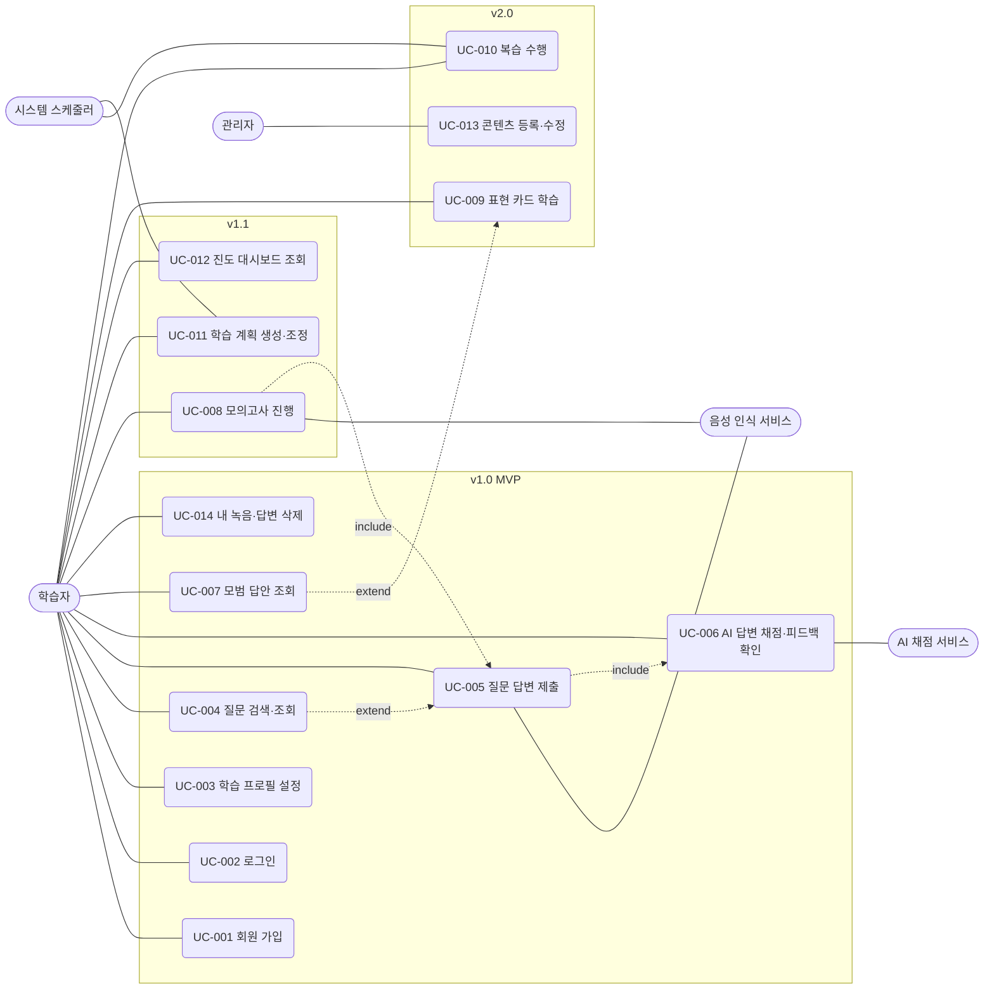

# 유즈케이스 문서

| 항목 | 내용 |
|:---|:---|
| 사업명 | OPIc 학습 앱 |
| 분석 범위 | 요구사항정의서 FR-001~FR-012 전체 (MVP v1.0 / v1.1 / v2.0 구분 표기), 음성 삭제(SR-004) 보완 UC 1건 |
| UC 총 건수 | 14건 |
| FR 연계 건수 | 12건 |
| 작성 일시 | 2026-09-30 |
| 버전 | v0.1 |

> 서비스 카탈로그(SC)는 아직 작성되지 않아 SC-ID는 `—`로 두었다. <!-- TODO: ai-dlc-service-catalog 작성 후 SC-ID 반영 -->
> 우선순위: 상 = v1.0 MVP, 중 = v1.1, 하 = v2.0 (MVP범위정의서 기준)

---

## 1. 액터 목록

| 액터명 | 유형 | 역할 설명 | 관련 UC |
|:---|:---:|:---|:---|
| 학습자 | 주 액터 | OPIc 응시 준비자. 질문 연습, 피드백 확인, 학습 관리를 수행한다. | UC-001~UC-012, UC-014 |
| 관리자 | 주 액터 | 질문·모범 답안·표현 콘텐츠를 등록·관리한다. | UC-013 |
| AI 채점 서비스 | 외부 시스템 | LLM API. 답변을 분석해 등급·점수·코멘트를 생성한다. | UC-006 |
| 음성 인식 서비스 | 외부 시스템 | STT API. 녹음 음성을 텍스트로 전사한다. | UC-005, UC-008 |
| 시스템 스케줄러 | 시스템 | 복습 일정과 학습 알림 대상을 산정한다. | UC-010, UC-011 |

---

## 2. 유즈케이스 목록

| UC-ID | 유즈케이스명 | 주요 액터 | 연관 FR | SC-ID | 우선순위 |
|:---|:---|:---|:---|:---|:---:|
| UC-001 | 회원 가입 | 학습자 | FR-001 | — | 상 |
| UC-002 | 로그인 | 학습자 | FR-001 | — | 상 |
| UC-003 | 학습 프로필 설정 | 학습자 | FR-002 | — | 상 |
| UC-004 | 질문 검색·조회 | 학습자 | FR-003 | — | 상 |
| UC-005 | 질문 답변 제출 | 학습자, 음성 인식 서비스 | FR-004 | — | 상 |
| UC-006 | AI 답변 채점·피드백 확인 | 학습자, AI 채점 서비스 | FR-006 | — | 상 |
| UC-007 | 모범 답안 조회 | 학습자 | FR-007 | — | 상 |
| UC-014 | 내 녹음·답변 삭제 | 학습자 | (SR-004, DR-004) | — | 상 |
| UC-008 | 모의고사 진행 | 학습자, 음성 인식 서비스 | FR-005 | — | 중 |
| UC-011 | 학습 계획 생성·조정 | 학습자, 시스템 스케줄러 | FR-010 | — | 중 |
| UC-012 | 진도 대시보드 조회 | 학습자 | FR-011 | — | 중 |
| UC-009 | 표현 카드 학습 | 학습자 | FR-008 | — | 하 |
| UC-010 | 복습 수행 | 학습자, 시스템 스케줄러 | FR-009 | — | 하 |
| UC-013 | 콘텐츠 등록·수정 | 관리자 | FR-012 | — | 하 |

---

## 3. 유즈케이스 상세

### UC-001: 회원 가입

| 항목 | 내용 |
|:---|:---|
| 액터 | 학습자 |
| 사전 조건 | 비로그인 상태 |
| 사후 조건 | 계정이 생성되고 인증된 세션이 시작된다. |
| 연관 FR | FR-001 |

**기본 흐름 (주요 성공 시나리오)**

| 단계 | 액터/시스템 | 처리 내용 |
|:---:|:---:|:---|
| 1 | 학습자 | 가입 화면에서 이메일과 비밀번호를 입력한다. |
| 2 | 학습자 | 이용약관 및 음성 데이터 수집·이용에 동의한다. |
| 3 | 시스템 | 입력값 형식과 이메일 중복 여부를 검증한다. |
| 4 | 시스템 | 계정을 생성하고 인증 메일을 발송한다. |
| 5 | 학습자 | 인증 링크를 클릭해 이메일을 확인한다. |
| 6 | 시스템 | 가입을 완료하고 학습 프로필 설정(UC-003)으로 이동시킨다. |

**대안 흐름**

- 2a. 학습자가 필수 동의 항목을 거부하면 가입을 진행할 수 없다.
- 5a. 인증 메일 만료 시 학습자가 재발송을 요청한다.

**예외 흐름**

| 예외 조건 | 처리 내용 |
|:---|:---|
| 이미 가입된 이메일 | "이미 사용 중인 이메일" 메시지를 표시하고 로그인 화면을 안내한다. |
| 비밀번호 정책 위반 | 위반 항목을 안내하고 재입력을 요청한다. |

---

### UC-002: 로그인

| 항목 | 내용 |
|:---|:---|
| 액터 | 학습자 |
| 사전 조건 | 가입 완료된 계정이 있다. |
| 사후 조건 | 인증된 세션이 시작된다. |
| 연관 FR | FR-001 |

**기본 흐름 (주요 성공 시나리오)**

| 단계 | 액터/시스템 | 처리 내용 |
|:---:|:---:|:---|
| 1 | 학습자 | 이메일과 비밀번호를 입력하고 로그인을 요청한다. |
| 2 | 시스템 | 인증 정보를 검증한다. |
| 3 | 시스템 | 세션을 발급한다. |
| 4 | 시스템 | 프로필 미설정 시 UC-003으로, 설정 완료 시 홈 화면으로 이동시킨다. |

**대안 흐름**

- 1a. 학습자가 "비밀번호 재설정"을 선택하면 재설정 메일을 발송한다.
- 1b. 로그아웃을 요청하면 세션을 폐기하고 로그인 화면으로 이동한다.

**예외 흐름**

| 예외 조건 | 처리 내용 |
|:---|:---|
| 이메일/비밀번호 불일치 | 오류 메시지를 표시한다(계정 존재 여부는 노출하지 않음). |
| 반복 실패 (횟수 초과) | 일정 시간 로그인을 제한한다. <!-- TODO: 제한 횟수·시간 확인 필요 --> |
| 이메일 미인증 계정 | 인증 메일 재발송을 안내한다. |

---

### UC-003: 학습 프로필 설정

| 항목 | 내용 |
|:---|:---|
| 액터 | 학습자 |
| 사전 조건 | 로그인 상태 |
| 사후 조건 | 목표 등급·시험일·관심 주제가 저장된다. |
| 연관 FR | FR-002 |

**기본 흐름 (주요 성공 시나리오)**

| 단계 | 액터/시스템 | 처리 내용 |
|:---:|:---:|:---|
| 1 | 학습자 | 프로필 설정 화면을 연다. |
| 2 | 학습자 | 현재 수준과 목표 등급(예: IM/IH/AL)을 선택한다. |
| 3 | 학습자 | 시험 예정일(선택)과 관심 주제(Background Survey)를 선택한다. |
| 4 | 시스템 | 입력값을 검증하고 저장한다. |
| 5 | 시스템 | 저장 완료 후 질문 은행(UC-004)으로 안내한다. |

**대안 흐름**

- 3a. 시험일을 입력하지 않으면 기간 제한 없는 학습으로 처리한다.
- 1a. 이후 언제든 프로필을 수정할 수 있으며, 학습 계획이 있으면 재조정 여부를 묻는다(UC-011).

**예외 흐름**

| 예외 조건 | 처리 내용 |
|:---|:---|
| 과거 날짜를 시험일로 입력 | 오류 메시지를 표시하고 재입력을 요청한다. |
| 필수 항목(목표 등급) 미선택 | 저장을 막고 필수 항목을 안내한다. |

---

### UC-004: 질문 검색·조회

| 항목 | 내용 |
|:---|:---|
| 액터 | 학습자 |
| 사전 조건 | 로그인 상태, 공개된 질문이 존재한다. |
| 사후 조건 | 조건에 맞는 질문 목록이 표시된다. |
| 연관 FR | FR-003 |

**기본 흐름 (주요 성공 시나리오)**

| 단계 | 액터/시스템 | 처리 내용 |
|:---:|:---:|:---|
| 1 | 학습자 | 질문 은행 화면을 연다. |
| 2 | 시스템 | 프로필의 관심 주제 기준으로 기본 목록을 표시한다. |
| 3 | 학습자 | 주제·난이도·유형 필터 또는 키워드를 지정한다. |
| 4 | 시스템 | 조건에 맞는 질문을 조회해 목록으로 표시한다. |
| 5 | 학습자 | 질문을 선택해 연습을 시작한다(UC-005). |

**대안 흐름**

- 4a. 답변 완료 여부(미답변/답변함)로 목록을 추가 필터링한다.

**예외 흐름**

| 예외 조건 | 처리 내용 |
|:---|:---|
| 조건에 맞는 질문 없음 | "조건에 맞는 질문이 없습니다" 안내와 필터 초기화 옵션을 제공한다. |
| 조회 실패 | 오류 메시지와 재시도 버튼을 표시한다. |

---

### UC-005: 질문 답변 제출

| 항목 | 내용 |
|:---|:---|
| 액터 | 학습자, 음성 인식 서비스 |
| 사전 조건 | 로그인 상태, 질문을 선택함, 음성 수집 동의 완료(음성 답변 시) |
| 사후 조건 | 답변(음성·전사 텍스트 또는 텍스트)이 저장되고 채점 요청이 접수된다. |
| 연관 FR | FR-004 |

**기본 흐름 (주요 성공 시나리오)**

| 단계 | 액터/시스템 | 처리 내용 |
|:---:|:---:|:---|
| 1 | 시스템 | 선택한 질문 텍스트를 표시하고 질문 음성을 재생한다. |
| 2 | 학습자 | 마이크 권한을 허용하고 녹음을 시작한다. |
| 3 | 학습자 | 답변 후 녹음을 종료하고 다시 들어본다. |
| 4 | 학습자 | 답변 제출을 요청한다. |
| 5 | 시스템 | 음성 파일을 저장하고 음성 인식 서비스로 전사를 요청한다. |
| 6 | 음성 인식 서비스 | 전사 텍스트를 반환한다. |
| 7 | 시스템 | 답변 이력을 저장하고 AI 채점(UC-006)을 요청한다. |

**대안 흐름**

- 2a. 마이크를 사용할 수 없으면 텍스트 입력으로 답변한다(전사 단계 생략).
- 3a. 녹음이 마음에 들지 않으면 다시 녹음한다.

**예외 흐름**

| 예외 조건 | 처리 내용 |
|:---|:---|
| 마이크 권한 거부 | 권한 허용 방법을 안내하고 텍스트 입력을 제안한다. |
| 녹음 시간 최대치 초과 | 자동으로 녹음을 종료하고 안내한다. <!-- TODO: 최대 녹음 시간 확인 필요 --> |
| 전사 실패 | 재시도를 안내하고 실패 시 텍스트 입력으로 전환한다. |
| 일일 제출 한도 초과 | 한도 안내 후 제출을 차단한다(CR-004). |

---

### UC-006: AI 답변 채점·피드백 확인

| 항목 | 내용 |
|:---|:---|
| 액터 | 학습자, AI 채점 서비스 |
| 사전 조건 | 제출된 답변이 있다(UC-005 완료). |
| 사후 조건 | 예상 등급·항목별 점수·개선 코멘트가 저장되고 표시된다. |
| 연관 FR | FR-006 |

**기본 흐름 (주요 성공 시나리오)**

| 단계 | 액터/시스템 | 처리 내용 |
|:---:|:---:|:---|
| 1 | 시스템 | 답변 전사문, 질문, 학습자 목표 등급을 AI 채점 서비스에 전달한다. |
| 2 | AI 채점 서비스 | 유창성·어휘·문법·내용 구성 기준으로 분석해 점수와 코멘트를 반환한다. |
| 3 | 시스템 | 결과를 저장한다. |
| 4 | 학습자 | 피드백 화면에서 예상 등급, 항목별 점수, 개선 코멘트를 확인한다. |
| 5 | 학습자 | 교정본과 모범 답안 비교(UC-007)로 이동할 수 있다. |

**대안 흐름**

- 4a. 처리가 지연되면 진행 상태를 표시하고 완료 시 알림을 표시한다(목표 30초 이내, PR-002).
- 5a. 학습자가 같은 질문에 다시 답변하여 재채점을 요청한다.

**예외 흐름**

| 예외 조건 | 처리 내용 |
|:---|:---|
| AI 서비스 오류/시간 초과 | 오류 안내 후 재시도를 제공하고 제출 횟수는 차감하지 않는다. |
| 답변이 너무 짧거나 무의미 | 채점 대신 "답변이 너무 짧습니다" 안내를 표시한다. |
| 응답 형식 오류 | 재요청하고 반복 실패 시 오류 처리한다. |

---

### UC-007: 모범 답안 조회

| 항목 | 내용 |
|:---|:---|
| 액터 | 학습자 |
| 사전 조건 | 로그인 상태, 질문에 모범 답안이 등록되어 있다. |
| 사후 조건 | 모범 답안이 표시된다. |
| 연관 FR | FR-007 |

**기본 흐름 (주요 성공 시나리오)**

| 단계 | 액터/시스템 | 처리 내용 |
|:---:|:---:|:---|
| 1 | 학습자 | 질문 상세 또는 피드백 화면에서 모범 답안 보기를 선택한다. |
| 2 | 시스템 | 목표 등급에 맞는 모범 답안 스크립트를 조회한다. |
| 3 | 시스템 | 내 답변(교정본)과 모범 답안을 나란히 표시한다. |
| 4 | 학습자 | 핵심 표현을 확인하고 필요 시 표현 카드로 저장한다(UC-009). |

**대안 흐름**

- 2a. 등급별 답안이 여러 개면 학습자가 등급을 바꿔 볼 수 있다.

**예외 흐름**

| 예외 조건 | 처리 내용 |
|:---|:---|
| 모범 답안 미등록 | "준비 중인 콘텐츠입니다" 안내를 표시한다. |
| 아직 답변하지 않은 질문 | 답변 후 확인을 권장하는 안내를 표시한다(정책에 따라 조회 허용 여부 결정). <!-- TODO: 확인 필요 --> |

---

### UC-014: 내 녹음·답변 삭제

| 항목 | 내용 |
|:---|:---|
| 액터 | 학습자 |
| 사전 조건 | 로그인 상태, 저장된 답변 이력이 있다. |
| 사후 조건 | 선택한 녹음 파일과 답변 이력이 삭제된다. |
| 연관 FR | (SR-004, DR-004 지원 — FR 미연계) |

**기본 흐름 (주요 성공 시나리오)**

| 단계 | 액터/시스템 | 처리 내용 |
|:---:|:---:|:---|
| 1 | 학습자 | 답변 이력 화면에서 삭제할 항목(또는 전체)을 선택한다. |
| 2 | 시스템 | 삭제 확인을 요청한다. |
| 3 | 학습자 | 삭제를 확정한다. |
| 4 | 시스템 | 음성 파일과 관련 전사·피드백 데이터를 삭제한다. |
| 5 | 시스템 | 삭제 완료를 안내한다. |

**대안 흐름**

- 3a. 학습자가 취소하면 삭제하지 않고 목록으로 돌아간다.

**예외 흐름**

| 예외 조건 | 처리 내용 |
|:---|:---|
| 삭제 실패 | 오류를 안내하고 재시도를 제공한다. |
| 타 사용자 데이터 접근 시도 | 접근을 거부한다(SR-002). |

---

### UC-008: 모의고사 진행

| 항목 | 내용 |
|:---|:---|
| 액터 | 학습자, 음성 인식 서비스 |
| 사전 조건 | 로그인 상태, 학습 프로필이 설정되어 있다. |
| 사후 조건 | 모의고사 답변과 종합 결과가 저장된다. |
| 연관 FR | FR-005 |

**기본 흐름 (주요 성공 시나리오)**

| 단계 | 액터/시스템 | 처리 내용 |
|:---:|:---:|:---|
| 1 | 학습자 | 모의고사 시작을 요청한다. |
| 2 | 시스템 | 프로필 기반으로 문항(예: 15문항)을 구성한다. <!-- TODO: 문항 구성 규칙 확인 필요 --> |
| 3 | 시스템 | 문항을 순서대로 재생하고 제한 시간을 표시한다. |
| 4 | 학습자 | 각 문항에 음성으로 답변한다(UC-005 절차 준용). |
| 5 | 시스템 | 전 문항 종료 후 AI 채점을 수행한다(UC-006 준용). |
| 6 | 학습자 | 종합 예상 등급과 문항별 결과를 확인한다. |

**대안 흐름**

- 4a. 학습자가 문항을 건너뛰면 미응답으로 기록한다.
- 3a. 각 문항의 질문은 실전과 동일하게 재청취 횟수를 제한한다. <!-- TODO: 확인 필요 -->

**예외 흐름**

| 예외 조건 | 처리 내용 |
|:---|:---|
| 진행 중 네트워크 끊김/새로고침 | 진행 상태를 저장하고 재접속 시 이어서 진행하거나 중단 처리한다. |
| 마이크 오류 | 오류 안내 후 해당 문항을 재시도하거나 건너뛴다. |

---

### UC-011: 학습 계획 생성·조정

| 항목 | 내용 |
|:---|:---|
| 액터 | 학습자, 시스템 스케줄러 |
| 사전 조건 | 학습 프로필이 설정되어 있다. |
| 사후 조건 | 주간/일일 학습 계획이 저장된다. |
| 연관 FR | FR-010 |

**기본 흐름 (주요 성공 시나리오)**

| 단계 | 액터/시스템 | 처리 내용 |
|:---:|:---:|:---|
| 1 | 학습자 | 학습 계획 화면에서 주당 학습 가능 시간을 입력한다. |
| 2 | 시스템 스케줄러 | 목표 등급, 시험일, 취약 영역을 반영해 주간/일일 계획을 산정한다. |
| 3 | 시스템 | 계획을 표시한다. |
| 4 | 학습자 | 계획을 확인하고 저장한다. |

**대안 흐름**

- 4a. 학습자가 항목을 직접 추가·삭제·이동해 조정한다.
- 2a. 프로필 변경 또는 진도 지연 시 계획 재산정을 제안한다.

**예외 흐름**

| 예외 조건 | 처리 내용 |
|:---|:---|
| 시험일까지 기간이 너무 짧음 | 달성 가능성이 낮음을 안내하고 우선순위 중심 계획을 제안한다. |
| 학습 가능 시간 미입력 | 기본값을 적용하고 안내한다. |

---

### UC-012: 진도 대시보드 조회

| 항목 | 내용 |
|:---|:---|
| 액터 | 학습자 |
| 사전 조건 | 로그인 상태 |
| 사후 조건 | 학습 통계가 표시된다. |
| 연관 FR | FR-011 |

**기본 흐름 (주요 성공 시나리오)**

| 단계 | 액터/시스템 | 처리 내용 |
|:---:|:---:|:---|
| 1 | 학습자 | 대시보드 화면을 연다. |
| 2 | 시스템 | 학습 시간, 답변 수, 점수 추이, 목표 대비 달성도를 집계한다. |
| 3 | 시스템 | 취약 영역(항목별 낮은 점수)을 도출한다. |
| 4 | 학습자 | 조회 기간을 변경하며 통계를 확인한다. |

**대안 흐름**

- 4a. 취약 영역에서 관련 질문 연습(UC-004)으로 바로 이동한다.

**예외 흐름**

| 예외 조건 | 처리 내용 |
|:---|:---|
| 학습 이력 없음 | 빈 상태 안내와 첫 연습 시작 버튼을 표시한다. |
| 집계 실패 | 오류 메시지와 재시도를 제공한다. |

---

### UC-009: 표현 카드 학습

| 항목 | 내용 |
|:---|:---|
| 액터 | 학습자 |
| 사전 조건 | 로그인 상태 |
| 사후 조건 | 표현 카드가 저장·학습 처리된다. |
| 연관 FR | FR-008 |

**기본 흐름 (주요 성공 시나리오)**

| 단계 | 액터/시스템 | 처리 내용 |
|:---:|:---:|:---|
| 1 | 학습자 | 주제별 표현 목록 또는 모범 답안에서 표현을 선택한다. |
| 2 | 학습자 | 카드로 저장한다. |
| 3 | 시스템 | 카드를 내 카드 목록에 추가한다. |
| 4 | 학습자 | 카드 학습 모드에서 표현·의미·예문을 확인한다. |

**대안 흐름**

- 2a. 학습자가 직접 표현과 메모를 입력해 카드를 만든다.

**예외 흐름**

| 예외 조건 | 처리 내용 |
|:---|:---|
| 이미 저장된 표현 | 중복 저장을 막고 기존 카드를 안내한다. |
| 저장 실패 | 오류 안내와 재시도를 제공한다. |

---

### UC-010: 복습 수행

| 항목 | 내용 |
|:---|:---|
| 액터 | 학습자, 시스템 스케줄러 |
| 사전 조건 | 저장된 표현 카드 또는 답변 이력이 있다. |
| 사후 조건 | 복습 결과에 따라 다음 복습 일정이 갱신된다. |
| 연관 FR | FR-009 |

**기본 흐름 (주요 성공 시나리오)**

| 단계 | 액터/시스템 | 처리 내용 |
|:---:|:---:|:---|
| 1 | 시스템 스케줄러 | 오늘 복습할 카드·질문 목록을 산정한다. |
| 2 | 학습자 | 복습 화면에서 항목을 하나씩 확인한다. |
| 3 | 학습자 | 기억 정도(어려움/보통/쉬움)를 선택한다. |
| 4 | 시스템 스케줄러 | 선택에 따라 다음 복습 일정을 갱신한다. |

**대안 흐름**

- 1a. 복습 대상이 없으면 새 카드 학습을 제안한다.

**예외 흐름**

| 예외 조건 | 처리 내용 |
|:---|:---|
| 복습 도중 이탈 | 처리한 항목까지만 반영하고 나머지는 유지한다. |
| 일정 갱신 실패 | 오류 안내 후 재시도한다. |

---

### UC-013: 콘텐츠 등록·수정

| 항목 | 내용 |
|:---|:---|
| 액터 | 관리자 |
| 사전 조건 | 관리자 권한으로 로그인 |
| 사후 조건 | 질문·모범 답안·표현 데이터가 저장된다. |
| 연관 FR | FR-012 |

**기본 흐름 (주요 성공 시나리오)**

| 단계 | 액터/시스템 | 처리 내용 |
|:---:|:---:|:---|
| 1 | 관리자 | 콘텐츠 관리 화면에서 등록 또는 수정할 항목을 선택한다. |
| 2 | 관리자 | 주제, 난이도, 유형, 질문 텍스트/음성, 모범 답안, 핵심 표현을 입력한다. |
| 3 | 시스템 | 필수 항목과 형식을 검증한다. |
| 4 | 시스템 | 저장하고 공개 여부를 설정한다. |

**대안 흐름**

- 4a. 관리자가 콘텐츠를 비공개 처리하면 학습자 목록에서 제외된다.
- 2a. 여러 건을 파일(CSV 등)로 일괄 등록한다. <!-- TODO: 확인 필요 -->

**예외 흐름**

| 예외 조건 | 처리 내용 |
|:---|:---|
| 필수 항목 누락 | 저장을 막고 누락 항목을 안내한다. |
| 관리자 권한 없음 | 접근을 거부한다. |
| 이미 답변 이력이 있는 질문 삭제 | 삭제 대신 비공개 처리를 안내한다. |

---

## 4. 유즈케이스 다이어그램

---

## 5. FR-UC 커버리지 매핑

| FR-ID | 기능명 | 연계 UC-ID | 커버 상태 |
|:---|:---|:---|:---:|
| FR-001 | 회원 가입/로그인 | UC-001, UC-002 | ✅ |
| FR-002 | 학습 프로필 설정 | UC-003 | ✅ |
| FR-003 | 질문 은행 조회 | UC-004 | ✅ |
| FR-004 | 질문 연습 | UC-005 | ✅ |
| FR-005 | 모의고사 | UC-008 | ✅ |
| FR-006 | AI 답변 채점·피드백 | UC-006 | ✅ |
| FR-007 | 모범 답안·스크립트 학습 | UC-007 | ✅ |
| FR-008 | 핵심 표현 카드 | UC-009 | ✅ |
| FR-009 | 복습 스케줄링 | UC-010 | ✅ |
| FR-010 | 학습 계획 생성 | UC-011 | ✅ |
| FR-011 | 진도·성취 대시보드 | UC-012 | ✅ |
| FR-012 | 콘텐츠 관리(관리자) | UC-013 | ✅ |

**커버리지**: 12건 / 12건 (100%)

> 참고: UC-014(내 녹음·답변 삭제)는 FR이 아니라 SR-004·DR-004를 지원하는 UC이다. FR로 승격할지 검토가 필요하다. <!-- TODO: 확인 필요 -->

---

## 문서 버전 이력

| 버전 | 일자 | 작성자 | 변경 내용 |
|:---|:---|:---|:---|
| v0.1 | 2026-09-30 | 초안 작성 | 최초 생성 |
