# 클래스 설계서

| 항목 | 내용 |
|:---|:---|
| 사업명 | OPIc 학습 앱 |
| 기술 스택 | TypeScript, Next.js (App Router, Route Handler), Supabase (PostgreSQL/Auth/Storage), Vercel <!-- TODO: 확인 필요 (요구사항정의서 기술스택 기준) --> |
| 클래스 수 | 55개 (Controller 10 + 공통 2 / Service 12 / Repository 11 / Infrastructure 4 / Domain 16) |
| 작성 일시 | 2026-09-30 |
| 버전 | v0.1 |

> 기준 문서: `유즈케이스_OPIc_학습_앱_20260930.md`, `API설계서_OPIc_학습_앱_20260930.md`(operationId 48개), `데이터설계서_OPIc_학습_앱_20260930.md`, `서비스분류_OPIc_학습_앱_20260930.md`
>
> **설계 규칙**
> - 레이어: `Controller → Service → Repository / Infrastructure → Domain` (역방향 의존 금지). 타입은 TypeScript 표기이다.
> - Controller는 `app/api/v1/**/route.ts`의 얇은 어댑터가 호출하는 클래스이다. `route.ts`는 파싱과 응답 변환만 하고, 인증·권한은 `AuthGuard`, 오류 변환은 `ApiError`로 통일한다.
> - Repository와 Infrastructure 클라이언트는 인터페이스로 정의하고 구현체는 `Impl` 접미사(`XxxRepositoryImpl` 등, Supabase 사용)로 둔다. 구현체는 인터페이스와 1:1이므로 별도 CLS-ID를 두지 않는다.
> - 요청/응답 DTO는 API설계서의 `components/schemas`와 같은 이름을 쓴다(예: `SubmitAnswerRequest`, `AnswerPage`). 별도 클래스로 채번하지 않는다.
> - 모듈은 서비스 카탈로그(SC) 기준이다: member(SC-001), content(SC-002), practice(SC-003), feedback(SC-004), planner(SC-005), review(SC-006).
> - 열거형(Enum)은 데이터설계서 공통 코드와 동일하며 각 모듈 `domain/`에 둔다: `Grade`, `QuestionType`, `QuestionStatus`, `AnswerType`, `AnswerStatus`, `ExamStatus`, `PlanItemType`, `ReviewRating`, `Role`.
> - 사용자 소유 데이터는 Repository 조회 시 항상 `userId` 조건을 포함한다(SR-002). Supabase RLS와 이중으로 적용한다.

---

## 1. 클래스 목록

| CLS-ID | 클래스명 | 레이어 | 설명 | 연계 UC |
|:---|:---|:---:|:---|:---|
| CLS-001 | AuthGuard | Controller(공통) | JWT 검증, 인증 컨텍스트 생성, 관리자 권한 검사 | 전 UC |
| CLS-002 | ApiError | Controller(공통) | 공통 오류 타입(코드→HTTP 상태 매핑, Error 스키마 변환) | 전 UC |
| CLS-003 | AuthController | Controller | 가입·로그인·로그아웃·비밀번호 재설정·인증 메일 재발송 | UC-001, UC-002 |
| CLS-004 | UserController | Controller | 내 프로필, 학습 프로필 수정, AI 사용량, 통계 | UC-002, UC-003, UC-005, UC-012 |
| CLS-005 | QuestionController | Controller | 주제, 질문 조회, 모범 답안 조회 | UC-003, UC-004, UC-005, UC-007 |
| CLS-006 | AnswerController | Controller | 답변 제출·조회·삭제 | UC-005, UC-006, UC-014 |
| CLS-007 | FeedbackController | Controller | 피드백 조회, 재채점 요청 | UC-006, UC-007 |
| CLS-008 | MockExamController | Controller | 모의고사 시작·조회·문항 답변·건너뛰기·종료 | UC-008 |
| CLS-009 | StudyPlanController | Controller | 학습 계획 생성·조회, 항목 추가·수정·삭제 | UC-011 |
| CLS-010 | ExpressionCardController | Controller | 표현 조회, 표현 카드 CRUD, 복습 결과 기록 | UC-009, UC-010 |
| CLS-011 | AdminQuestionController | Controller | 관리자 질문·음성·모범 답안 관리 | UC-013 |
| CLS-012 | AdminExpressionController | Controller | 관리자 핵심 표현 관리 | UC-013 |
| CLS-013 | AuthService | Service | 가입·로그인 등 인증 유스케이스 | UC-001, UC-002 |
| CLS-014 | UserService | Service | 프로필 조회·학습 프로필 저장 | UC-003 |
| CLS-015 | QuestionService | Service | 주제·질문 검색·상세·모범 답안 조회 | UC-003, UC-004, UC-005, UC-007 |
| CLS-016 | AnswerService | Service | 답변 제출·전사·이력·삭제 | UC-005, UC-014 |
| CLS-017 | FeedbackService | Service | AI 채점 수행·피드백 조회·재채점 | UC-006 |
| CLS-018 | AiUsageService | Service | 일일 AI 사용 한도 확인·차감·환원 | UC-005, UC-006 |
| CLS-019 | MockExamService | Service | 모의고사 구성·진행·종료·채점 | UC-008 |
| CLS-020 | StudyPlanService | Service | 학습 계획 생성·조정 | UC-011 |
| CLS-021 | StatsService | Service | 진도·성취 통계 집계 | UC-012 |
| CLS-022 | ExpressionCardService | Service | 표현 조회, 카드 CRUD, 복습 일정 갱신 | UC-009, UC-010 |
| CLS-023 | AdminQuestionService | Service | 질문·음성·모범 답안 관리 | UC-013 |
| CLS-024 | AdminExpressionService | Service | 핵심 표현 관리 | UC-013 |
| CLS-025 | UserRepository | Repository | 사용자 프로필(관심 주제 포함) 영속화 | UC-001~003 |
| CLS-026 | TopicRepository | Repository | 주제 마스터 조회 | UC-003, UC-004 |
| CLS-027 | QuestionRepository | Repository | 질문 검색·저장·삭제 | UC-004, UC-008, UC-013 |
| CLS-028 | ModelAnswerRepository | Repository | 모범 답안 조회·저장·삭제 | UC-007, UC-013 |
| CLS-029 | ExpressionRepository | Repository | 핵심 표현 조회·저장·삭제 | UC-009, UC-013 |
| CLS-030 | AnswerRepository | Repository | 답변 이력 영속화·삭제·집계 | UC-005, UC-006, UC-012, UC-014 |
| CLS-031 | FeedbackRepository | Repository | 피드백 영속화·점수 집계 | UC-006, UC-012 |
| CLS-032 | AiUsageRepository | Repository | 일일 AI 사용량 원자적 증감 | UC-005, UC-006 |
| CLS-033 | MockExamRepository | Repository | 모의고사·문항 영속화 | UC-008 |
| CLS-034 | StudyPlanRepository | Repository | 학습 계획·항목 영속화 | UC-011 |
| CLS-035 | ExpressionCardRepository | Repository | 표현 카드·복습 이력 영속화 | UC-009, UC-010 |
| CLS-036 | SttClient | Infrastructure | 음성 인식(STT) 외부 API 연계 (IR-002) | UC-005, UC-008 |
| CLS-037 | ScoringClient | Infrastructure | AI 채점(LLM) 외부 API 연계 (IR-001) | UC-006 |
| CLS-038 | StorageClient | Infrastructure | 음성·질문 음성 파일 저장소 연계 (Supabase Storage) | UC-005, UC-013, UC-014 |
| CLS-039 | AuthClient | Infrastructure | 인증 제공자(Supabase Auth) 연계 | UC-001, UC-002 |
| CLS-040 | User | Domain | 학습자/관리자 프로필 엔터티 | UC-001~003 |
| CLS-041 | Topic | Domain | 주제 엔터티 | UC-003, UC-004 |
| CLS-042 | Question | Domain | 질문 엔터티 | UC-004, UC-013 |
| CLS-043 | ModelAnswer | Domain | 모범 답안 엔터티 | UC-007, UC-013 |
| CLS-044 | Expression | Domain | 핵심 표현 엔터티 | UC-009, UC-013 |
| CLS-045 | Answer | Domain | 답변 엔터티(상태 전이·음성 삭제 규칙 포함) | UC-005, UC-014 |
| CLS-046 | Feedback | Domain | AI 피드백 엔터티 | UC-006 |
| CLS-047 | AiUsageDaily | Domain | 일일 AI 사용량 엔터티 | UC-005, UC-006 |
| CLS-048 | MockExam | Domain | 모의고사 엔터티(집합 루트) | UC-008 |
| CLS-049 | MockExamItem | Domain | 모의고사 문항 엔터티 | UC-008 |
| CLS-050 | StudyPlan | Domain | 학습 계획 엔터티(집합 루트) | UC-011 |
| CLS-051 | StudyPlanItem | Domain | 학습 계획 항목 엔터티 | UC-011 |
| CLS-052 | ExpressionCard | Domain | 표현 카드 엔터티(복습 상태 포함) | UC-009, UC-010 |
| CLS-053 | ReviewLog | Domain | 복습 이력 엔터티 | UC-010 |
| CLS-054 | ReviewSchedulePolicy | Domain | 간격 반복 복습 주기 산정 정책 | UC-010 |
| CLS-055 | StudyPlanGenerator | Domain | 학습 계획 산정 도메인 서비스 | UC-011 |

---

## 2. 클래스 다이어그램

```mermaid
classDiagram
    direction TB

    %% ===== Controller 레이어 =====
    class AuthGuard
    class ApiError
    class AuthController
    class UserController
    class QuestionController
    class AnswerController
    class FeedbackController
    class MockExamController
    class StudyPlanController
    class ExpressionCardController
    class AdminQuestionController
    class AdminExpressionController

    %% ===== Service 레이어 =====
    class AuthService {
        +signUp()
        +login()
        +logout()
    }
    class UserService {
        +getMyProfile()
        +updateMyProfile()
    }
    class QuestionService {
        +listQuestions()
        +getQuestion()
        +listModelAnswers()
    }
    class AnswerService {
        +submitAnswer()
        +listMyAnswers()
        +deleteAnswer()
    }
    class FeedbackService {
        +scoreAnswer()
        +getFeedback()
        +requestFeedback()
    }
    class AiUsageService {
        +consume()
        +refund()
    }
    class MockExamService {
        +createMockExam()
        +submitMockExamAnswer()
        +updateMockExamStatus()
    }
    class StudyPlanService {
        +createStudyPlan()
        +updateStudyPlanItem()
    }
    class StatsService {
        +getMyStats()
    }
    class ExpressionCardService {
        +createExpressionCard()
        +createCardReview()
    }
    class AdminQuestionService {
        +createQuestion()
        +upsertModelAnswer()
    }
    class AdminExpressionService {
        +createExpression()
    }

    %% ===== Repository / Infrastructure 레이어 =====
    class UserRepository { <<interface>> }
    class TopicRepository { <<interface>> }
    class QuestionRepository { <<interface>> }
    class ModelAnswerRepository { <<interface>> }
    class ExpressionRepository { <<interface>> }
    class AnswerRepository { <<interface>> }
    class FeedbackRepository { <<interface>> }
    class AiUsageRepository { <<interface>> }
    class MockExamRepository { <<interface>> }
    class StudyPlanRepository { <<interface>> }
    class ExpressionCardRepository { <<interface>> }
    class SttClient { <<interface>> }
    class ScoringClient { <<interface>> }
    class StorageClient { <<interface>> }
    class AuthClient { <<interface>> }

    %% ===== Domain 레이어 =====
    class User
    class Topic
    class Question
    class ModelAnswer
    class Expression
    class Answer
    class Feedback
    class AiUsageDaily
    class MockExam
    class MockExamItem
    class StudyPlan
    class StudyPlanItem
    class ExpressionCard
    class ReviewLog
    class ReviewSchedulePolicy
    class StudyPlanGenerator

    %% Controller -> Service
    AuthController --> AuthService
    UserController --> UserService
    UserController --> StatsService
    UserController --> AiUsageService
    QuestionController --> QuestionService
    AnswerController --> AnswerService
    FeedbackController --> FeedbackService
    MockExamController --> MockExamService
    StudyPlanController --> StudyPlanService
    ExpressionCardController --> ExpressionCardService
    AdminQuestionController --> AdminQuestionService
    AdminExpressionController --> AdminExpressionService
    AuthGuard --> AuthClient
    AuthGuard --> UserRepository

    %% Service -> Service
    AnswerService --> FeedbackService
    AnswerService --> AiUsageService
    FeedbackService --> AiUsageService
    MockExamService --> AnswerService
    MockExamService --> FeedbackService

    %% Service -> Repository / Infrastructure
    AuthService --> AuthClient
    AuthService --> UserRepository
    UserService --> UserRepository
    UserService --> TopicRepository
    QuestionService --> QuestionRepository
    QuestionService --> TopicRepository
    QuestionService --> ModelAnswerRepository
    QuestionService --> AnswerRepository
    QuestionService --> UserRepository
    AnswerService --> AnswerRepository
    AnswerService --> QuestionRepository
    AnswerService --> UserRepository
    AnswerService --> StorageClient
    AnswerService --> SttClient
    FeedbackService --> FeedbackRepository
    FeedbackService --> AnswerRepository
    FeedbackService --> QuestionRepository
    FeedbackService --> UserRepository
    FeedbackService --> ScoringClient
    AiUsageService --> AiUsageRepository
    MockExamService --> MockExamRepository
    MockExamService --> QuestionRepository
    MockExamService --> UserRepository
    MockExamService --> FeedbackRepository
    StudyPlanService --> StudyPlanRepository
    StudyPlanService --> UserRepository
    StudyPlanService --> QuestionRepository
    StudyPlanService --> FeedbackRepository
    StudyPlanService --> StudyPlanGenerator
    StatsService --> AnswerRepository
    StatsService --> FeedbackRepository
    StatsService --> UserRepository
    ExpressionCardService --> ExpressionCardRepository
    ExpressionCardService --> ExpressionRepository
    ExpressionCardService --> ReviewSchedulePolicy
    AdminQuestionService --> QuestionRepository
    AdminQuestionService --> ModelAnswerRepository
    AdminQuestionService --> TopicRepository
    AdminQuestionService --> StorageClient
    AdminExpressionService --> ExpressionRepository

    %% Repository -> Domain
    UserRepository ..> User
    TopicRepository ..> Topic
    QuestionRepository ..> Question
    ModelAnswerRepository ..> ModelAnswer
    ExpressionRepository ..> Expression
    AnswerRepository ..> Answer
    FeedbackRepository ..> Feedback
    AiUsageRepository ..> AiUsageDaily
    MockExamRepository ..> MockExam
    StudyPlanRepository ..> StudyPlan
    ExpressionCardRepository ..> ExpressionCard
    ExpressionCardRepository ..> ReviewLog

    %% Domain 내부
    MockExam *-- MockExamItem
    StudyPlan *-- StudyPlanItem
    Question --> Topic
    ModelAnswer --> Question
    Answer --> Question
    Feedback --> Answer
    ExpressionCard --> Expression
    ReviewLog --> ExpressionCard
    ExpressionCard ..> ReviewSchedulePolicy
    StudyPlanGenerator ..> StudyPlan
```



> 모든 Controller는 `AuthGuard`(인증·권한)와 `ApiError`(오류 변환)를 공통 사용한다. 도식이 복잡해져 화살표는 생략했다. `AuthGuard`는 Controller 공통 계층이지만 인증 제공자와 프로필 조회를 위해 Infrastructure/Repository에 직접 의존한다(횡단 관심사 예외). <!-- TODO: 확인 필요 -->
> Repository·Infrastructure 인터페이스의 구현체(`XxxImpl`)는 도식에서 생략했다.

---

## 3. 클래스별 상세 정의

### CLS-001: AuthGuard

| 항목 | 내용 |
|:---|:---|
| 레이어 | Controller(공통) |
| 패키지 | `src/shared/auth` |
| 설명 | 요청의 Bearer 토큰을 검증해 `AuthContext(userId, role)`를 만들고 관리자 권한을 검사한다. |
| 연계 UC | 전 UC (SR-001) |

**속성**

| 접근제어자 | 속성명 | 타입 | 기본값 | 설명 |
|:---:|:---|:---|:---|:---|
| - | authClient | AuthClient | 주입 | 토큰 검증 |
| - | userRepository | UserRepository | 주입 | 역할(role) 조회 |

**메서드**

| 접근제어자 | 메서드명 | 파라미터 | 반환 타입 | 설명 |
|:---:|:---|:---|:---|:---|
| + | authenticate | request: Request | Promise\<AuthContext\> | 토큰 검증, 실패 시 401 |
| + | requireAdmin | ctx: AuthContext | void | role이 ADMIN이 아니면 403 |

**의존 관계**

| 관계 유형 | 대상 클래스 | 설명 |
|:---:|:---|:---|
| 연관 | AuthClient (CLS-039) | 토큰 검증 |
| 연관 | UserRepository (CLS-025) | 역할 조회 |

---

### CLS-002: ApiError

| 항목 | 내용 |
|:---|:---|
| 레이어 | Controller(공통) |
| 패키지 | `src/shared/errors` |
| 설명 | 도메인·서비스 오류를 API `Error` 스키마와 HTTP 상태로 변환하는 예외 타입. |
| 연계 UC | 전 UC |

**속성**

| 접근제어자 | 속성명 | 타입 | 기본값 | 설명 |
|:---:|:---|:---|:---|:---|
| + | code | string | | 오류 코드 (예: VALIDATION_ERROR, NOT_FOUND, QUOTA_EXCEEDED) |
| + | status | number | | HTTP 상태 코드 |
| + | message | string | | 사용자 메시지 |
| + | details | FieldError[] | [] | 필드별 사유 |

**메서드**

| 접근제어자 | 메서드명 | 파라미터 | 반환 타입 | 설명 |
|:---:|:---|:---|:---|:---|
| + | toResponse | | Response | Error 스키마 JSON 응답 생성 |
| + static | badRequest / unauthorized / forbidden / notFound / conflict / tooManyRequests | message, details? | ApiError | 상태별 팩토리 |

**의존 관계**

| 관계 유형 | 대상 클래스 | 설명 |
|:---:|:---|:---|
| — | — | 의존 대상 없음 |

---

### CLS-003: AuthController

| 항목 | 내용 |
|:---|:---|
| 레이어 | Controller |
| 패키지 | `src/modules/member/controller` |
| 설명 | `/auth/*` 엔드포인트 5개를 처리한다. |
| 연계 UC | UC-001, UC-002 |

**속성**

| 접근제어자 | 속성명 | 타입 | 기본값 | 설명 |
|:---:|:---|:---|:---|:---|
| - | authService | AuthService | 주입 | |
| - | authGuard | AuthGuard | 주입 | 로그아웃 인증 |

**메서드**

| 접근제어자 | 메서드명 | 파라미터 | 반환 타입 | 설명 |
|:---:|:---|:---|:---|:---|
| + | signUp | req: SignUpRequest | Promise\<SignUpResponse\> | POST /auth/signup |
| + | login | req: LoginRequest | Promise\<AuthSession\> | POST /auth/login |
| + | logout | request: Request | Promise\<void\> | POST /auth/logout |
| + | requestPasswordReset | req: EmailRequest | Promise\<void\> | POST /auth/password-reset (항상 202) |
| + | resendVerificationEmail | req: EmailRequest | Promise\<void\> | POST /auth/verification-email |

**의존 관계**

| 관계 유형 | 대상 클래스 | 설명 |
|:---:|:---|:---|
| 연관 | AuthService (CLS-013) | |
| 연관 | AuthGuard (CLS-001) | |

---

### CLS-004: UserController

| 항목 | 내용 |
|:---|:---|
| 레이어 | Controller |
| 패키지 | `src/modules/member/controller` |
| 설명 | `/users/me*` 엔드포인트 4개를 처리한다. |
| 연계 UC | UC-002, UC-003, UC-005, UC-012 |

**속성**

| 접근제어자 | 속성명 | 타입 | 기본값 | 설명 |
|:---:|:---|:---|:---|:---|
| - | userService | UserService | 주입 | |
| - | statsService | StatsService | 주입 | |
| - | aiUsageService | AiUsageService | 주입 | |

**메서드**

| 접근제어자 | 메서드명 | 파라미터 | 반환 타입 | 설명 |
|:---:|:---|:---|:---|:---|
| + | getMyProfile | ctx: AuthContext | Promise\<UserProfile\> | GET /users/me |
| + | updateMyProfile | ctx, req: ProfileUpdateRequest | Promise\<UserProfile\> | PUT /users/me/profile |
| + | getMyAiUsage | ctx | Promise\<AiUsage\> | GET /users/me/ai-usage |
| + | getMyStats | ctx, from?: Date, to?: Date | Promise\<StudyStats\> | GET /users/me/stats |

**의존 관계**

| 관계 유형 | 대상 클래스 | 설명 |
|:---:|:---|:---|
| 연관 | UserService (CLS-014), StatsService (CLS-021), AiUsageService (CLS-018) | |

---

### CLS-005: QuestionController

| 항목 | 내용 |
|:---|:---|
| 레이어 | Controller |
| 패키지 | `src/modules/content/controller` |
| 설명 | 주제·질문·모범 답안 조회 엔드포인트 4개를 처리한다. |
| 연계 UC | UC-003, UC-004, UC-005, UC-007 |

**속성**

| 접근제어자 | 속성명 | 타입 | 기본값 | 설명 |
|:---:|:---|:---|:---|:---|
| - | questionService | QuestionService | 주입 | |

**메서드**

| 접근제어자 | 메서드명 | 파라미터 | 반환 타입 | 설명 |
|:---:|:---|:---|:---|:---|
| + | listTopics | ctx | Promise\<Topic[]\> | GET /topics |
| + | listQuestions | ctx, query: QuestionSearchQuery | Promise\<QuestionPage\> | GET /questions |
| + | getQuestion | ctx, questionId: number | Promise\<Question\> | GET /questions/{questionId} |
| + | listModelAnswers | ctx, questionId, targetGrade?: Grade | Promise\<ModelAnswer[]\> | GET /questions/{questionId}/model-answers |

**의존 관계**

| 관계 유형 | 대상 클래스 | 설명 |
|:---:|:---|:---|
| 연관 | QuestionService (CLS-015) | |

---

### CLS-006: AnswerController

| 항목 | 내용 |
|:---|:---|
| 레이어 | Controller |
| 패키지 | `src/modules/practice/controller` |
| 설명 | `/answers*` 엔드포인트 5개를 처리한다(multipart 파싱 포함). |
| 연계 UC | UC-005, UC-006, UC-014 |

**속성**

| 접근제어자 | 속성명 | 타입 | 기본값 | 설명 |
|:---:|:---|:---|:---|:---|
| - | answerService | AnswerService | 주입 | |

**메서드**

| 접근제어자 | 메서드명 | 파라미터 | 반환 타입 | 설명 |
|:---:|:---|:---|:---|:---|
| + | submitAnswer | ctx, form: SubmitAnswerRequest | Promise\<Answer\> | POST /answers |
| + | listMyAnswers | ctx, query: AnswerListQuery | Promise\<AnswerPage\> | GET /answers |
| + | getAnswer | ctx, answerId | Promise\<Answer\> | GET /answers/{answerId} |
| + | deleteAnswer | ctx, answerId | Promise\<void\> | DELETE /answers/{answerId} |
| + | deleteMyAnswers | ctx, ids?: number[], all?: boolean | Promise\<void\> | DELETE /answers |

**의존 관계**

| 관계 유형 | 대상 클래스 | 설명 |
|:---:|:---|:---|
| 연관 | AnswerService (CLS-016) | |

---

### CLS-007: FeedbackController

| 항목 | 내용 |
|:---|:---|
| 레이어 | Controller |
| 패키지 | `src/modules/feedback/controller` |
| 설명 | 피드백 조회와 재채점 요청 엔드포인트를 처리한다. |
| 연계 UC | UC-006, UC-007 |

**속성**

| 접근제어자 | 속성명 | 타입 | 기본값 | 설명 |
|:---:|:---|:---|:---|:---|
| - | feedbackService | FeedbackService | 주입 | |

**메서드**

| 접근제어자 | 메서드명 | 파라미터 | 반환 타입 | 설명 |
|:---:|:---|:---|:---|:---|
| + | getFeedback | ctx, answerId | Promise\<Feedback\> | GET /answers/{answerId}/feedback |
| + | requestFeedback | ctx, answerId | Promise\<void\> | POST /answers/{answerId}/feedback (202) |

**의존 관계**

| 관계 유형 | 대상 클래스 | 설명 |
|:---:|:---|:---|
| 연관 | FeedbackService (CLS-017) | |

---

### CLS-008: MockExamController

| 항목 | 내용 |
|:---|:---|
| 레이어 | Controller |
| 패키지 | `src/modules/practice/controller` |
| 설명 | `/mock-exams*` 엔드포인트 6개를 처리한다. (v1.1) |
| 연계 UC | UC-008 |

**속성**

| 접근제어자 | 속성명 | 타입 | 기본값 | 설명 |
|:---:|:---|:---|:---|:---|
| - | mockExamService | MockExamService | 주입 | |

**메서드**

| 접근제어자 | 메서드명 | 파라미터 | 반환 타입 | 설명 |
|:---:|:---|:---|:---|:---|
| + | createMockExam | ctx, questionCount?: number | Promise\<MockExam\> | POST /mock-exams |
| + | listMockExams | ctx, page, size | Promise\<MockExamPage\> | GET /mock-exams |
| + | getMockExam | ctx, examId | Promise\<MockExam\> | GET /mock-exams/{examId} |
| + | updateMockExamStatus | ctx, examId, status | Promise\<MockExam\> | PATCH /mock-exams/{examId} |
| + | skipMockExamItem | ctx, examId, examItemId, skipped | Promise\<MockExamItem\> | PATCH .../items/{examItemId} |
| + | submitMockExamAnswer | ctx, examId, examItemId, form: SubmitExamAnswerRequest | Promise\<Answer\> | POST .../items/{examItemId}/answer |

**의존 관계**

| 관계 유형 | 대상 클래스 | 설명 |
|:---:|:---|:---|
| 연관 | MockExamService (CLS-019) | |

---

### CLS-009: StudyPlanController

| 항목 | 내용 |
|:---|:---|
| 레이어 | Controller |
| 패키지 | `src/modules/planner/controller` |
| 설명 | `/study-plans*` 엔드포인트 5개를 처리한다. (v1.1) |
| 연계 UC | UC-011 |

**속성**

| 접근제어자 | 속성명 | 타입 | 기본값 | 설명 |
|:---:|:---|:---|:---|:---|
| - | studyPlanService | StudyPlanService | 주입 | |

**메서드**

| 접근제어자 | 메서드명 | 파라미터 | 반환 타입 | 설명 |
|:---:|:---|:---|:---|:---|
| + | createStudyPlan | ctx, weeklyMinutes?: number | Promise\<StudyPlan\> | POST /study-plans |
| + | getCurrentStudyPlan | ctx | Promise\<StudyPlan\> | GET /study-plans/current |
| + | addStudyPlanItem | ctx, planId, req: StudyPlanItemCreateRequest | Promise\<StudyPlanItem\> | POST /study-plans/{planId}/items |
| + | updateStudyPlanItem | ctx, planId, planItemId, req | Promise\<StudyPlanItem\> | PATCH .../items/{planItemId} |
| + | deleteStudyPlanItem | ctx, planId, planItemId | Promise\<void\> | DELETE .../items/{planItemId} |

**의존 관계**

| 관계 유형 | 대상 클래스 | 설명 |
|:---:|:---|:---|
| 연관 | StudyPlanService (CLS-020) | |

---

### CLS-010: ExpressionCardController

| 항목 | 내용 |
|:---|:---|
| 레이어 | Controller |
| 패키지 | `src/modules/review/controller` |
| 설명 | 핵심 표현 조회, 표현 카드 CRUD, 복습 기록 엔드포인트 6개를 처리한다. (v2.0) |
| 연계 UC | UC-009, UC-010 |

**속성**

| 접근제어자 | 속성명 | 타입 | 기본값 | 설명 |
|:---:|:---|:---|:---|:---|
| - | expressionCardService | ExpressionCardService | 주입 | |

**메서드**

| 접근제어자 | 메서드명 | 파라미터 | 반환 타입 | 설명 |
|:---:|:---|:---|:---|:---|
| + | listExpressions | ctx, query: ExpressionSearchQuery | Promise\<ExpressionPage\> | GET /expressions |
| + | listMyExpressionCards | ctx, due?: boolean, page, size | Promise\<ExpressionCardPage\> | GET /expression-cards |
| + | createExpressionCard | ctx, req: ExpressionCardCreateRequest | Promise\<ExpressionCard\> | POST /expression-cards |
| + | updateExpressionCard | ctx, cardId, req | Promise\<ExpressionCard\> | PATCH /expression-cards/{cardId} |
| + | deleteExpressionCard | ctx, cardId | Promise\<void\> | DELETE /expression-cards/{cardId} |
| + | createCardReview | ctx, cardId, rating: ReviewRating | Promise\<ExpressionCard\> | POST /expression-cards/{cardId}/reviews |

**의존 관계**

| 관계 유형 | 대상 클래스 | 설명 |
|:---:|:---|:---|
| 연관 | ExpressionCardService (CLS-022) | |

---

### CLS-011: AdminQuestionController

| 항목 | 내용 |
|:---|:---|
| 레이어 | Controller |
| 패키지 | `src/modules/content/controller` |
| 설명 | `/admin/questions*` 엔드포인트 8개를 처리한다. 모든 메서드에서 `AuthGuard.requireAdmin`을 호출한다. (v2.0) |
| 연계 UC | UC-013 |

**속성**

| 접근제어자 | 속성명 | 타입 | 기본값 | 설명 |
|:---:|:---|:---|:---|:---|
| - | adminQuestionService | AdminQuestionService | 주입 | |
| - | authGuard | AuthGuard | 주입 | |

**메서드**

| 접근제어자 | 메서드명 | 파라미터 | 반환 타입 | 설명 |
|:---:|:---|:---|:---|:---|
| + | listAdminQuestions | ctx, query | Promise\<AdminQuestionPage\> | GET /admin/questions |
| + | createQuestion | ctx, req: QuestionUpsertRequest | Promise\<AdminQuestion\> | POST /admin/questions |
| + | getAdminQuestion | ctx, questionId | Promise\<AdminQuestion\> | GET /admin/questions/{questionId} |
| + | updateQuestion | ctx, questionId, req | Promise\<AdminQuestion\> | PUT /admin/questions/{questionId} |
| + | deleteQuestion | ctx, questionId | Promise\<void\> | DELETE /admin/questions/{questionId} |
| + | uploadQuestionAudio | ctx, questionId, audio: File | Promise\<AdminQuestion\> | PUT .../audio |
| + | upsertModelAnswer | ctx, questionId, targetGrade, req | Promise\<ModelAnswer\> | PUT .../model-answers/{targetGrade} |
| + | deleteModelAnswer | ctx, questionId, targetGrade | Promise\<void\> | DELETE .../model-answers/{targetGrade} |

**의존 관계**

| 관계 유형 | 대상 클래스 | 설명 |
|:---:|:---|:---|
| 연관 | AdminQuestionService (CLS-023), AuthGuard (CLS-001) | |

---

### CLS-012: AdminExpressionController

| 항목 | 내용 |
|:---|:---|
| 레이어 | Controller |
| 패키지 | `src/modules/content/controller` |
| 설명 | `/admin/expressions*` 엔드포인트 3개를 처리한다. (v2.0) |
| 연계 UC | UC-013 |

**속성**

| 접근제어자 | 속성명 | 타입 | 기본값 | 설명 |
|:---:|:---|:---|:---|:---|
| - | adminExpressionService | AdminExpressionService | 주입 | |
| - | authGuard | AuthGuard | 주입 | |

**메서드**

| 접근제어자 | 메서드명 | 파라미터 | 반환 타입 | 설명 |
|:---:|:---|:---|:---|:---|
| + | createExpression | ctx, req: ExpressionUpsertRequest | Promise\<Expression\> | POST /admin/expressions |
| + | updateExpression | ctx, expressionId, req | Promise\<Expression\> | PUT /admin/expressions/{expressionId} |
| + | deleteExpression | ctx, expressionId | Promise\<void\> | DELETE /admin/expressions/{expressionId} |

**의존 관계**

| 관계 유형 | 대상 클래스 | 설명 |
|:---:|:---|:---|
| 연관 | AdminExpressionService (CLS-024), AuthGuard (CLS-001) | |

---

### CLS-013: AuthService

| 항목 | 내용 |
|:---|:---|
| 레이어 | Service |
| 패키지 | `src/modules/member/service` |
| 설명 | 가입 시 인증 계정과 앱 프로필(`User`)을 함께 생성하고, 로그인 시 프로필 완료 여부를 판단한다. |
| 연계 UC | UC-001, UC-002 |

**속성**

| 접근제어자 | 속성명 | 타입 | 기본값 | 설명 |
|:---:|:---|:---|:---|:---|
| - | authClient | AuthClient | 주입 | |
| - | userRepository | UserRepository | 주입 | |

**메서드**

| 접근제어자 | 메서드명 | 파라미터 | 반환 타입 | 설명 |
|:---:|:---|:---|:---|:---|
| + | signUp | req: SignUpRequest | Promise\<SignUpResponse\> | 약관 동의 검증, 계정 생성, 프로필 생성(음성 동의 반영), 중복 이메일 시 409 |
| + | login | req: LoginRequest | Promise\<AuthSession\> | 인증, `profileCompleted` 산정, 반복 실패 제한 <!-- TODO: 확인 필요 (제한 정책) --> |
| + | logout | ctx: AuthContext | Promise\<void\> | 세션 폐기 |
| + | requestPasswordReset | email: string | Promise\<void\> | 계정 존재 여부와 무관하게 성공 처리 |
| + | resendVerificationEmail | email: string | Promise\<void\> | 인증 메일 재발송 |

**의존 관계**

| 관계 유형 | 대상 클래스 | 설명 |
|:---:|:---|:---|
| 연관 | AuthClient (CLS-039), UserRepository (CLS-025) | |
| 의존 | User (CLS-040) | 프로필 생성 |

---

### CLS-014: UserService

| 항목 | 내용 |
|:---|:---|
| 레이어 | Service |
| 패키지 | `src/modules/member/service` |
| 설명 | 프로필 조회와 학습 프로필(목표 등급·시험일·관심 주제) 저장. |
| 연계 UC | UC-003 |

**속성**

| 접근제어자 | 속성명 | 타입 | 기본값 | 설명 |
|:---:|:---|:---|:---|:---|
| - | userRepository | UserRepository | 주입 | |
| - | topicRepository | TopicRepository | 주입 | 관심 주제 ID 유효성 검증 |

**메서드**

| 접근제어자 | 메서드명 | 파라미터 | 반환 타입 | 설명 |
|:---:|:---|:---|:---|:---|
| + | getMyProfile | ctx | Promise\<UserProfile\> | 프로필과 관심 주제 조회 |
| + | updateMyProfile | ctx, req: ProfileUpdateRequest | Promise\<UserProfile\> | 시험일이 과거이면 400, 존재하지 않는 주제면 400 |

**의존 관계**

| 관계 유형 | 대상 클래스 | 설명 |
|:---:|:---|:---|
| 연관 | UserRepository (CLS-025), TopicRepository (CLS-026) | |
| 의존 | User (CLS-040) | `updateProfile` 호출 |

---

### CLS-015: QuestionService

| 항목 | 내용 |
|:---|:---|
| 레이어 | Service |
| 패키지 | `src/modules/content/service` |
| 설명 | 공개 질문만 노출하며 답변 여부(`answered`)를 결합한다. 모범 답안은 미지정 시 목표 등급 기준으로 조회한다. |
| 연계 UC | UC-003, UC-004, UC-005, UC-007 |

**속성**

| 접근제어자 | 속성명 | 타입 | 기본값 | 설명 |
|:---:|:---|:---|:---|:---|
| - | questionRepository | QuestionRepository | 주입 | |
| - | topicRepository | TopicRepository | 주입 | |
| - | modelAnswerRepository | ModelAnswerRepository | 주입 | |
| - | answerRepository | AnswerRepository | 주입 | 답변 여부 결합 |
| - | userRepository | UserRepository | 주입 | 목표 등급 조회 |

**메서드**

| 접근제어자 | 메서드명 | 파라미터 | 반환 타입 | 설명 |
|:---:|:---|:---|:---|:---|
| + | listTopics | | Promise\<Topic[]\> | 사용 중 주제 |
| + | listQuestions | ctx, query: QuestionSearchQuery | Promise\<QuestionPage\> | PUBLISHED만, `answered` 필터 처리 |
| + | getQuestion | ctx, questionId | Promise\<Question\> | 비공개 질문은 404 |
| + | listModelAnswers | ctx, questionId, targetGrade? | Promise\<ModelAnswer[]\> | 미등록 시 빈 배열 |

**의존 관계**

| 관계 유형 | 대상 클래스 | 설명 |
|:---:|:---|:---|
| 연관 | QuestionRepository (CLS-027), TopicRepository (CLS-026), ModelAnswerRepository (CLS-028), AnswerRepository (CLS-030), UserRepository (CLS-025) | |

---

### CLS-016: AnswerService

| 항목 | 내용 |
|:---|:---|
| 레이어 | Service |
| 패키지 | `src/modules/practice/service` |
| 설명 | 답변 제출 흐름(동의·한도 확인 → 음성 저장 → 접수)을 처리하고 전사·채점은 비동기로 이어 호출한다. 음성 삭제 규칙을 적용한다. |
| 연계 UC | UC-005, UC-014 |

**속성**

| 접근제어자 | 속성명 | 타입 | 기본값 | 설명 |
|:---:|:---|:---|:---|:---|
| - | answerRepository | AnswerRepository | 주입 | |
| - | questionRepository | QuestionRepository | 주입 | |
| - | userRepository | UserRepository | 주입 | 음성 수집 동의 확인 |
| - | storageClient | StorageClient | 주입 | |
| - | sttClient | SttClient | 주입 | |
| - | feedbackService | FeedbackService | 주입 | 전사 후 채점 호출 |
| - | aiUsageService | AiUsageService | 주입 | 한도 확인 |

**메서드**

| 접근제어자 | 메서드명 | 파라미터 | 반환 타입 | 설명 |
|:---:|:---|:---|:---|:---|
| + | submitAnswer | ctx, form: SubmitAnswerRequest | Promise\<Answer\> | 검증(동의·한도·형식) 후 저장, `processAnswer`를 비동기 예약. 비동기 실행 방식은 확인 필요 <!-- TODO: 확인 필요 (Next.js after(), Edge Function, 큐) --> |
| + | createExamAnswer | ctx, questionId, form | Promise\<Answer\> | 모의고사 문항 답변 저장(채점 미수행). `MockExamService`가 호출 |
| + | listMyAnswers | ctx, query: AnswerListQuery | Promise\<AnswerPage\> | 본인 이력, 음성은 서명 URL로 변환 |
| + | getAnswer | ctx, answerId | Promise\<Answer\> | 처리 상태 폴링 |
| + | deleteAnswer | ctx, answerId | Promise\<void\> | 음성 파일 → 답변 순으로 삭제 |
| + | deleteMyAnswers | ctx, ids?, all? | Promise\<void\> | ids 또는 all 중 하나만 허용 |
| - | processAnswer | answerId | Promise\<void\> | STT 전사 → 상태 갱신 → `FeedbackService.scoreAnswer`. 실패 시 FAILED 처리 |

**의존 관계**

| 관계 유형 | 대상 클래스 | 설명 |
|:---:|:---|:---|
| 연관 | AnswerRepository (CLS-030), QuestionRepository (CLS-027), UserRepository (CLS-025) | |
| 연관 | StorageClient (CLS-038), SttClient (CLS-036) | |
| 연관 | FeedbackService (CLS-017), AiUsageService (CLS-018) | |
| 의존 | Answer (CLS-045) | 상태 전이 |

---

### CLS-017: FeedbackService

| 항목 | 내용 |
|:---|:---|
| 레이어 | Service |
| 패키지 | `src/modules/feedback/service` |
| 설명 | 전사 텍스트·질문·목표 등급으로 채점을 요청하고 결과를 저장한다. `AnswerService`에 의존하지 않고 Repository를 직접 사용해 순환 의존을 피한다. |
| 연계 UC | UC-006 |

**속성**

| 접근제어자 | 속성명 | 타입 | 기본값 | 설명 |
|:---:|:---|:---|:---|:---|
| - | feedbackRepository | FeedbackRepository | 주입 | |
| - | answerRepository | AnswerRepository | 주입 | |
| - | questionRepository | QuestionRepository | 주입 | |
| - | userRepository | UserRepository | 주입 | 목표 등급 |
| - | scoringClient | ScoringClient | 주입 | |
| - | aiUsageService | AiUsageService | 주입 | |

**메서드**

| 접근제어자 | 메서드명 | 파라미터 | 반환 타입 | 설명 |
|:---:|:---|:---|:---|:---|
| + | scoreAnswer | answerId | Promise\<Feedback\> | 한도 차감 → 채점 → 저장 → 상태 SCORED. 너무 짧은 답변은 채점 없이 안내 오류 |
| + | getFeedback | ctx, answerId | Promise\<Feedback\> | 본인 답변만, 채점 전이면 404 |
| + | requestFeedback | ctx, answerId | Promise\<void\> | FAILED 또는 재답변 건 재채점 접수(202). 진행 중이면 409 |

**의존 관계**

| 관계 유형 | 대상 클래스 | 설명 |
|:---:|:---|:---|
| 연관 | FeedbackRepository (CLS-031), AnswerRepository (CLS-030), QuestionRepository (CLS-027), UserRepository (CLS-025) | |
| 연관 | ScoringClient (CLS-037), AiUsageService (CLS-018) | |
| 의존 | Feedback (CLS-046), Answer (CLS-045) | |

---

### CLS-018: AiUsageService

| 항목 | 내용 |
|:---|:---|
| 레이어 | Service |
| 패키지 | `src/modules/feedback/service` |
| 설명 | 사용자별 일일 AI 호출 한도(CR-004)를 원자적으로 확인·차감하고, 실패 시 환원한다. |
| 연계 UC | UC-005, UC-006 |

**속성**

| 접근제어자 | 속성명 | 타입 | 기본값 | 설명 |
|:---:|:---|:---|:---|:---|
| - | aiUsageRepository | AiUsageRepository | 주입 | |
| - | dailyLimit | number | 환경설정 | 일일 한도 <!-- TODO: 확인 필요 (한도 값) --> |

**메서드**

| 접근제어자 | 메서드명 | 파라미터 | 반환 타입 | 설명 |
|:---:|:---|:---|:---|:---|
| + | getMyAiUsage | ctx | Promise\<AiUsage\> | 오늘 사용량·한도 |
| + | consume | userId | Promise\<void\> | 한도 내면 +1, 초과 시 429 (`ApiError`) |
| + | refund | userId | Promise\<void\> | 채점 실패 시 차감 환원 |

**의존 관계**

| 관계 유형 | 대상 클래스 | 설명 |
|:---:|:---|:---|
| 연관 | AiUsageRepository (CLS-032) | |
| 의존 | AiUsageDaily (CLS-047) | |

---

### CLS-019: MockExamService

| 항목 | 내용 |
|:---|:---|
| 레이어 | Service |
| 패키지 | `src/modules/practice/service` |
| 설명 | 프로필 기반 문항 구성, 진행 상태 관리, 종료 시 일괄 채점과 종합 등급 산정. (v1.1) |
| 연계 UC | UC-008 |

**속성**

| 접근제어자 | 속성명 | 타입 | 기본값 | 설명 |
|:---:|:---|:---|:---|:---|
| - | mockExamRepository | MockExamRepository | 주입 | |
| - | questionRepository | QuestionRepository | 주입 | 문항 구성용 조회 |
| - | userRepository | UserRepository | 주입 | |
| - | feedbackRepository | FeedbackRepository | 주입 | 종합 등급 산정 |
| - | answerService | AnswerService | 주입 | 답변 저장 |
| - | feedbackService | FeedbackService | 주입 | 종료 시 채점 |

**메서드**

| 접근제어자 | 메서드명 | 파라미터 | 반환 타입 | 설명 |
|:---:|:---|:---|:---|:---|
| + | createMockExam | ctx, questionCount? | Promise\<MockExam\> | 진행 중 시험이 있으면 409. 문항 구성 규칙 <!-- TODO: 확인 필요 --> |
| + | listMockExams | ctx, page, size | Promise\<MockExamPage\> | |
| + | getMockExam | ctx, examId | Promise\<MockExam\> | 이어하기·결과 조회 |
| + | submitMockExamAnswer | ctx, examId, examItemId, form | Promise\<Answer\> | 진행 중인 시험만 |
| + | skipMockExamItem | ctx, examId, examItemId, skipped | Promise\<MockExamItem\> | |
| + | updateMockExamStatus | ctx, examId, status | Promise\<MockExam\> | COMPLETED 시 일괄 채점·`overallGrade` 산정, ABANDONED 처리 |

**의존 관계**

| 관계 유형 | 대상 클래스 | 설명 |
|:---:|:---|:---|
| 연관 | MockExamRepository (CLS-033), QuestionRepository (CLS-027), UserRepository (CLS-025), FeedbackRepository (CLS-031) | |
| 연관 | AnswerService (CLS-016), FeedbackService (CLS-017) | |
| 의존 | MockExam (CLS-048) | |

---

### CLS-020: StudyPlanService

| 항목 | 내용 |
|:---|:---|
| 레이어 | Service |
| 패키지 | `src/modules/planner/service` |
| 설명 | 생성기(`StudyPlanGenerator`)로 계획을 산정하고 기존 활성 계획을 보관 처리한다. (v1.1) |
| 연계 UC | UC-011 |

**속성**

| 접근제어자 | 속성명 | 타입 | 기본값 | 설명 |
|:---:|:---|:---|:---|:---|
| - | studyPlanRepository | StudyPlanRepository | 주입 | |
| - | userRepository | UserRepository | 주입 | |
| - | questionRepository | QuestionRepository | 주입 | 추천 질문 후보 |
| - | feedbackRepository | FeedbackRepository | 주입 | 취약 영역 |
| - | studyPlanGenerator | StudyPlanGenerator | 주입 | |

**메서드**

| 접근제어자 | 메서드명 | 파라미터 | 반환 타입 | 설명 |
|:---:|:---|:---|:---|:---|
| + | createStudyPlan | ctx, weeklyMinutes? | Promise\<StudyPlan\> | 기존 활성 계획 보관 후 신규 저장. 프로필 미설정이면 400 |
| + | getCurrentStudyPlan | ctx | Promise\<StudyPlan\> | 없으면 404 |
| + | addStudyPlanItem | ctx, planId, req | Promise\<StudyPlanItem\> | |
| + | updateStudyPlanItem | ctx, planId, planItemId, req | Promise\<StudyPlanItem\> | 이동·완료 처리 |
| + | deleteStudyPlanItem | ctx, planId, planItemId | Promise\<void\> | |

**의존 관계**

| 관계 유형 | 대상 클래스 | 설명 |
|:---:|:---|:---|
| 연관 | StudyPlanRepository (CLS-034), UserRepository (CLS-025), QuestionRepository (CLS-027), FeedbackRepository (CLS-031) | |
| 의존 | StudyPlanGenerator (CLS-055), StudyPlan (CLS-050) | |

---

### CLS-021: StatsService

| 항목 | 내용 |
|:---|:---|
| 레이어 | Service |
| 패키지 | `src/modules/planner/service` |
| 설명 | 기간별 학습 시간·답변 수·점수 추이·취약 영역을 집계한다. (v1.1) |
| 연계 UC | UC-012 |

**속성**

| 접근제어자 | 속성명 | 타입 | 기본값 | 설명 |
|:---:|:---|:---|:---|:---|
| - | answerRepository | AnswerRepository | 주입 | |
| - | feedbackRepository | FeedbackRepository | 주입 | |
| - | userRepository | UserRepository | 주입 | 목표 등급 |

**메서드**

| 접근제어자 | 메서드명 | 파라미터 | 반환 타입 | 설명 |
|:---:|:---|:---|:---|:---|
| + | getMyStats | ctx, from?, to? | Promise\<StudyStats\> | 기간 검증, 이력 없으면 빈 통계 반환 |

**의존 관계**

| 관계 유형 | 대상 클래스 | 설명 |
|:---:|:---|:---|
| 연관 | AnswerRepository (CLS-030), FeedbackRepository (CLS-031), UserRepository (CLS-025) | |

---

### CLS-022: ExpressionCardService

| 항목 | 내용 |
|:---|:---|
| 레이어 | Service |
| 패키지 | `src/modules/review/service` |
| 설명 | 표현 조회, 카드 저장·수정·삭제, 복습 결과 반영. (v2.0) |
| 연계 UC | UC-009, UC-010 |

**속성**

| 접근제어자 | 속성명 | 타입 | 기본값 | 설명 |
|:---:|:---|:---|:---|:---|
| - | expressionCardRepository | ExpressionCardRepository | 주입 | |
| - | expressionRepository | ExpressionRepository | 주입 | |
| - | reviewSchedulePolicy | ReviewSchedulePolicy | 주입 | |

**메서드**

| 접근제어자 | 메서드명 | 파라미터 | 반환 타입 | 설명 |
|:---:|:---|:---|:---|:---|
| + | listExpressions | ctx, query | Promise\<ExpressionPage\> | |
| + | listMyExpressionCards | ctx, due?, page, size | Promise\<ExpressionCardPage\> | `due=true`면 오늘 복습 대상 |
| + | createExpressionCard | ctx, req | Promise\<ExpressionCard\> | 동일 표현 중복 저장 시 409 |
| + | updateExpressionCard | ctx, cardId, req | Promise\<ExpressionCard\> | |
| + | deleteExpressionCard | ctx, cardId | Promise\<void\> | |
| + | createCardReview | ctx, cardId, rating | Promise\<ExpressionCard\> | 복습 이력 저장, 다음 복습 일정 갱신 |

**의존 관계**

| 관계 유형 | 대상 클래스 | 설명 |
|:---:|:---|:---|
| 연관 | ExpressionCardRepository (CLS-035), ExpressionRepository (CLS-029) | |
| 의존 | ReviewSchedulePolicy (CLS-054), ExpressionCard (CLS-052), ReviewLog (CLS-053) | |

---

### CLS-023: AdminQuestionService

| 항목 | 내용 |
|:---|:---|
| 레이어 | Service |
| 패키지 | `src/modules/content/service` |
| 설명 | 질문·질문 음성·모범 답안 관리. 답변 이력이 있는 질문은 삭제 대신 비공개 처리를 안내한다. (v2.0) |
| 연계 UC | UC-013 |

**속성**

| 접근제어자 | 속성명 | 타입 | 기본값 | 설명 |
|:---:|:---|:---|:---|:---|
| - | questionRepository | QuestionRepository | 주입 | |
| - | modelAnswerRepository | ModelAnswerRepository | 주입 | |
| - | topicRepository | TopicRepository | 주입 | 주제 검증 |
| - | storageClient | StorageClient | 주입 | 질문 음성 |

**메서드**

| 접근제어자 | 메서드명 | 파라미터 | 반환 타입 | 설명 |
|:---:|:---|:---|:---|:---|
| + | listAdminQuestions | query | Promise\<AdminQuestionPage\> | 전 상태 조회 |
| + | createQuestion | req | Promise\<AdminQuestion\> | 필수 항목 검증 |
| + | getAdminQuestion | questionId | Promise\<AdminQuestion\> | 모범 답안 포함 |
| + | updateQuestion | questionId, req | Promise\<AdminQuestion\> | 공개 상태 변경 포함 |
| + | deleteQuestion | questionId | Promise\<void\> | 답변 이력 있으면 409 |
| + | uploadQuestionAudio | questionId, audio | Promise\<AdminQuestion\> | 기존 파일 교체 |
| + | upsertModelAnswer | questionId, targetGrade, req | Promise\<ModelAnswer\> | |
| + | deleteModelAnswer | questionId, targetGrade | Promise\<void\> | |

**의존 관계**

| 관계 유형 | 대상 클래스 | 설명 |
|:---:|:---|:---|
| 연관 | QuestionRepository (CLS-027), ModelAnswerRepository (CLS-028), TopicRepository (CLS-026), StorageClient (CLS-038) | |
| 의존 | Question (CLS-042), ModelAnswer (CLS-043) | |

---

### CLS-024: AdminExpressionService

| 항목 | 내용 |
|:---|:---|
| 레이어 | Service |
| 패키지 | `src/modules/content/service` |
| 설명 | 핵심 표현 등록·수정·삭제. (v2.0) |
| 연계 UC | UC-013 |

**속성**

| 접근제어자 | 속성명 | 타입 | 기본값 | 설명 |
|:---:|:---|:---|:---|:---|
| - | expressionRepository | ExpressionRepository | 주입 | |

**메서드**

| 접근제어자 | 메서드명 | 파라미터 | 반환 타입 | 설명 |
|:---:|:---|:---|:---|:---|
| + | createExpression | req | Promise\<Expression\> | |
| + | updateExpression | expressionId, req | Promise\<Expression\> | |
| + | deleteExpression | expressionId | Promise\<void\> | 사용자 카드의 원천 참조는 SET NULL |

**의존 관계**

| 관계 유형 | 대상 클래스 | 설명 |
|:---:|:---|:---|
| 연관 | ExpressionRepository (CLS-029) | |
| 의존 | Expression (CLS-044) | |

---

### CLS-025: UserRepository

| 항목 | 내용 |
|:---|:---|
| 레이어 | Repository (interface) |
| 패키지 | `src/modules/member/repository` (구현: `UserRepositoryImpl`) |
| 설명 | `tb_user`, `tb_user_topic` 영속화. 관심 주제는 `User` 집합의 일부로 함께 저장한다. |
| 연계 UC | UC-001, UC-002, UC-003 |

**속성**

| 접근제어자 | 속성명 | 타입 | 기본값 | 설명 |
|:---:|:---|:---|:---|:---|
| — | (없음) | | | 구현체가 Supabase 클라이언트를 주입받음 |

**메서드**

| 접근제어자 | 메서드명 | 파라미터 | 반환 타입 | 설명 |
|:---:|:---|:---|:---|:---|
| + | findById | userId: string | Promise\<User \| null\> | 관심 주제 ID 포함 |
| + | create | user: User | Promise\<User\> | 가입 시 프로필 생성 |
| + | save | user: User | Promise\<User\> | 프로필·관심 주제 갱신(트랜잭션) |

**의존 관계**

| 관계 유형 | 대상 클래스 | 설명 |
|:---:|:---|:---|
| 의존 | User (CLS-040) | |

---

### CLS-026: TopicRepository

| 항목 | 내용 |
|:---|:---|
| 레이어 | Repository (interface) |
| 패키지 | `src/modules/content/repository` (구현: `TopicRepositoryImpl`) |
| 설명 | `tb_topic` 조회. |
| 연계 UC | UC-003, UC-004 |

**속성**

| 접근제어자 | 속성명 | 타입 | 기본값 | 설명 |
|:---:|:---|:---|:---|:---|
| — | (없음) | | | |

**메서드**

| 접근제어자 | 메서드명 | 파라미터 | 반환 타입 | 설명 |
|:---:|:---|:---|:---|:---|
| + | findAllActive | | Promise\<Topic[]\> | 정렬순서대로 |
| + | findByIds | ids: number[] | Promise\<Topic[]\> | 존재 검증용 |

**의존 관계**

| 관계 유형 | 대상 클래스 | 설명 |
|:---:|:---|:---|
| 의존 | Topic (CLS-041) | |

---

### CLS-027: QuestionRepository

| 항목 | 내용 |
|:---|:---|
| 레이어 | Repository (interface) |
| 패키지 | `src/modules/content/repository` (구현: `QuestionRepositoryImpl`) |
| 설명 | `tb_question` 검색·저장·삭제. 검색 조건은 `ix_tb_question_search` 인덱스를 활용한다. |
| 연계 UC | UC-004, UC-008, UC-011, UC-013 |

**속성**

| 접근제어자 | 속성명 | 타입 | 기본값 | 설명 |
|:---:|:---|:---|:---|:---|
| — | (없음) | | | |

**메서드**

| 접근제어자 | 메서드명 | 파라미터 | 반환 타입 | 설명 |
|:---:|:---|:---|:---|:---|
| + | search | criteria: QuestionSearchCriteria, page: PageRequest | Promise\<Page\<Question\>\> | `includeAllStatuses`로 관리자 조회 구분 |
| + | findById | id: number | Promise\<Question \| null\> | 상태 무관 |
| + | findPublishedById | id: number | Promise\<Question \| null\> | PUBLISHED만 |
| + | findRandomPublished | criteria, count: number | Promise\<Question[]\> | 모의고사 구성·추천용 |
| + | save | question: Question | Promise\<Question\> | 등록·수정 |
| + | delete | id: number | Promise\<void\> | |
| + | hasAnswers | id: number | Promise\<boolean\> | 삭제 가능 여부 |

**의존 관계**

| 관계 유형 | 대상 클래스 | 설명 |
|:---:|:---|:---|
| 의존 | Question (CLS-042) | |

---

### CLS-028: ModelAnswerRepository

| 항목 | 내용 |
|:---|:---|
| 레이어 | Repository (interface) |
| 패키지 | `src/modules/content/repository` (구현: `ModelAnswerRepositoryImpl`) |
| 설명 | `tb_model_answer` 영속화. (question_id, target_grade) 유일. |
| 연계 UC | UC-007, UC-013 |

**속성**

| 접근제어자 | 속성명 | 타입 | 기본값 | 설명 |
|:---:|:---|:---|:---|:---|
| — | (없음) | | | |

**메서드**

| 접근제어자 | 메서드명 | 파라미터 | 반환 타입 | 설명 |
|:---:|:---|:---|:---|:---|
| + | findByQuestionId | questionId, grade?: Grade | Promise\<ModelAnswer[]\> | |
| + | upsert | answer: ModelAnswer | Promise\<ModelAnswer\> | |
| + | delete | questionId, grade | Promise\<void\> | |

**의존 관계**

| 관계 유형 | 대상 클래스 | 설명 |
|:---:|:---|:---|
| 의존 | ModelAnswer (CLS-043) | |

---

### CLS-029: ExpressionRepository

| 항목 | 내용 |
|:---|:---|
| 레이어 | Repository (interface) |
| 패키지 | `src/modules/content/repository` (구현: `ExpressionRepositoryImpl`) |
| 설명 | `tb_expression` 영속화. |
| 연계 UC | UC-009, UC-013 |

**속성**

| 접근제어자 | 속성명 | 타입 | 기본값 | 설명 |
|:---:|:---|:---|:---|:---|
| — | (없음) | | | |

**메서드**

| 접근제어자 | 메서드명 | 파라미터 | 반환 타입 | 설명 |
|:---:|:---|:---|:---|:---|
| + | search | criteria: ExpressionSearchCriteria, page | Promise\<Page\<Expression\>\> | |
| + | findById | id | Promise\<Expression \| null\> | |
| + | save | expression | Promise\<Expression\> | |
| + | delete | id | Promise\<void\> | |

**의존 관계**

| 관계 유형 | 대상 클래스 | 설명 |
|:---:|:---|:---|
| 의존 | Expression (CLS-044) | |

---

### CLS-030: AnswerRepository

| 항목 | 내용 |
|:---|:---|
| 레이어 | Repository (interface) |
| 패키지 | `src/modules/practice/repository` (구현: `AnswerRepositoryImpl`) |
| 설명 | `tb_answer` 영속화. 모든 조회·삭제에 `userId` 조건을 포함한다. |
| 연계 UC | UC-005, UC-006, UC-012, UC-014 |

**속성**

| 접근제어자 | 속성명 | 타입 | 기본값 | 설명 |
|:---:|:---|:---|:---|:---|
| — | (없음) | | | |

**메서드**

| 접근제어자 | 메서드명 | 파라미터 | 반환 타입 | 설명 |
|:---:|:---|:---|:---|:---|
| + | save | answer: Answer | Promise\<Answer\> | |
| + | findByIdAndUser | id, userId | Promise\<Answer \| null\> | 타인 답변은 null |
| + | findByUser | userId, criteria: AnswerListCriteria, page | Promise\<Page\<Answer\>\> | |
| + | findAnsweredQuestionIds | userId, questionIds: number[] | Promise\<Set\<number\>\> | `answered` 계산 |
| + | deleteByIds | userId, ids: number[] | Promise\<Answer[]\> | 삭제된 답변(음성 경로 포함) 반환 |
| + | deleteAllByUser | userId | Promise\<Answer[]\> | 전체 삭제 |
| + | findAudioExpired | before: Date | Promise\<Answer[]\> | 보관기간 만료 음성 정리 배치용 (DR-004) <!-- TODO: 확인 필요 (배치 실행 주체) --> |
| + | countAndDurationByUser | userId, from, to | Promise\<AnswerSummary\> | 통계용 |

**의존 관계**

| 관계 유형 | 대상 클래스 | 설명 |
|:---:|:---|:---|
| 의존 | Answer (CLS-045) | |

---

### CLS-031: FeedbackRepository

| 항목 | 내용 |
|:---|:---|
| 레이어 | Repository (interface) |
| 패키지 | `src/modules/feedback/repository` (구현: `FeedbackRepositoryImpl`) |
| 설명 | `tb_feedback` 영속화와 점수 집계. |
| 연계 UC | UC-006, UC-008, UC-011, UC-012 |

**속성**

| 접근제어자 | 속성명 | 타입 | 기본값 | 설명 |
|:---:|:---|:---|:---|:---|
| — | (없음) | | | |

**메서드**

| 접근제어자 | 메서드명 | 파라미터 | 반환 타입 | 설명 |
|:---:|:---|:---|:---|:---|
| + | upsert | feedback: Feedback | Promise\<Feedback\> | 답변당 1건 |
| + | findByAnswerId | answerId | Promise\<Feedback \| null\> | |
| + | findByAnswerIds | answerIds: number[] | Promise\<Feedback[]\> | 모의고사 종합 등급 산정 |
| + | scoreTrend | userId, from, to | Promise\<ScorePoint[]\> | 일자별 평균 |
| + | averageScores | userId, from, to | Promise\<ScoreAverages\> | 취약 영역 도출 |

**의존 관계**

| 관계 유형 | 대상 클래스 | 설명 |
|:---:|:---|:---|
| 의존 | Feedback (CLS-046) | |

---

### CLS-032: AiUsageRepository

| 항목 | 내용 |
|:---|:---|
| 레이어 | Repository (interface) |
| 패키지 | `src/modules/feedback/repository` (구현: `AiUsageRepositoryImpl`) |
| 설명 | `tb_ai_usage_daily`. 동시 요청에서도 한도를 넘지 않도록 증가를 원자적으로 처리한다(upsert + 조건부 update). |
| 연계 UC | UC-005, UC-006 |

**속성**

| 접근제어자 | 속성명 | 타입 | 기본값 | 설명 |
|:---:|:---|:---|:---|:---|
| — | (없음) | | | |

**메서드**

| 접근제어자 | 메서드명 | 파라미터 | 반환 타입 | 설명 |
|:---:|:---|:---|:---|:---|
| + | findByUserAndDate | userId, date | Promise\<AiUsageDaily \| null\> | |
| + | incrementIfBelowLimit | userId, date, limit | Promise\<boolean\> | 성공 시 true, 한도 도달 시 false |
| + | decrement | userId, date | Promise\<void\> | 환원 |

**의존 관계**

| 관계 유형 | 대상 클래스 | 설명 |
|:---:|:---|:---|
| 의존 | AiUsageDaily (CLS-047) | |

---

### CLS-033: MockExamRepository

| 항목 | 내용 |
|:---|:---|
| 레이어 | Repository (interface) |
| 패키지 | `src/modules/practice/repository` (구현: `MockExamRepositoryImpl`) |
| 설명 | `tb_mock_exam`, `tb_mock_exam_item`을 `MockExam` 집합 단위로 영속화. (v1.1) |
| 연계 UC | UC-008 |

**속성**

| 접근제어자 | 속성명 | 타입 | 기본값 | 설명 |
|:---:|:---|:---|:---|:---|
| — | (없음) | | | |

**메서드**

| 접근제어자 | 메서드명 | 파라미터 | 반환 타입 | 설명 |
|:---:|:---|:---|:---|:---|
| + | save | exam: MockExam | Promise\<MockExam\> | 문항 포함 저장 |
| + | findByIdAndUser | examId, userId | Promise\<MockExam \| null\> | 문항·질문 포함 |
| + | findByUser | userId, page | Promise\<Page\<MockExam\>\> | |
| + | findInProgressByUser | userId | Promise\<MockExam \| null\> | 중복 시작 방지 |
| + | saveItem | item: MockExamItem | Promise\<MockExamItem\> | 응답 연결·건너뛰기 |

**의존 관계**

| 관계 유형 | 대상 클래스 | 설명 |
|:---:|:---|:---|
| 의존 | MockExam (CLS-048), MockExamItem (CLS-049) | |

---

### CLS-034: StudyPlanRepository

| 항목 | 내용 |
|:---|:---|
| 레이어 | Repository (interface) |
| 패키지 | `src/modules/planner/repository` (구현: `StudyPlanRepositoryImpl`) |
| 설명 | `tb_study_plan`, `tb_study_plan_item`. 사용자당 활성 계획 1건 제약을 지킨다. (v1.1) |
| 연계 UC | UC-011 |

**속성**

| 접근제어자 | 속성명 | 타입 | 기본값 | 설명 |
|:---:|:---|:---|:---|:---|
| — | (없음) | | | |

**메서드**

| 접근제어자 | 메서드명 | 파라미터 | 반환 타입 | 설명 |
|:---:|:---|:---|:---|:---|
| + | save | plan: StudyPlan | Promise\<StudyPlan\> | 항목 포함 |
| + | findActiveByUser | userId | Promise\<StudyPlan \| null\> | |
| + | findByIdAndUser | planId, userId | Promise\<StudyPlan \| null\> | |
| + | archiveActive | userId | Promise\<void\> | 신규 계획 저장 전 호출(같은 트랜잭션) |
| + | saveItem | item: StudyPlanItem | Promise\<StudyPlanItem\> | |
| + | deleteItem | planId, planItemId | Promise\<void\> | |

**의존 관계**

| 관계 유형 | 대상 클래스 | 설명 |
|:---:|:---|:---|
| 의존 | StudyPlan (CLS-050), StudyPlanItem (CLS-051) | |

---

### CLS-035: ExpressionCardRepository

| 항목 | 내용 |
|:---|:---|
| 레이어 | Repository (interface) |
| 패키지 | `src/modules/review/repository` (구현: `ExpressionCardRepositoryImpl`) |
| 설명 | `tb_expression_card`, `tb_review_log` 영속화. (v2.0) |
| 연계 UC | UC-009, UC-010 |

**속성**

| 접근제어자 | 속성명 | 타입 | 기본값 | 설명 |
|:---:|:---|:---|:---|:---|
| — | (없음) | | | |

**메서드**

| 접근제어자 | 메서드명 | 파라미터 | 반환 타입 | 설명 |
|:---:|:---|:---|:---|:---|
| + | save | card: ExpressionCard | Promise\<ExpressionCard\> | |
| + | findByIdAndUser | cardId, userId | Promise\<ExpressionCard \| null\> | |
| + | findByUser | userId, due: boolean, now: Date, page | Promise\<Page\<ExpressionCard\>\> | `ix_tb_expression_card_review` 활용 |
| + | delete | cardId, userId | Promise\<void\> | 복습 이력 CASCADE |
| + | existsByUserAndExpression | userId, expressionId | Promise\<boolean\> | 중복 저장 방지 |
| + | saveReviewLog | log: ReviewLog | Promise\<ReviewLog\> | |

**의존 관계**

| 관계 유형 | 대상 클래스 | 설명 |
|:---:|:---|:---|
| 의존 | ExpressionCard (CLS-052), ReviewLog (CLS-053) | |

---

### CLS-036: SttClient

| 항목 | 내용 |
|:---|:---|
| 레이어 | Infrastructure (interface) |
| 패키지 | `src/infrastructure/stt` (구현: `SttClientImpl`) |
| 설명 | 음성 파일을 텍스트로 전사하는 외부 STT API 어댑터 (IR-002). <!-- TODO: 확인 필요 (공급자 선정) --> |
| 연계 UC | UC-005, UC-008 |

**속성**

| 접근제어자 | 속성명 | 타입 | 기본값 | 설명 |
|:---:|:---|:---|:---|:---|
| — | (없음) | | | 구현체가 API 키·엔드포인트를 서버 환경변수로 보유 |

**메서드**

| 접근제어자 | 메서드명 | 파라미터 | 반환 타입 | 설명 |
|:---:|:---|:---|:---|:---|
| + | transcribe | audio: AudioSource, language: string = 'en' | Promise\<Transcript\> | 실패 시 `SttError` |

**의존 관계**

| 관계 유형 | 대상 클래스 | 설명 |
|:---:|:---|:---|
| — | 외부 STT API | |

---

### CLS-037: ScoringClient

| 항목 | 내용 |
|:---|:---|
| 레이어 | Infrastructure (interface) |
| 패키지 | `src/infrastructure/scoring` (구현: `ScoringClientImpl`) |
| 설명 | 질문·전사문·목표 등급을 LLM에 전달해 등급·항목 점수·코멘트·교정본을 받는 어댑터 (IR-001). 응답 형식 검증 후 `ScoringResult`로 변환한다. <!-- TODO: 확인 필요 (공급자·프롬프트 설계) --> |
| 연계 UC | UC-006 |

**속성**

| 접근제어자 | 속성명 | 타입 | 기본값 | 설명 |
|:---:|:---|:---|:---|:---|
| — | (없음) | | | 구현체가 API 키·모델명을 서버 환경변수로 보유 |

**메서드**

| 접근제어자 | 메서드명 | 파라미터 | 반환 타입 | 설명 |
|:---:|:---|:---|:---|:---|
| + | score | req: ScoringRequest | Promise\<ScoringResult\> | 시간 초과·형식 오류 시 `ScoringError`(재시도 후) |

**의존 관계**

| 관계 유형 | 대상 클래스 | 설명 |
|:---:|:---|:---|
| — | 외부 LLM API | |

---

### CLS-038: StorageClient

| 항목 | 내용 |
|:---|:---|
| 레이어 | Infrastructure (interface) |
| 패키지 | `src/infrastructure/storage` (구현: `StorageClientImpl`, Supabase Storage) |
| 설명 | 답변 음성과 질문 음성 파일의 업로드·서명 URL 발급·삭제. |
| 연계 UC | UC-005, UC-013, UC-014 |

**속성**

| 접근제어자 | 속성명 | 타입 | 기본값 | 설명 |
|:---:|:---|:---|:---|:---|
| — | (없음) | | | 버킷 분리: 답변 음성(비공개), 질문 음성 |

**메서드**

| 접근제어자 | 메서드명 | 파라미터 | 반환 타입 | 설명 |
|:---:|:---|:---|:---|:---|
| + | upload | bucket, path, data, contentType | Promise\<string\> | 저장 경로 반환 |
| + | createSignedUrl | bucket, path, ttlSec | Promise\<string\> | 임시 URL |
| + | delete | bucket, paths: string[] | Promise\<void\> | |

**의존 관계**

| 관계 유형 | 대상 클래스 | 설명 |
|:---:|:---|:---|
| — | Supabase Storage | |

---

### CLS-039: AuthClient

| 항목 | 내용 |
|:---|:---|
| 레이어 | Infrastructure (interface) |
| 패키지 | `src/infrastructure/auth` (구현: `AuthClientImpl`, Supabase Auth) |
| 설명 | 인증 제공자 연계. 계정 생성, 로그인, 토큰 검증 등을 감싼다. |
| 연계 UC | UC-001, UC-002 |

**속성**

| 접근제어자 | 속성명 | 타입 | 기본값 | 설명 |
|:---:|:---|:---|:---|:---|
| — | (없음) | | | |

**메서드**

| 접근제어자 | 메서드명 | 파라미터 | 반환 타입 | 설명 |
|:---:|:---|:---|:---|:---|
| + | signUp | email, password | Promise\<AuthAccount\> | 중복 이메일 시 `ConflictError` |
| + | signIn | email, password | Promise\<AuthSession\> | |
| + | signOut | accessToken | Promise\<void\> | |
| + | sendPasswordReset | email | Promise\<void\> | |
| + | resendVerification | email | Promise\<void\> | |
| + | verifyToken | accessToken | Promise\<AuthIdentity\> | 만료·위조 시 `UnauthorizedError` |

**의존 관계**

| 관계 유형 | 대상 클래스 | 설명 |
|:---:|:---|:---|
| — | Supabase Auth | |

---

### CLS-040: User

| 항목 | 내용 |
|:---|:---|
| 레이어 | Domain |
| 패키지 | `src/modules/member/domain` |
| 설명 | `tb_user` + 관심 주제. 음성 수집 동의와 학습 프로필 변경 규칙을 가진다. |
| 연계 UC | UC-001, UC-002, UC-003 |

**속성**

| 접근제어자 | 속성명 | 타입 | 기본값 | 설명 |
|:---:|:---|:---|:---|:---|
| - | userId | string (uuid) | | PK, 인증 계정 ID |
| - | email | string | | |
| - | nickname | string | | |
| - | role | Role | LEARNER | LEARNER / ADMIN |
| - | targetGrade | Grade \| null | null | |
| - | currentGrade | Grade \| null | null | |
| - | examDate | Date \| null | null | |
| - | topicIds | number[] | [] | 관심 주제 |
| - | voiceConsent | boolean | false | 음성 수집 동의 |
| - | voiceConsentAt | Date \| null | null | |

**메서드**

| 접근제어자 | 메서드명 | 파라미터 | 반환 타입 | 설명 |
|:---:|:---|:---|:---|:---|
| + | updateProfile | targetGrade, currentGrade?, examDate?, topicIds, today: Date | void | 시험일이 과거이면 도메인 오류 |
| + | grantVoiceConsent | now: Date | void | |
| + | isProfileCompleted | | boolean | 목표 등급 설정 여부 |
| + | isAdmin | | boolean | |

**의존 관계**

| 관계 유형 | 대상 클래스 | 설명 |
|:---:|:---|:---|
| 연관 | Topic (CLS-041) | ID 참조 |

---

### CLS-041: Topic

| 항목 | 내용 |
|:---|:---|
| 레이어 | Domain |
| 패키지 | `src/modules/content/domain` |
| 설명 | 질문·표현 분류와 관심 주제 마스터. |
| 연계 UC | UC-003, UC-004 |

**속성**

| 접근제어자 | 속성명 | 타입 | 기본값 | 설명 |
|:---:|:---|:---|:---|:---|
| - | topicId | number | | PK |
| - | topicName | string | | |
| - | sortNo | number | 0 | |
| - | active | boolean | true | use_yn |

**메서드**

| 접근제어자 | 메서드명 | 파라미터 | 반환 타입 | 설명 |
|:---:|:---|:---|:---|:---|
| + | isActive | | boolean | |

**의존 관계**

| 관계 유형 | 대상 클래스 | 설명 |
|:---:|:---|:---|
| — | — | |

---

### CLS-042: Question

| 항목 | 내용 |
|:---|:---|
| 레이어 | Domain |
| 패키지 | `src/modules/content/domain` |
| 설명 | 질문 은행의 질문. 공개 상태 전이(DRAFT → PUBLISHED ↔ HIDDEN) 규칙을 가진다. |
| 연계 UC | UC-004, UC-005, UC-013 |

**속성**

| 접근제어자 | 속성명 | 타입 | 기본값 | 설명 |
|:---:|:---|:---|:---|:---|
| - | questionId | number | | PK |
| - | topicId | number | | |
| - | questionType | QuestionType | | |
| - | difficulty | number | | 1~6 <!-- TODO: 확인 필요 (난이도 체계) --> |
| - | questionText | string | | |
| - | audioPath | string \| null | null | |
| - | status | QuestionStatus | DRAFT | |

**메서드**

| 접근제어자 | 메서드명 | 파라미터 | 반환 타입 | 설명 |
|:---:|:---|:---|:---|:---|
| + | isPublished | | boolean | |
| + | update | topicId, type, difficulty, text, status | void | 난이도 범위 검증 |
| + | publish | | void | 필수 항목 검증 후 공개 |
| + | hide | | void | |
| + | attachAudio | path: string | void | |

**의존 관계**

| 관계 유형 | 대상 클래스 | 설명 |
|:---:|:---|:---|
| 연관 | Topic (CLS-041) | ID 참조 |

---

### CLS-043: ModelAnswer

| 항목 | 내용 |
|:---|:---|
| 레이어 | Domain |
| 패키지 | `src/modules/content/domain` |
| 설명 | 질문별·등급별 모범 답안 스크립트. |
| 연계 UC | UC-007, UC-013 |

**속성**

| 접근제어자 | 속성명 | 타입 | 기본값 | 설명 |
|:---:|:---|:---|:---|:---|
| - | modelAnswerId | number | | PK |
| - | questionId | number | | |
| - | targetGrade | Grade | | (questionId, targetGrade) 유일 |
| - | scriptText | string | | |
| - | keyExpressionNote | string \| null | null | |

**메서드**

| 접근제어자 | 메서드명 | 파라미터 | 반환 타입 | 설명 |
|:---:|:---|:---|:---|:---|
| + | update | scriptText, keyExpressionNote? | void | 빈 스크립트 불가 |

**의존 관계**

| 관계 유형 | 대상 클래스 | 설명 |
|:---:|:---|:---|
| 연관 | Question (CLS-042) | ID 참조 |

---

### CLS-044: Expression

| 항목 | 내용 |
|:---|:---|
| 레이어 | Domain |
| 패키지 | `src/modules/content/domain` |
| 설명 | 주제별 핵심 표현 콘텐츠. (v2.0) |
| 연계 UC | UC-009, UC-013 |

**속성**

| 접근제어자 | 속성명 | 타입 | 기본값 | 설명 |
|:---:|:---|:---|:---|:---|
| - | expressionId | number | | PK |
| - | topicId | number \| null | null | |
| - | expressionText | string | | ≤300자 |
| - | meaning | string | | ≤500자 |
| - | exampleText | string \| null | null | |

**메서드**

| 접근제어자 | 메서드명 | 파라미터 | 반환 타입 | 설명 |
|:---:|:---|:---|:---|:---|
| + | update | topicId?, text, meaning, example? | void | 길이 검증 |

**의존 관계**

| 관계 유형 | 대상 클래스 | 설명 |
|:---:|:---|:---|
| 연관 | Topic (CLS-041) | ID 참조 |

---

### CLS-045: Answer

| 항목 | 내용 |
|:---|:---|
| 레이어 | Domain |
| 패키지 | `src/modules/practice/domain` |
| 설명 | 학습자의 답변. 처리 상태 전이(SUBMITTED → TRANSCRIBED → SCORED, 실패 시 FAILED)와 음성 삭제 규칙을 가진다. |
| 연계 UC | UC-005, UC-006, UC-014 |

**속성**

| 접근제어자 | 속성명 | 타입 | 기본값 | 설명 |
|:---:|:---|:---|:---|:---|
| - | answerId | number | | PK |
| - | userId | string | | 소유자 |
| - | questionId | number | | |
| - | answerType | AnswerType | | VOICE / TEXT |
| - | audioPath | string \| null | null | |
| - | transcriptText | string \| null | null | |
| - | durationSec | number \| null | null | |
| - | status | AnswerStatus | SUBMITTED | |
| - | submittedAt | Date | now | |
| - | audioDeletedAt | Date \| null | null | |

**메서드**

| 접근제어자 | 메서드명 | 파라미터 | 반환 타입 | 설명 |
|:---:|:---|:---|:---|:---|
| + | isOwnedBy | userId | boolean | |
| + | isVoice | | boolean | |
| + | markTranscribed | text: string | void | SUBMITTED에서만 가능 |
| + | markScored | | void | |
| + | markFailed | | void | |
| + | removeAudio | now: Date | void | `audioPath`를 null로, 삭제일시 기록 |
| + | canRescore | | boolean | FAILED 또는 전사문이 있는 경우 |

**의존 관계**

| 관계 유형 | 대상 클래스 | 설명 |
|:---:|:---|:---|
| 연관 | Question (CLS-042), User (CLS-040) | ID 참조 |

---

### CLS-046: Feedback

| 항목 | 내용 |
|:---|:---|
| 레이어 | Domain |
| 패키지 | `src/modules/feedback/domain` |
| 설명 | 답변 1건당 AI 채점 결과. |
| 연계 UC | UC-006, UC-007 |

**속성**

| 접근제어자 | 속성명 | 타입 | 기본값 | 설명 |
|:---:|:---|:---|:---|:---|
| - | feedbackId | number | | PK |
| - | answerId | number | | 유일 |
| - | estimatedGrade | Grade | | |
| - | fluencyScore | number | | 0~100 |
| - | vocabularyScore | number | | 0~100 |
| - | grammarScore | number | | 0~100 |
| - | contentScore | number | | 0~100 |
| - | commentText | string | | |
| - | correctedText | string \| null | null | |
| - | aiModelName | string \| null | null | |

**메서드**

| 접근제어자 | 메서드명 | 파라미터 | 반환 타입 | 설명 |
|:---:|:---|:---|:---|:---|
| + | averageScore | | number | 4개 항목 평균 |
| + | weakestArea | | 'FLUENCY' \| 'VOCABULARY' \| 'GRAMMAR' \| 'CONTENT' | 취약 영역 도출 |

**의존 관계**

| 관계 유형 | 대상 클래스 | 설명 |
|:---:|:---|:---|
| 연관 | Answer (CLS-045) | ID 참조 |

---

### CLS-047: AiUsageDaily

| 항목 | 내용 |
|:---|:---|
| 레이어 | Domain |
| 패키지 | `src/modules/feedback/domain` |
| 설명 | 사용자·일자별 AI 호출 횟수. |
| 연계 UC | UC-005, UC-006 |

**속성**

| 접근제어자 | 속성명 | 타입 | 기본값 | 설명 |
|:---:|:---|:---|:---|:---|
| - | usageId | number | | PK |
| - | userId | string | | |
| - | usageDate | Date | today | |
| - | callCount | number | 0 | |

**메서드**

| 접근제어자 | 메서드명 | 파라미터 | 반환 타입 | 설명 |
|:---:|:---|:---|:---|:---|
| + | canConsume | limit: number | boolean | |
| + | consume | | void | |
| + | refund | | void | 0 미만 방지 |

**의존 관계**

| 관계 유형 | 대상 클래스 | 설명 |
|:---:|:---|:---|
| — | — | |

---

### CLS-048: MockExam

| 항목 | 내용 |
|:---|:---|
| 레이어 | Domain |
| 패키지 | `src/modules/practice/domain` |
| 설명 | 모의고사 집합 루트. 진행 상태 전이와 문항 관리 규칙을 가진다. (v1.1) |
| 연계 UC | UC-008 |

**속성**

| 접근제어자 | 속성명 | 타입 | 기본값 | 설명 |
|:---:|:---|:---|:---|:---|
| - | examId | number | | PK |
| - | userId | string | | |
| - | status | ExamStatus | IN_PROGRESS | |
| - | questionCount | number | | |
| - | startedAt | Date | now | |
| - | finishedAt | Date \| null | null | |
| - | overallGrade | Grade \| null | null | |
| - | items | MockExamItem[] | [] | |

**메서드**

| 접근제어자 | 메서드명 | 파라미터 | 반환 타입 | 설명 |
|:---:|:---|:---|:---|:---|
| + | isInProgress | | boolean | |
| + | findItem | examItemId | MockExamItem | 없으면 도메인 오류 |
| + | complete | now: Date | void | IN_PROGRESS에서만 |
| + | abandon | now: Date | void | |
| + | assignOverallGrade | grade: Grade | void | |

**의존 관계**

| 관계 유형 | 대상 클래스 | 설명 |
|:---:|:---|:---|
| 컴포지션 | MockExamItem (CLS-049) | |

---

### CLS-049: MockExamItem

| 항목 | 내용 |
|:---|:---|
| 레이어 | Domain |
| 패키지 | `src/modules/practice/domain` |
| 설명 | 모의고사 출제 문항과 응답 연결. (v1.1) |
| 연계 UC | UC-008 |

**속성**

| 접근제어자 | 속성명 | 타입 | 기본값 | 설명 |
|:---:|:---|:---|:---|:---|
| - | examItemId | number | | PK |
| - | examId | number | | |
| - | questionId | number | | |
| - | seqNo | number | | 출제 순서 |
| - | answerId | number \| null | null | |
| - | skipped | boolean | false | |

**메서드**

| 접근제어자 | 메서드명 | 파라미터 | 반환 타입 | 설명 |
|:---:|:---|:---|:---|:---|
| + | attachAnswer | answerId | void | 이미 응답했거나 건너뛴 문항이면 오류 |
| + | skip | | void | |
| + | unskip | | void | 응답 전에만 |

**의존 관계**

| 관계 유형 | 대상 클래스 | 설명 |
|:---:|:---|:---|
| 연관 | Question (CLS-042), Answer (CLS-045) | ID 참조 |

---

### CLS-050: StudyPlan

| 항목 | 내용 |
|:---|:---|
| 레이어 | Domain |
| 패키지 | `src/modules/planner/domain` |
| 설명 | 학습 계획 집합 루트. (v1.1) |
| 연계 UC | UC-011 |

**속성**

| 접근제어자 | 속성명 | 타입 | 기본값 | 설명 |
|:---:|:---|:---|:---|:---|
| - | planId | number | | PK |
| - | userId | string | | |
| - | startDate | Date | | |
| - | endDate | Date \| null | null | 시험일 |
| - | weeklyMinutes | number | | |
| - | status | 'ACTIVE' \| 'ARCHIVED' | ACTIVE | |
| - | items | StudyPlanItem[] | [] | |

**메서드**

| 접근제어자 | 메서드명 | 파라미터 | 반환 타입 | 설명 |
|:---:|:---|:---|:---|:---|
| + | isActive | | boolean | |
| + | archive | | void | |
| + | addItem | planDate, itemType, questionId? | StudyPlanItem | 계획 기간 밖이면 오류 |
| + | removeItem | planItemId | void | |

**의존 관계**

| 관계 유형 | 대상 클래스 | 설명 |
|:---:|:---|:---|
| 컴포지션 | StudyPlanItem (CLS-051) | |

---

### CLS-051: StudyPlanItem

| 항목 | 내용 |
|:---|:---|
| 레이어 | Domain |
| 패키지 | `src/modules/planner/domain` |
| 설명 | 일자별 학습 항목과 완료 여부. (v1.1) |
| 연계 UC | UC-011, UC-012 |

**속성**

| 접근제어자 | 속성명 | 타입 | 기본값 | 설명 |
|:---:|:---|:---|:---|:---|
| - | planItemId | number | | PK |
| - | planId | number | | |
| - | planDate | Date | | |
| - | itemType | PlanItemType | | QUESTION / MOCK / REVIEW |
| - | questionId | number \| null | null | |
| - | done | boolean | false | |
| - | doneAt | Date \| null | null | |

**메서드**

| 접근제어자 | 메서드명 | 파라미터 | 반환 타입 | 설명 |
|:---:|:---|:---|:---|:---|
| + | moveTo | date: Date | void | |
| + | markDone | now: Date | void | |
| + | markUndone | | void | |

**의존 관계**

| 관계 유형 | 대상 클래스 | 설명 |
|:---:|:---|:---|
| 연관 | Question (CLS-042) | ID 참조 |

---

### CLS-052: ExpressionCard

| 항목 | 내용 |
|:---|:---|
| 레이어 | Domain |
| 패키지 | `src/modules/review/domain` |
| 설명 | 사용자별 표현 카드와 간격 반복 복습 상태. (v2.0) |
| 연계 UC | UC-009, UC-010 |

**속성**

| 접근제어자 | 속성명 | 타입 | 기본값 | 설명 |
|:---:|:---|:---|:---|:---|
| - | cardId | number | | PK |
| - | userId | string | | |
| - | expressionId | number \| null | null | 직접 입력 카드는 null |
| - | expressionText | string | | |
| - | meaning | string | | |
| - | memo | string \| null | null | |
| - | intervalDays | number | 0 | |
| - | nextReviewAt | Date \| null | null | |
| - | lastReviewedAt | Date \| null | null | |
| - | reviewCount | number | 0 | |

**메서드**

| 접근제어자 | 메서드명 | 파라미터 | 반환 타입 | 설명 |
|:---:|:---|:---|:---|:---|
| + | updateContent | text?, meaning?, memo? | void | |
| + | isDue | now: Date | boolean | |
| + | applyReview | rating: ReviewRating, policy: ReviewSchedulePolicy, now: Date | ReviewLog | 간격·다음 복습일 갱신, 복습 이력 생성 |

**의존 관계**

| 관계 유형 | 대상 클래스 | 설명 |
|:---:|:---|:---|
| 의존 | ReviewSchedulePolicy (CLS-054) | 메서드 인자 |
| 연관 | Expression (CLS-044) | ID 참조 |

---

### CLS-053: ReviewLog

| 항목 | 내용 |
|:---|:---|
| 레이어 | Domain |
| 패키지 | `src/modules/review/domain` |
| 설명 | 카드 복습 결과 이력. (v2.0) |
| 연계 UC | UC-010 |

**속성**

| 접근제어자 | 속성명 | 타입 | 기본값 | 설명 |
|:---:|:---|:---|:---|:---|
| - | reviewLogId | number | | PK |
| - | cardId | number | | |
| - | rating | ReviewRating | | HARD / NORMAL / EASY |
| - | reviewedAt | Date | now | |

**메서드**

| 접근제어자 | 메서드명 | 파라미터 | 반환 타입 | 설명 |
|:---:|:---|:---|:---|:---|
| — | (없음) | | | 불변 값 객체에 가까움 |

**의존 관계**

| 관계 유형 | 대상 클래스 | 설명 |
|:---:|:---|:---|
| 연관 | ExpressionCard (CLS-052) | ID 참조 |

---

### CLS-054: ReviewSchedulePolicy

| 항목 | 내용 |
|:---|:---|
| 레이어 | Domain (정책) |
| 패키지 | `src/modules/review/domain` |
| 설명 | 기억 정도에 따라 다음 복습 간격을 산정하는 순수 함수형 정책. <!-- TODO: 확인 필요 (간격 규칙, 예: HARD→1일, NORMAL→직전×2, EASY→직전×3) --> |
| 연계 UC | UC-010 |

**속성**

| 접근제어자 | 속성명 | 타입 | 기본값 | 설명 |
|:---:|:---|:---|:---|:---|
| - | baseIntervals | Record\<ReviewRating, number\> | 설정값 | 최소 간격 |

**메서드**

| 접근제어자 | 메서드명 | 파라미터 | 반환 타입 | 설명 |
|:---:|:---|:---|:---|:---|
| + | nextIntervalDays | currentDays: number, rating: ReviewRating | number | |
| + | nextReviewAt | now: Date, intervalDays: number | Date | |

**의존 관계**

| 관계 유형 | 대상 클래스 | 설명 |
|:---:|:---|:---|
| — | — | |

---

### CLS-055: StudyPlanGenerator

| 항목 | 내용 |
|:---|:---|
| 레이어 | Domain (도메인 서비스) |
| 패키지 | `src/modules/planner/domain` |
| 설명 | 목표 등급·시험일·주간 학습 시간·취약 영역·후보 질문으로 일자별 항목을 배치한다. 외부 I/O 없이 입력만으로 계산한다. <!-- TODO: 확인 필요 (산정 규칙) --> |
| 연계 UC | UC-011 |

**속성**

| 접근제어자 | 속성명 | 타입 | 기본값 | 설명 |
|:---:|:---|:---|:---|:---|
| — | (없음) | | | |

**메서드**

| 접근제어자 | 메서드명 | 파라미터 | 반환 타입 | 설명 |
|:---:|:---|:---|:---|:---|
| + | generate | user: User, weeklyMinutes: number, weakAreas: WeakArea[], candidates: Question[], today: Date | StudyPlan | 시험일까지 기간이 짧으면 우선순위 중심으로 축소 |

**의존 관계**

| 관계 유형 | 대상 클래스 | 설명 |
|:---:|:---|:---|
| 의존 | User (CLS-040), Question (CLS-042), StudyPlan (CLS-050) | |

---

## 4. 레이어 의존 관계

```
┌──────────────────────────────────────────────────────────────┐
│ Controller   AuthGuard, ApiError                             │
│              AuthController ... AdminExpressionController    │
└───────────────────────────────┬──────────────────────────────┘
                                ▼
┌──────────────────────────────────────────────────────────────┐
│ Service      AuthService ... AdminExpressionService          │
│              (Service → Service: AnswerService→FeedbackService│
│               →AiUsageService, MockExamService→AnswerService)│
└───────────────┬──────────────────────────────┬───────────────┘
                ▼                              ▼
┌───────────────────────────────┐ ┌────────────────────────────┐
│ Repository (interface)        │ │ Infrastructure (interface) │
│  Impl → Supabase PostgreSQL   │ │  SttClient, ScoringClient, │
│                               │ │  StorageClient, AuthClient │
└───────────────┬───────────────┘ └────────────────────────────┘
                ▼
┌──────────────────────────────────────────────────────────────┐
│ Domain       User, Question, Answer, Feedback, MockExam, ... │
│              ReviewSchedulePolicy, StudyPlanGenerator        │
└──────────────────────────────────────────────────────────────┘
```

> 의존 방향: Controller → Service → Repository → Domain
>
> **의존 규칙 점검**
> - Service 간 의존은 `AnswerService → FeedbackService → AiUsageService`, `AnswerService → AiUsageService`, `MockExamService → AnswerService / FeedbackService`뿐이며 순환이 없다. `FeedbackService`는 `AnswerService`를 참조하지 않고 `AnswerRepository`를 직접 사용한다.
> - Domain은 Repository·Infrastructure·Service를 참조하지 않는다. `ExpressionCard.applyReview`는 정책 객체를 인자로 받는다.
> - Repository·Infrastructure 인터페이스는 Domain 타입만 노출하며, Supabase 타입은 `Impl`에 가둔다.
> - `AuthGuard`는 Controller 공통 계층에서 `AuthClient`, `UserRepository`를 직접 사용한다(횡단 관심사 예외로 허용).

---

## 5. 패키지 구조

```
src/
├─ app/api/v1/                        # Next.js Route Handler (얇은 어댑터, 컨트롤러 호출)
│   ├─ auth/{signup,login,logout,password-reset,verification-email}/route.ts
│   ├─ users/me/{route.ts, profile/route.ts, ai-usage/route.ts, stats/route.ts}
│   ├─ topics/route.ts
│   ├─ questions/[questionId]/{route.ts, model-answers/route.ts}
│   ├─ answers/[answerId]/{route.ts, feedback/route.ts}
│   ├─ mock-exams/[examId]/items/[examItemId]/{route.ts, answer/route.ts}
│   ├─ study-plans/...
│   ├─ expressions/route.ts
│   ├─ expression-cards/[cardId]/{route.ts, reviews/route.ts}
│   └─ admin/{questions,expressions}/...
├─ shared/
│   ├─ auth/            AuthGuard, AuthContext
│   ├─ errors/          ApiError
│   └─ paging/          PageRequest, Page, PageMeta
├─ infrastructure/
│   ├─ auth/            AuthClient, AuthClientImpl
│   ├─ stt/             SttClient, SttClientImpl
│   ├─ scoring/         ScoringClient, ScoringClientImpl
│   └─ storage/         StorageClient, StorageClientImpl
└─ modules/
    ├─ member/          (SC-001)
    │   ├─ controller/  AuthController, UserController
    │   ├─ service/     AuthService, UserService
    │   ├─ repository/  UserRepository, UserRepositoryImpl
    │   └─ domain/      User, Role
    ├─ content/         (SC-002)
    │   ├─ controller/  QuestionController, AdminQuestionController, AdminExpressionController
    │   ├─ service/     QuestionService, AdminQuestionService, AdminExpressionService
    │   ├─ repository/  TopicRepository, QuestionRepository, ModelAnswerRepository, ExpressionRepository (+Impl)
    │   └─ domain/      Topic, Question, ModelAnswer, Expression, QuestionType, QuestionStatus, Grade
    ├─ practice/        (SC-003)
    │   ├─ controller/  AnswerController, MockExamController
    │   ├─ service/     AnswerService, MockExamService
    │   ├─ repository/  AnswerRepository, MockExamRepository (+Impl)
    │   └─ domain/      Answer, MockExam, MockExamItem, AnswerType, AnswerStatus, ExamStatus
    ├─ feedback/        (SC-004)
    │   ├─ controller/  FeedbackController
    │   ├─ service/     FeedbackService, AiUsageService
    │   ├─ repository/  FeedbackRepository, AiUsageRepository (+Impl)
    │   └─ domain/      Feedback, AiUsageDaily
    ├─ planner/         (SC-005)
    │   ├─ controller/  StudyPlanController
    │   ├─ service/     StudyPlanService, StatsService
    │   ├─ repository/  StudyPlanRepository (+Impl)
    │   └─ domain/      StudyPlan, StudyPlanItem, StudyPlanGenerator, PlanItemType
    └─ review/          (SC-006)
        ├─ controller/  ExpressionCardController
        ├─ service/     ExpressionCardService
        ├─ repository/  ExpressionCardRepository (+Impl)
        └─ domain/      ExpressionCard, ReviewLog, ReviewSchedulePolicy, ReviewRating
```

> `Grade`는 여러 모듈이 쓰므로 공유 도메인(`src/shared/domain`)으로 옮길지 검토가 필요하다. <!-- TODO: 확인 필요 -->

---

## 6. UC-클래스 커버리지

| UC-ID | UC명 | 연계 CLS-ID | 커버 상태 |
|:---|:---|:---|:---:|
| UC-001 | 회원 가입 | CLS-003, 013, 025, 039, 040 | ✅ |
| UC-002 | 로그인 | CLS-001, 003, 013, 039 | ✅ |
| UC-003 | 학습 프로필 설정 | CLS-004, 005, 014, 015, 025, 026, 040, 041 | ✅ |
| UC-004 | 질문 검색·조회 | CLS-005, 015, 026, 027, 030, 042 | ✅ |
| UC-005 | 질문 답변 제출 | CLS-006, 016, 018, 027, 030, 032, 036, 038, 045 | ✅ |
| UC-006 | AI 답변 채점·피드백 확인 | CLS-007, 017, 018, 031, 037, 046, 047 | ✅ |
| UC-007 | 모범 답안 조회 | CLS-005, 015, 028, 043 | ✅ |
| UC-008 | 모의고사 진행 | CLS-008, 019, 033, 048, 049 (+016, 017) | ✅ |
| UC-009 | 표현 카드 학습 | CLS-010, 022, 029, 035, 044, 052 | ✅ |
| UC-010 | 복습 수행 | CLS-010, 022, 035, 052, 053, 054 | ✅ |
| UC-011 | 학습 계획 생성·조정 | CLS-009, 020, 034, 050, 051, 055 | ✅ |
| UC-012 | 진도 대시보드 조회 | CLS-004, 021, 030, 031 | ✅ |
| UC-013 | 콘텐츠 등록·수정 | CLS-011, 012, 023, 024, 027, 028, 029, 038 | ✅ |
| UC-014 | 내 녹음·답변 삭제 | CLS-006, 016, 030, 038, 045 | ✅ |

**커버리지**: 14건 / 14건 (100%)

**API operationId 커버리지**: 48개 전부가 Controller 메서드(CLS-003~012)에 1:1로 대응된다.

**SRP 점검**: 클래스당 메서드 수 ≤ 10 (최대 `AdminQuestionController`·`AdminQuestionService` 8개, `AnswerService` 7개, `Answer` 7개). 관리자 서비스는 질문/표현으로 분리해 10개 초과를 피했다.

---

## 문서 버전 이력

| 버전 | 일자 | 작성자 | 변경 내용 |
|:---|:---|:---|:---|
| v0.1 | 2026-09-30 | 초안 작성 | 최초 생성 |
