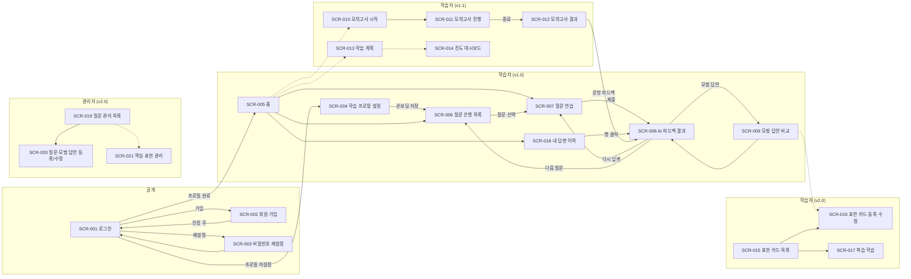

# 화면 정의서

| 항목 | 내용 |
|:---|:---|
| 사업명 | OPIc 학습 앱 |
| 화면 수 | 21개 (상세 정의 10개 = v1.0 MVP 화면 / 기본 정보 11개 = v1.1·v2.0 화면) |
| 작성 일시 | 2026-09-30 |
| 버전 | v0.1 |

> 기준 문서: `화면목록_OPIc_학습_앱_20260930.md`, `API설계서_OPIc_학습_앱_20260930.yaml`(operationId), `유즈케이스_OPIc_학습_앱_20260930.md`
> 화면 수가 20개를 넘어 **우선순위 '상'(v1.0 MVP) 10개 화면을 상세 정의**하고, v1.1·v2.0 화면 11개는 §2-2에 기본 정보만 표로 정리했다. 후속 릴리즈 착수 시 상세화한다.
> 형태: 반응형 웹(Next.js). 브레이크포인트 768px 미만은 모바일 레이아웃(GNB → 하단 탭, 2단 → 1단 스택)으로 전환한다. <!-- TODO: 확인 필요 (디자인 가이드/브레이크포인트) -->
> 공통 규칙: 미인증 접근 시 `/login`으로 이동(`?next=` 원래 경로 보존). API 오류 응답의 `Error.message`는 토스트 또는 필드 하단에 표시한다. 로딩은 스켈레톤, 오류는 재시도 버튼을 제공한다.
> 입력 규칙의 `TODO`는 요구사항에서 미확정인 값이다.

---

## 1. 화면 개요

| SCR-ID | 화면명 | 유형 | URL | 접근 권한 | 연계 UC |
|:---|:---|:---:|:---|:---|:---|
| SCR-001 | 로그인 | AUTH | `/login` | 비로그인 | UC-002 |
| SCR-002 | 회원 가입 | AUTH | `/signup` | 비로그인 | UC-001 |
| SCR-003 | 비밀번호 재설정 | AUTH | `/password-reset` | 비로그인 | UC-002 |
| SCR-004 | 학습 프로필 설정 | FORM | `/profile` (온보딩: `/profile?onboarding=true`) | 학습자 | UC-003 |
| SCR-005 | 홈 | DASH | `/home` | 학습자 | UC-004 |
| SCR-006 | 질문 은행 목록 | LIST | `/questions` | 학습자 | UC-004 |
| SCR-007 | 질문 연습 (답변 제출) | FORM | `/questions/{questionId}/practice` | 학습자 | UC-005 |
| SCR-008 | AI 피드백 결과 | DETAIL | `/answers/{answerId}/feedback` | 학습자 | UC-006 |
| SCR-009 | 모범 답안 비교 | DETAIL | `/questions/{questionId}/model-answer?answerId={answerId}` | 학습자 | UC-007 |
| SCR-018 | 내 답변 이력 | LIST | `/answers` | 학습자 | UC-006, UC-014 |
| SCR-010 | 모의고사 시작 | FORM | `/mock-exams/new` | 학습자 | UC-008 |
| SCR-011 | 모의고사 진행 | PROC | `/mock-exams/{examId}` | 학습자 | UC-008 |
| SCR-012 | 모의고사 결과 | DETAIL | `/mock-exams/{examId}/result` | 학습자 | UC-008, UC-006 |
| SCR-013 | 학습 계획 | FORM | `/study-plan` | 학습자 | UC-011 |
| SCR-014 | 진도 대시보드 | DASH | `/dashboard` | 학습자 | UC-012 |
| SCR-015 | 표현 카드 목록 | LIST | `/expression-cards` | 학습자 | UC-009 |
| SCR-016 | 표현 카드 등록·수정 | FORM | `/expression-cards/new`, `/expression-cards/{cardId}/edit` | 학습자 | UC-009 |
| SCR-017 | 복습 학습 | PROC | `/review` | 학습자 | UC-009, UC-010 |
| SCR-019 | 질문 관리 목록 | LIST | `/admin/questions` | 관리자 | UC-013 |
| SCR-020 | 질문·모범 답안 등록/수정 | FORM | `/admin/questions/new`, `/admin/questions/{questionId}/edit` | 관리자 | UC-013 |
| SCR-021 | 핵심 표현 관리 | LIST | `/admin/expressions` | 관리자 | UC-013 |

---

## 2. 화면별 상세 정의

### 2-1. 상세 정의 (v1.0 MVP)

### SCR-001: 로그인

| 항목 | 내용 |
|:---|:---|
| 화면 유형 | AUTH |
| URL 패턴 | `/login` |
| 접근 권한 | 비로그인 (로그인 상태 진입 시 `/home`으로 이동) |
| 연계 UC | UC-002 |
| 진입 경로 | 앱 최초 진입, 미인증 접근 리다이렉트, 로그아웃 후, SCR-002 가입 완료 후 |
| 이탈 경로 | 성공: 프로필 미설정 → SCR-004(온보딩) / 설정 완료 → SCR-005 (또는 `next`), 링크: SCR-002, SCR-003 |

**레이아웃 (텍스트 박스)**

```
+--------------------------------------+
|              OPIc 학습 앱             |
+--------------------------------------+
| 이메일     [______________________]  |
| 비밀번호   [______________________]  |
| (오류 메시지 영역)                    |
| [            로그인               ]  |
| 비밀번호를 잊으셨나요? | 회원 가입     |
+--------------------------------------+
```

**입력 항목**

| 필드명 | 타입 | 필수 | 유효성 규칙 | 기본값 |
|:---|:---:|:---:|:---|:---|
| email | text(email) | Y | 이메일 형식 | 빈 값 |
| password | password | Y | 빈 값 불가 | 빈 값 |

**출력 항목**

| 필드명 | 타입 | 형식/정렬 | 비고 |
|:---|:---:|:---|:---|
| 오류 메시지 | text | 폼 상단 | 계정 존재 여부를 노출하지 않는 일반 문구 |
| 인증 메일 재발송 안내 | 링크 | 오류 영역 | 403(이메일 미인증) 시에만 표시 |

**이벤트 처리**

| 이벤트 | 트리거 | 처리 내용 | 연계 API |
|:---|:---|:---|:---|
| 로그인 | [로그인] 클릭 / Enter | 형식 검증 후 호출. 성공 시 세션 저장, `profileCompleted=false`면 SCR-004(온보딩), 아니면 SCR-005 또는 `next`로 이동. 401 일반 오류 문구, 403 인증 메일 재발송 안내, 429 "잠시 후 다시 시도" 안내 | `login` |
| 인증 메일 재발송 | 재발송 링크 클릭 | 입력한 이메일로 재발송, 완료 토스트 | `resendVerificationEmail` |
| 이동 | 링크 클릭 | SCR-003 / SCR-002 이동 | — |

> 세션 토큰 저장 방식(Authorization 헤더 vs 쿠키)은 미정이다. <!-- TODO: 확인 필요 -->

---

### SCR-002: 회원 가입

| 항목 | 내용 |
|:---|:---|
| 화면 유형 | AUTH |
| URL 패턴 | `/signup` |
| 접근 권한 | 비로그인 |
| 연계 UC | UC-001 |
| 진입 경로 | SCR-001 링크 |
| 이탈 경로 | 가입 완료(인증 안내 상태) → 인증 링크 확인 후 SCR-001 / SCR-004 |

**레이아웃 (텍스트 박스)**

```
+--------------------------------------+
| 회원 가입                             |
+--------------------------------------+
| 이메일      [_____________________]  |
| 비밀번호    [_____________________]  |
| 비밀번호 확인[____________________]  |
| 닉네임      [_____________________]  |
| [x] (필수) 이용약관 동의   [보기]     |
| [ ] (선택) 음성 데이터 수집·이용 동의 |
|     * 음성 답변 기능을 쓰려면 필요     |
| [            가입하기              ]  |
+--------------------------------------+
| 가입 완료 상태:                       |
| "인증 메일을 보냈습니다."             |
| [인증 메일 재발송]  [로그인으로]      |
+--------------------------------------+
```

**입력 항목**

| 필드명 | 타입 | 필수 | 유효성 규칙 | 기본값 |
|:---|:---:|:---:|:---|:---|
| email | text(email) | Y | 이메일 형식 | 빈 값 |
| password | password | Y | 8자 이상 <!-- TODO: 확인 필요 (비밀번호 정책) --> | 빈 값 |
| passwordConfirm | password | Y | password와 일치 (클라이언트 검증만) | 빈 값 |
| nickname | text | Y | 1~50자 | 빈 값 |
| termsAgreed | checkbox | Y | 체크 필수 | 해제 |
| voiceConsent | checkbox | N | — | 해제 |

**출력 항목**

| 필드명 | 타입 | 형식/정렬 | 비고 |
|:---|:---:|:---|:---|
| 필드별 오류 | text | 각 입력 하단 | `Error.details`의 field/reason 매핑 |
| 가입 완료 안내 | 상태 화면 | 폼 대체 표시 | `emailVerificationRequired=true`일 때 |

**이벤트 처리**

| 이벤트 | 트리거 | 처리 내용 | 연계 API |
|:---|:---|:---|:---|
| 가입 | [가입하기] 클릭 | 클라이언트 검증 후 호출. 201이면 완료 안내 상태로 전환. 409는 이메일 필드에 "이미 사용 중인 이메일"과 로그인 안내 표시, 400은 필드별 오류 표시 | `signUp` |
| 약관 보기 | [보기] 클릭 | 약관 모달 표시 <!-- TODO: 확인 필요 (약관 문안) --> | — |
| 인증 메일 재발송 | [인증 메일 재발송] 클릭 | 재발송, 완료 토스트 | `resendVerificationEmail` |

> 인증 링크를 클릭했을 때 도착하는 콜백 화면(`/auth/callback`)은 화면 목록에 없다. 로그인 화면으로 이동시키는 단순 처리로 갈지 별도 SCR로 둘지 결정이 필요하다. <!-- TODO: 확인 필요 -->

---

### SCR-003: 비밀번호 재설정

| 항목 | 내용 |
|:---|:---|
| 화면 유형 | AUTH |
| URL 패턴 | `/password-reset` |
| 접근 권한 | 비로그인 |
| 연계 UC | UC-002 (대안 흐름 1a) |
| 진입 경로 | SCR-001 링크 |
| 이탈 경로 | SCR-001 |

**레이아웃 (텍스트 박스)**

```
+--------------------------------------+
| 비밀번호 재설정                       |
+--------------------------------------+
| 가입한 이메일을 입력하세요.           |
| 이메일 [________________________]    |
| [        재설정 메일 받기         ]  |
| (완료 안내 영역)                      |
| [로그인으로 돌아가기]                 |
+--------------------------------------+
```

**입력 항목**

| 필드명 | 타입 | 필수 | 유효성 규칙 | 기본값 |
|:---|:---:|:---:|:---|:---|
| email | text(email) | Y | 이메일 형식 | 빈 값 |

**출력 항목**

| 필드명 | 타입 | 형식/정렬 | 비고 |
|:---|:---:|:---|:---|
| 완료 안내 | text | 폼 하단 | "가입된 이메일이면 재설정 메일을 보냈습니다" (계정 존재 여부 비노출) |

**이벤트 처리**

| 이벤트 | 트리거 | 처리 내용 | 연계 API |
|:---|:---|:---|:---|
| 재설정 메일 요청 | [재설정 메일 받기] 클릭 | 항상 202이므로 동일한 완료 안내 표시. 연속 요청은 버튼 잠금(60초) <!-- TODO: 확인 필요 --> | `requestPasswordReset` |

> 메일 링크를 통해 새 비밀번호를 입력하는 화면과 이를 처리하는 API는 아직 설계에 없다(인증 제공자 SDK 처리 예정). <!-- TODO: 확인 필요 -->

---

### SCR-004: 학습 프로필 설정

| 항목 | 내용 |
|:---|:---|
| 화면 유형 | FORM |
| URL 패턴 | `/profile` (온보딩: `/profile?onboarding=true`) |
| 접근 권한 | 학습자 |
| 연계 UC | UC-003 |
| 진입 경로 | 최초 로그인(프로필 미설정) 자동 이동, GNB > 내 정보 |
| 이탈 경로 | 온보딩: SCR-006 / 일반: 저장 후 현재 화면 유지(토스트) |

**레이아웃 (텍스트 박스)**

```
+--------------------------------------------+
| 학습 프로필                                 |
+--------------------------------------------+
| 목표 등급 *   [ IH v ]                       |
| 현재 수준     [ IM1 v ] (선택)               |
| 시험 예정일   [ 2026-11-15 ] (선택)          |
| 관심 주제 *                                  |
|  [영화] [여행] [음악] [운동] [요리] ...      |
|  (다중 선택 칩)                              |
+--------------------------------------------+
| [ 저장 ]                       (온보딩: 건너뛰기 없음) |
+--------------------------------------------+
```

**입력 항목**

| 필드명 | 타입 | 필수 | 유효성 규칙 | 기본값 |
|:---|:---:|:---:|:---|:---|
| targetGrade | select(Grade) | Y | NL/NM/NH/IL/IM1/IM2/IM3/IH/AL 중 1개 | 저장된 값 또는 미선택 |
| currentGrade | select(Grade) | N | 동일 | 저장된 값 |
| examDate | date | N | 오늘 이후 날짜만 | 저장된 값 |
| topicIds | chip 다중 선택 | Y | 최소 1개 <!-- TODO: 확인 필요 (최소/최대 선택 수) --> | 저장된 값 |

**출력 항목**

| 필드명 | 타입 | 형식/정렬 | 비고 |
|:---|:---:|:---|:---|
| 주제 목록 | chip | `sortNo` 순 | 사용 중 주제만 |
| D-day | text | 시험일 입력 시 "D-N" | 클라이언트 계산 |
| 필드별 오류 | text | 필드 하단 | 400 응답 매핑 |

**이벤트 처리**

| 이벤트 | 트리거 | 처리 내용 | 연계 API |
|:---|:---|:---|:---|
| 화면 로드 | 페이지 진입 | 기존 프로필과 주제 목록 조회 후 폼 채움 | `getMyProfile`, `listTopics` |
| 저장 | [저장] 클릭 | 검증 후 저장. 성공 시 온보딩이면 SCR-006 이동, 아니면 "저장되었습니다" 토스트. v1.1 이후 활성 학습 계획이 있으면 "학습 계획을 다시 만들까요?" 확인 다이얼로그 표시 | `updateMyProfile` (v1.1: `createStudyPlan`) |
| 이탈 방지 | 변경 후 이동 시도 | 저장하지 않은 변경 확인 다이얼로그 | — |

---

### SCR-005: 홈

| 항목 | 내용 |
|:---|:---|
| 화면 유형 | DASH |
| URL 패턴 | `/home` |
| 접근 권한 | 학습자 |
| 연계 UC | UC-004 |
| 진입 경로 | 로그인 성공, GNB > 홈 |
| 이탈 경로 | SCR-007(연습 시작), SCR-006, SCR-008, SCR-018, (v1.1) SCR-013·SCR-014 |

**레이아웃 (텍스트 박스)**

```
+---------------------------------------------------+
| 안녕하세요, {닉네임}님       목표 IH  |  D-45      |
+---------------------------------------------------+
| [프로필 미설정 배너: 목표 등급을 설정하세요 ->]     |
+---------------------------------------------------+
| 이어서 연습하기        | AI 피드백 잔여 4 / 5회     |
| "Describe your ..."    |                           |
| [ 이어서 연습 ]        |                           |
+---------------------------------------------------+
| 추천 질문 (미답변)                                 |
| [질문카드] [질문카드] [질문카드]      [더 보기 ->]  |
+---------------------------------------------------+
| 최근 답변                                          |
| 09-30 | 영화 | IM2 | [결과 보기]                   |
| ...                                    [전체 보기 ->]|
+---------------------------------------------------+
| (v1.1) 오늘의 학습 계획 / 요약 통계                 |
+---------------------------------------------------+
```

**입력 항목**

| 필드명 | 타입 | 필수 | 유효성 규칙 | 기본값 |
|:---|:---:|:---:|:---|:---|
| — | — | — | 입력 항목 없음 | — |

**출력 항목**

| 필드명 | 타입 | 형식/정렬 | 비고 |
|:---|:---:|:---|:---|
| nickname, targetGrade, examDate | text | D-day는 클라이언트 계산 | `getMyProfile` |
| 이어서 연습 카드 | card | 가장 최근 제출 답변의 질문 | `listMyAnswers(size=1)` 결과의 질문. 없으면 카드 숨김 |
| 추천 질문 | card 3개 | 미답변(`answered=false`) 질문 | 관심 주제 기준 <!-- TODO: 확인 필요 (추천 규칙) --> |
| AI 잔여 횟수 | text | `dailyLimit - callCount` / `dailyLimit` | `getMyAiUsage` |
| 최근 답변 | list 3건 | 제출일시 내림차순 | 주제, 예상 등급 |
| (v1.1) 오늘의 학습 계획 | list | `planDate`=오늘 항목, 완료 체크 | `getCurrentStudyPlan` |

**이벤트 처리**

| 이벤트 | 트리거 | 처리 내용 | 연계 API |
|:---|:---|:---|:---|
| 화면 로드 | 페이지 진입 | 프로필·사용량·추천 질문·최근 답변을 병렬 조회. 실패한 영역만 개별 재시도 표시 | `getMyProfile`, `getMyAiUsage`, `listQuestions`, `listMyAnswers` |
| 프로필 배너 클릭 | 배너 클릭 | SCR-004로 이동 | — |
| 질문 카드 클릭 | 카드/이어서 연습 클릭 | SCR-007 이동 | — |
| 최근 답변 결과 보기 | 링크 클릭 | SCR-008 이동 | — |
| (v1.1) 계획 항목 체크 | 체크박스 클릭 | 완료 처리 | `updateStudyPlanItem` |

---

### SCR-006: 질문 은행 목록

| 항목 | 내용 |
|:---|:---|
| 화면 유형 | LIST |
| URL 패턴 | `/questions` (쿼리: `topicId`, `questionType`, `difficulty`, `answered`, `keyword`, `page`) |
| 접근 권한 | 학습자 |
| 연계 UC | UC-004 |
| 진입 경로 | GNB > 연습 > 질문 은행, SCR-004 온보딩 저장 후, SCR-005 |
| 이탈 경로 | SCR-007 (질문 선택) |

**레이아웃 (텍스트 박스)**

```
+---------------------------------------------------------+
| 질문 은행                                                |
+---------------------------------------------------------+
| 주제[전체 v] 유형[전체 v] 난이도[전체 v] 답변[전체 v]     |
| 키워드 [______________] [검색] [초기화]                   |
+---------------------------------------------------------+
| [영화][묘사][난이도3]                        미답변       |
| "Tell me about a movie you like..."                      |
| ------------------------------------------------------- |
| [여행][과거경험][난이도4]                    답변함       |
| "Describe your most memorable trip..."                   |
| ...                                                      |
+---------------------------------------------------------+
|              < 1 2 3 4 5 >   (총 128건)                  |
+---------------------------------------------------------+
```

**입력 항목**

| 필드명 | 타입 | 필수 | 유효성 규칙 | 기본값 |
|:---|:---:|:---:|:---|:---|
| topicId | select | N | `listTopics` 값 중 1개 | 전체 |
| questionType | select | N | DESCRIBE/ROUTINE/PAST_EXP/ROLE_PLAY/COMPARE/UNEXPECTED/ISSUE | 전체 |
| difficulty | select | N | 1~6 <!-- TODO: 확인 필요 (난이도 체계) --> | 전체 |
| answered | select | N | 전체 / 미답변(false) / 답변함(true) | 전체 |
| keyword | text | N | 최대 100자, 입력 후 300ms 디바운스 | 빈 값 |
| page / size | number | N | size 20 고정 | 1 / 20 |

**출력 항목**

| 필드명 | 타입 | 형식/정렬 | 비고 |
|:---|:---:|:---|:---|
| 질문 카드 목록 | list | 서버 기본 정렬 <!-- TODO: 확인 필요 (정렬 기준) --> | 주제·유형·난이도 배지, 질문 텍스트(2줄 말줄임), 답변 여부 |
| 총 건수·페이지네이션 | text/pager | `totalCount` | 필터는 URL 쿼리에 반영(공유·뒤로가기 유지) |
| 빈 상태 | empty | "조건에 맞는 질문이 없습니다" + [필터 초기화] | |

**이벤트 처리**

| 이벤트 | 트리거 | 처리 내용 | 연계 API |
|:---|:---|:---|:---|
| 화면 로드 | 페이지 진입 | 주제 목록과 질문 목록 조회(URL 쿼리 조건 적용) | `listTopics`, `listQuestions` |
| 조건 변경 | 필터 변경/검색 | page=1로 재조회, URL 갱신 | `listQuestions` |
| 페이지 이동 | 페이지 번호 클릭 | 해당 페이지 재조회 | `listQuestions` |
| 초기화 | [초기화] 클릭 | 모든 조건 해제 후 재조회 | `listQuestions` |
| 질문 선택 | 카드 클릭 | SCR-007로 이동 | — |
| 조회 실패 | 오류 응답 | 오류 안내 + [다시 시도] | — |

> 관심 주제로 기본 필터링하려면 `topicId`를 여러 개 받을 수 있어야 하는데 현재 API는 단일 값만 받는다. `topicIds` 다중 지원을 API에 반영할지 결정이 필요하다. <!-- TODO: 확인 필요 -->

---

### SCR-007: 질문 연습 (답변 제출)

| 항목 | 내용 |
|:---|:---|
| 화면 유형 | FORM |
| URL 패턴 | `/questions/{questionId}/practice` |
| 접근 권한 | 학습자 |
| 연계 UC | UC-005 |
| 진입 경로 | SCR-006, SCR-005, SCR-008(다시 답변) |
| 이탈 경로 | 제출 성공 → SCR-008, 뒤로 → SCR-006 |

**레이아웃 (텍스트 박스)**

```
+---------------------------------------------------+
| < 질문 은행          [영화][묘사][난이도3]         |
+---------------------------------------------------+
| "Tell me about a movie you like. Why do you ..."  |
| [> 질문 듣기]  0:12 / 0:25                        |
+---------------------------------------------------+
| [ 음성 답변 ] [ 텍스트 답변 ]                      |
+---------------------------------------------------+
| (음성 탭)                                         |
|   [ ● 녹음 시작 ]     00:00 / 최대 02:00          |
|   녹음 후: [> 다시 듣기] [ ↺ 다시 녹음 ]          |
| (텍스트 탭)                                       |
|   [ 답변을 입력하세요...                        ] |
|   [                                             ] |
+---------------------------------------------------+
| AI 피드백 잔여 4 / 5회       [ 제출하고 피드백 받기 ]|
+---------------------------------------------------+
```

**입력 항목**

| 필드명 | 타입 | 필수 | 유효성 규칙 | 기본값 |
|:---|:---:|:---:|:---|:---|
| answerType | tab(VOICE/TEXT) | Y | 마이크 미지원/거부 시 TEXT로 전환 가능 | VOICE |
| audio | Blob(녹음) | 음성 탭 Y | 녹음 1회 이상, 최대 길이 <!-- TODO: 확인 필요 (최대 녹음 시간·포맷) --> | 없음 |
| text | textarea | 텍스트 탭 Y | 공백 제외 최소 길이 <!-- TODO: 확인 필요 (최소 글자 수) -->, 최대 5,000자 | 빈 값 |
| durationSec | number | N | 녹음 길이(자동) | 자동 |

**출력 항목**

| 필드명 | 타입 | 형식/정렬 | 비고 |
|:---|:---:|:---|:---|
| 질문 텍스트·배지 | text | 주제·유형·난이도 | `getQuestion` |
| 질문 음성 | audio player | 재생/일시정지/진행바 | `audioUrl`이 null이면 TTS 대체 <!-- TODO: 확인 필요 (IR-003 방식) --> |
| 녹음 상태·시간 | text | mm:ss | 녹음 중/대기/완료 |
| AI 잔여 횟수 | text | `dailyLimit - callCount` / `dailyLimit` | 0이면 제출 버튼 비활성 + 안내 |

**이벤트 처리**

| 이벤트 | 트리거 | 처리 내용 | 연계 API |
|:---|:---|:---|:---|
| 화면 로드 | 페이지 진입 | 질문·프로필(음성 동의 여부)·사용량 조회. 비공개/없는 질문이면 404 안내 후 SCR-006 | `getQuestion`, `getMyProfile`, `getMyAiUsage` |
| 질문 듣기 | [> 질문 듣기] | 음성 재생 | — |
| 녹음 시작 | [● 녹음 시작] | 마이크 권한 요청 후 녹음. 거부 시 권한 허용 방법 안내와 [텍스트 답변으로 전환] 제안. 최대 길이 도달 시 자동 종료·안내 | — |
| 녹음 확인/재녹음 | [다시 듣기]/[다시 녹음] | 로컬 재생 / 기존 녹음 폐기 후 재시작 | — |
| 제출 | [제출하고 피드백 받기] | 검증 후 multipart 전송, 성공(201) 시 SCR-008로 이동(`answerId`). 403(음성 미동의)은 동의 안내 다이얼로그, 429는 한도 초과 안내, 413은 길이 초과 안내, 404는 질문 없음 안내 | `submitAnswer` |
| 이탈 방지 | 녹음/입력 후 이동 시도 | 저장하지 않은 답변 폐기 확인 다이얼로그 | — |

> 음성 수집 동의를 가입 시 체크하지 않은 사용자가 이 화면에서 동의하는 API(동의 저장)가 아직 설계에 없다. `PUT /users/me/voice-consent` 등을 추가해야 한다. <!-- TODO: 확인 필요 -->

---

### SCR-008: AI 피드백 결과

| 항목 | 내용 |
|:---|:---|
| 화면 유형 | DETAIL |
| URL 패턴 | `/answers/{answerId}/feedback` |
| 접근 권한 | 학습자 (본인 답변만, 타인 답변은 404) |
| 연계 UC | UC-006 |
| 진입 경로 | SCR-007 제출 후, SCR-005 최근 답변, SCR-018 행 클릭 |
| 이탈 경로 | SCR-009(모범 답안 비교), SCR-007(다시 답변), SCR-006(다음 질문) |

**레이아웃 (텍스트 박스)**

```
+---------------------------------------------------+
| < 내 답변 이력         "Tell me about a movie ..." |
+---------------------------------------------------+
| (처리 중)  전사 중... -> 채점 중...  [스피너]        |
+---------------------------------------------------+
| 내 답변   [> 다시 듣기]                             |
| "I like the movie because ..."  (전사문)            |
+---------------------------------------------------+
| 예상 등급  [ IM2 ]       목표 IH                    |
| 유창성   [========--] 78                            |
| 어휘     [=======---] 70                            |
| 문법     [======----] 62                            |
| 내용구성 [========--] 80                            |
+---------------------------------------------------+
| 개선 코멘트                                         |
|  - ...                                              |
| 교정본                                              |
|  "I like the movie because ..."                     |
+---------------------------------------------------+
| [모범 답안 비교] [다시 답변] [다음 질문]            |
+---------------------------------------------------+
```

**입력 항목**

| 필드명 | 타입 | 필수 | 유효성 규칙 | 기본값 |
|:---|:---:|:---:|:---|:---|
| — | — | — | 입력 항목 없음 (URL의 `answerId`만 사용) | — |

**출력 항목**

| 필드명 | 타입 | 형식/정렬 | 비고 |
|:---|:---:|:---|:---|
| 처리 상태 | stepper | SUBMITTED → TRANSCRIBED → SCORED | `Answer.status` |
| 내 답변 | audio + text | `audioUrl`(삭제 후 없음), `transcriptText` | 음성이 삭제된 경우 텍스트만 표시 |
| 예상 등급 | badge | `estimatedGrade`, 목표 등급 대비 표시 | |
| 항목 점수 | bar ×4 | 0~100 정수 | 유창성·어휘·문법·내용 구성 |
| 개선 코멘트 | text | 줄바꿈 유지 | |
| 교정본 | text | `correctedText` | 없으면 영역 숨김 |
| 실패/안내 상태 | message | FAILED 오류, "답변이 너무 짧습니다" | |

**이벤트 처리**

| 이벤트 | 트리거 | 처리 내용 | 연계 API |
|:---|:---|:---|:---|
| 화면 로드·폴링 | 페이지 진입 | 답변 상태를 2초 간격으로 조회해 SCORED가 되면 피드백 조회. 처리 시간 목표 30초(PR-002), 60초 초과 시 "지연 중" 안내 유지 후 계속 폴링 <!-- TODO: 확인 필요 (폴링 간격·타임아웃) --> | `getAnswer`, `getFeedback` |
| 재시도 | FAILED 상태의 [다시 시도] | 재채점 접수(202) 후 폴링 재개. 429(한도 초과)·409(진행 중)는 안내 | `requestFeedback` |
| 모범 답안 비교 | [모범 답안 비교] | SCR-009 이동(`?answerId=`) | — |
| 다시 답변 | [다시 답변] | SCR-007 이동 | — |
| 다음 질문 | [다음 질문] | SCR-006 이동 | — |
| 존재하지 않는 답변 | 404 | 오류 안내 후 SCR-018로 이동 | `getAnswer` |

---

### SCR-009: 모범 답안 비교

| 항목 | 내용 |
|:---|:---|
| 화면 유형 | DETAIL |
| URL 패턴 | `/questions/{questionId}/model-answer?answerId={answerId}` (`answerId`는 선택) |
| 접근 권한 | 학습자 |
| 연계 UC | UC-007 |
| 진입 경로 | SCR-008 [모범 답안 비교], SCR-007/SCR-006에서 모범 답안 보기 |
| 이탈 경로 | SCR-008, SCR-007, SCR-006 |

**레이아웃 (텍스트 박스)**

```
+---------------------------------------------------------+
| < 피드백으로     "Tell me about a movie you like..."     |
+---------------------------------------------------------+
| 모범 답안 등급: [IL] [IM2] [IM3] [*IH*] [AL]              |
+------------------------------+--------------------------+
| 내 답변 (교정본)              | 모범 답안 (IH)            |
| [원문] [교정본]               |                          |
| "I like the movie ..."       | "Well, one of my ..."    |
+------------------------------+--------------------------+
| 핵심 표현                                                |
|  - "one of my all-time favorites" ...                   |
|  ([v2.0] 표현을 선택해 [카드로 저장])                     |
+---------------------------------------------------------+
```

**입력 항목**

| 필드명 | 타입 | 필수 | 유효성 규칙 | 기본값 |
|:---|:---:|:---:|:---|:---|
| targetGrade | tab | N | Grade 중 1개 | 내 목표 등급 |
| answerId | query | N | 본인 답변 ID | 없음(모범 답안만 표시) |

**출력 항목**

| 필드명 | 타입 | 형식/정렬 | 비고 |
|:---|:---:|:---|:---|
| 모범 답안 | text | `scriptText` | 선택 등급 기준 |
| 핵심 표현 | text | `keyExpressionNote` | 없으면 영역 숨김 |
| 내 답변/교정본 | text | 원문·교정본 탭 | `answerId`가 있을 때만 표시. 모바일은 세로 스택(내 답변 → 모범 답안) |
| 빈 상태 | empty | "준비 중인 콘텐츠입니다" | 모범 답안 미등록 등급 |

**이벤트 처리**

| 이벤트 | 트리거 | 처리 내용 | 연계 API |
|:---|:---|:---|:---|
| 화면 로드 | 페이지 진입 | 모범 답안 조회(목표 등급 기준). `answerId`가 있으면 내 답변과 교정본도 조회 | `listModelAnswers`, `getAnswer`, `getFeedback` |
| 등급 변경 | 등급 탭 클릭 | 해당 등급 모범 답안 조회 | `listModelAnswers` |
| (v2.0) 표현 카드 저장 | 텍스트 선택 후 [카드로 저장] | 선택 표현으로 카드 생성 후 토스트, 중복(409) 시 안내 | `createExpressionCard` |
| 404 | 질문/답변 없음 | 오류 안내 후 SCR-006 | — |

> 아직 답변하지 않은 질문의 모범 답안을 볼 수 있게 할지(`answerId` 없이 진입) 정책은 확정 전이다. 현재는 허용하는 것으로 설계했다. <!-- TODO: 확인 필요 -->

---

### SCR-018: 내 답변 이력

| 항목 | 내용 |
|:---|:---|
| 화면 유형 | LIST |
| URL 패턴 | `/answers` (쿼리: `questionId`, `page`) |
| 접근 권한 | 학습자 |
| 연계 UC | UC-006, UC-014 |
| 진입 경로 | GNB > 연습 > 내 답변 이력, SCR-005 |
| 이탈 경로 | SCR-008 (행 클릭) |

**레이아웃 (텍스트 박스)**

```
+---------------------------------------------------------------+
| 내 답변 이력             [선택 삭제(2)] [전체 삭제]            |
+---------------------------------------------------------------+
| [ ] | 제출일시        | 질문                | 상태  | 등급 | 음성 |
| [x] | 09-30 14:02    | Tell me about a ... | 완료  | IM2  | [>]  |
| [ ] | 09-29 21:15    | Describe your ...   | 실패  |  -   | [>]  |
| [x] | 09-29 20:40    | Compare two ...     | 완료  | IM1  | 삭제됨|
+---------------------------------------------------------------+
|                    < 1 2 3 >                                   |
+---------------------------------------------------------------+
| 삭제 확인 다이얼로그:                                          |
|  "선택한 2건의 음성과 전사·피드백이 함께 삭제되며               |
|   복구할 수 없습니다."        [취소] [삭제]                     |
+---------------------------------------------------------------+
```

**입력 항목**

| 필드명 | 타입 | 필수 | 유효성 규칙 | 기본값 |
|:---|:---:|:---:|:---|:---|
| questionId | query/filter | N | 특정 질문의 이력만 보기 | 없음 |
| 선택(체크박스) | checkbox | N | 삭제 시 1건 이상 | 해제 |
| page / size | number | N | size 20 | 1 / 20 |

**출력 항목**

| 필드명 | 타입 | 형식/정렬 | 비고 |
|:---|:---:|:---|:---|
| 제출일시 | datetime | 내림차순 | 사용자 시간대 표시 |
| 질문 | text | 1줄 말줄임 | API 응답에 질문 텍스트가 없어 보완 필요 (아래 참고) |
| 처리 상태 | badge | 처리 중/완료/실패 | `Answer.status` |
| 예상 등급 | badge | `estimatedGrade` | 채점 전 "-" |
| 음성 | player | 재생 버튼 | 삭제된 경우 "삭제됨" 표시 |
| 빈 상태 | empty | "아직 답변이 없습니다" + [질문 은행으로] | |

**이벤트 처리**

| 이벤트 | 트리거 | 처리 내용 | 연계 API |
|:---|:---|:---|:---|
| 화면 로드/페이지 이동 | 진입, 페이지 클릭 | 이력 조회 | `listMyAnswers` |
| 행 클릭 | 행(체크박스·재생 제외) 클릭 | SCR-008 이동 | — |
| 음성 재생 | [>] 클릭 | 서명 URL 오디오 재생(만료 시 재조회) | `listMyAnswers` (URL 갱신) |
| 선택 삭제 | [선택 삭제] → [삭제] | 선택 `answerId` 삭제. 1건이면 단건 삭제 사용. 완료 후 목록 재조회·토스트 | `deleteMyAnswers` / `deleteAnswer` |
| 전체 삭제 | [전체 삭제] → 확인 문구 입력 후 [삭제] <!-- TODO: 확인 필요 (재확인 방식) --> | `all=true`로 전체 삭제 | `deleteMyAnswers` |
| 삭제 실패 | 오류 응답 | 오류 안내와 재시도 | — |

> API 보완 필요: `Answer` 스키마에 `questionText`(및 `topicName`)가 없어 목록에 질문을 표시할 수 없다. `listMyAnswers` 응답에 추가하거나 별도 조회가 필요하다. <!-- TODO: 확인 필요 -->

---

### 2-2. 기본 정보 (v1.1 / v2.0 — 후속 상세화 대상)

| SCR-ID | 화면명 | 유형 | URL | 주요 구성 | 연계 API operationId | 릴리즈 |
|:---|:---|:---:|:---|:---|:---|:---:|
| SCR-010 | 모의고사 시작 | FORM | `/mock-exams/new` | 시험 안내(문항 수·시간), 마이크 점검, [시작] / 진행 중 시험 [이어하기] | `createMockExam`, `listMockExams` | v1.1 |
| SCR-011 | 모의고사 진행 | PROC | `/mock-exams/{examId}` | 문항 진행 표시, 질문 재생(재청취 제한), 타이머, 녹음 컨트롤, [건너뛰기]/[다음], 이어하기 복원 | `getMockExam`, `submitMockExamAnswer`, `skipMockExamItem`, `updateMockExamStatus` | v1.1 |
| SCR-012 | 모의고사 결과 | DETAIL | `/mock-exams/{examId}/result` | 종합 예상 등급(채점 중이면 폴링), 문항별 등급·피드백 링크(SCR-008) | `getMockExam`, `getFeedback` | v1.1 |
| SCR-013 | 학습 계획 | FORM | `/study-plan` | 주간 학습 시간 입력, 주간/일별 계획 캘린더, 항목 추가·이동·삭제·완료 | `getCurrentStudyPlan`, `createStudyPlan`, `addStudyPlanItem`, `updateStudyPlanItem`, `deleteStudyPlanItem` | v1.1 |
| SCR-014 | 진도 대시보드 | DASH | `/dashboard` | 기간 선택, 학습 시간·답변 수, 점수 추이 차트, 취약 영역, 목표 대비 등급 | `getMyStats`, `getCurrentStudyPlan` | v1.1 |
| SCR-015 | 표현 카드 목록 | LIST | `/expression-cards` | 내 카드 목록, 콘텐츠 표현 탐색·저장, 카드 삭제, 복습 시작 버튼 | `listMyExpressionCards`, `listExpressions`, `createExpressionCard`, `deleteExpressionCard` | v2.0 |
| SCR-016 | 표현 카드 등록·수정 | FORM | `/expression-cards/new`, `/expression-cards/{cardId}/edit` | 표현·의미·메모 입력, 중복 저장 안내 | `createExpressionCard`, `updateExpressionCard` | v2.0 |
| SCR-017 | 복습 학습 | PROC | `/review` | 오늘 복습 카드 앞/뒤 전환, 기억 정도(어려움/보통/쉬움), 진행률, 복습 대상 없음 안내 | `listMyExpressionCards`(`due=true`), `createCardReview` | v2.0 |
| SCR-019 | 질문 관리 목록 | LIST | `/admin/questions` | 상태·주제·키워드 필터, 질문 목록, 등록·수정·비공개 처리·삭제 | `listAdminQuestions`, `updateQuestion`, `deleteQuestion`, `listTopics` | v2.0 |
| SCR-020 | 질문·모범 답안 등록/수정 | FORM | `/admin/questions/new`, `/admin/questions/{questionId}/edit` | 질문 정보 입력, 질문 음성 업로드, 등급별 모범 답안 편집, 공개 상태 | `createQuestion`, `getAdminQuestion`, `updateQuestion`, `uploadQuestionAudio`, `upsertModelAnswer`, `deleteModelAnswer`, `listTopics` | v2.0 |
| SCR-021 | 핵심 표현 관리 | LIST | `/admin/expressions` | 표현 목록(주제 필터), 등록·수정 다이얼로그, 삭제 | `listExpressions`, `createExpression`, `updateExpression`, `deleteExpression` | v2.0 |

> 모의고사 진행 중 시험 조회는 전용 API가 없어 `listMockExams`에서 `status=IN_PROGRESS` 항목을 찾는 방식을 가정했다. 상태 필터 파라미터 추가를 검토한다. <!-- TODO: 확인 필요 -->

---

## 3. 공통 컴포넌트 목록

| 컴포넌트명 | 유형 | 설명 | 사용 화면 |
|:---|:---:|:---|:---|
| AppHeader / GNB | 레이아웃 | 상단 내비게이션(연습·모의고사·학습 관리·복습·내 정보), 사용자 메뉴·로그아웃 | SCR-004~021 |
| BottomTabBar | 레이아웃 | 모바일 하단 탭(GNB 대체) | SCR-004~018 (모바일) |
| AuthLayout | 레이아웃 | 로그인·가입·재설정 공통 카드형 레이아웃 | SCR-001~003 |
| AuthGuardRoute | 라우팅 | 미인증 시 `/login?next=`로 이동, 관리자 경로는 ADMIN만 허용 | SCR-004~021 |
| FormField | 입력 | 라벨·입력·오류 메시지 묶음(react-hook-form + 스키마 검증) | SCR-001~004, SCR-007, SCR-016, SCR-020 |
| GradeSelect | 입력 | OPIc 등급 선택(NL~AL) | SCR-004, SCR-009, SCR-020 |
| TopicChipSelect | 입력 | 주제 다중 선택 칩 | SCR-004, SCR-006 |
| ConsentCheckbox | 입력 | 약관·음성 수집 동의 체크와 안내 문구 | SCR-002, SCR-007 |
| QuestionCard | 표시 | 주제·유형·난이도 배지, 질문 텍스트, 답변 여부 | SCR-005, SCR-006 |
| AudioPlayer | 미디어 | 질문 음성/내 답변 재생(진행바, 서명 URL 만료 재조회) | SCR-007, SCR-008, SCR-018 |
| AudioRecorder | 미디어 | 마이크 권한, 녹음/중지/재생/재녹음, 최대 길이 제한 | SCR-007, SCR-011 |
| GradeBadge | 표시 | 등급 배지(목표 대비 색상) | SCR-005, SCR-008, SCR-018 |
| ScoreBar | 표시 | 항목별 0~100 점수 막대(색만으로 구분하지 않고 숫자 병기) | SCR-008, SCR-014 |
| StatusStepper | 표시 | 답변 처리 진행 상태(제출→전사→채점) | SCR-008 |
| Pagination | 내비게이션 | 페이지 이동, 총 건수 표시 | SCR-006, SCR-018, SCR-019 |
| FilterBar | 입력 | 필터 셀렉트·키워드·초기화 묶음 | SCR-006, SCR-018, SCR-019 |
| ConfirmDialog | 다이얼로그 | 삭제·이탈 확인 | SCR-004, SCR-007, SCR-018 |
| Toast | 피드백 | 성공·오류 알림(스크린리더 알림 영역 포함) | 전 화면 |
| EmptyState / ErrorState | 피드백 | 빈 상태·오류 + 재시도 | SCR-005, SCR-006, SCR-018 |
| Skeleton | 피드백 | 로딩 표시 | 전 화면 |

> 접근성: WCAG 2.1 AA(QR-003) 기준으로 모든 입력에 라벨, 오류는 `aria-live`로 안내하고 녹음 컨트롤은 키보드로 조작할 수 있게 한다.

---

## 4. 화면 흐름도



---

## 문서 버전 이력

| 버전 | 일자 | 작성자 | 변경 내용 |
|:---|:---|:---|:---|
| v0.1 | 2026-09-30 | 초안 작성 | 최초 생성 (v1.0 MVP 화면 10개 상세, 나머지 11개 기본 정보) |
